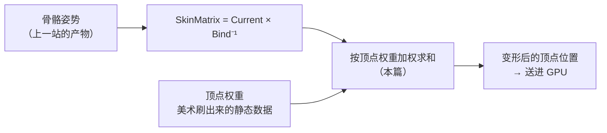

> [[Notes/动画系统/索引|← 返回 动画系统索引]]

# 顶点权重与蒙皮算法

> [!todo] 本篇核心问题
> 顶点是怎么被多根骨骼"一起拽着"变形的？权重怎么分配、为什么必须归一化？Linear Skinning 为什么弯肘会塌陷？

> [!tip] 先回答一个更实际的问题：需要懂多深？
> 遇到「手肘塌得像折纸」「人物发胖」这类问题时，你的全部需求是：
> 1. **知道顶点是被多根骨骼"一起拽着"的**（骨骼不是骨头，是一个没有长度的坐标架——这个地基由 [[Notes/动画系统/角色资产与骨骼基础/骨骼的本质：从骨架到 Skeleton 资产|骨骼的本质]] 打好，本篇直接拿来用），每根骨骼各出多少力由一个叫**权重**的数字决定。
> 2. **知道权重是美术刷出来的静态数据**，不是运行时算的。
> 3. **知道权重的硬规矩：非负、且加起来等于 1**。
> 4. **知道 LBS、DQS 各自解决什么问题**——LBS 有固有缺陷，DQS 是更贵的那条出路。
> 至于塌陷的数学细节、DQS 怎么实现，都不影响你下手排查问题。

## 为什么需要解决这个问题

上一篇 [[Notes/动画系统/蒙皮与骨骼网格/蒙皮矩阵：从骨骼姿势到顶点变形|蒙皮矩阵]] 已经解决了一个顶点的搬运问题：骨骼在当前姿势下的变换乘上它 bind pose 的逆，就是这个顶点该被拽到哪去——`skin matrix = Current × Bind⁻¹`，本篇不再重复推导，只当成一个已知部件使用。

现在假设最省事的做法：**每个顶点只绑一根骨骼**。肩膀上的顶点绑给肩膀骨，小臂上的顶点绑给小臂骨。骨骼一动，顶点整段整段地跟着转，看起来完全合理——**直到你弯手肘**。

弯肘时，小臂骨骼相对大臂转了 120°。于是：

- 绑给小臂的顶点**整个旋过去 120°**；
- 绑给大臂的顶点**原地不动**；
- 而这两个顶点在网格上是**挨着的**（相邻的两个三角面共用它们）。

结果就是：网格沿着关节"撕开"了，肘部出现一道**像折纸一样的硬邦邦的尖角**，模型看起来像一具**机器人**——关节处只有两块硬壳在互相穿插，没有皮肤。膝盖、肩膀、脖子、手腕，所有会弯的地方都会这样。

现实里，人身上**没有任何一块皮肤是"纯属某一块骨头"的**。肘窝的皮肤被大臂外侧和小臂外侧同时拉扯，弯得越狠，两侧拉得越紧——正是这股"互相拉扯"让关节处永远是平滑的弧。所以顶点必须**同时受多根骨骼影响**：让肘部那个顶点一半听大臂的、一半听小臂的，它就停在两者中间，过渡自然。

那么问题就变成了三个互相牵连的子问题：**怎么分配这些影响力？这套加权平均在什么情况下会坏掉？坏了怎么修？**



数据流位置：本篇处在动画链路的**最后一站**，和上一篇的分工是——上一篇回答"**当一根骨骼拽一个顶点时，拽到哪去**"，本篇回答"**多根骨骼一起拽时，谁出多少力、结果为什么有时会坏**"。输入是若干张 skin matrix（每根骨骼一张）+ 每个顶点的一组权重，输出是变形后的顶点位置。

## 直观理解：一顶帐篷和它的拉绳

想象一顶帐篷的篷布，"顶点"就是布上的每个点，"骨骼"就是插在地上的桩子。桩子一动，篷布跟着变形。

**每个顶点是一个环，环上系着若干根拉绳，每根绳的另一头绑在一根骨骼上。** 环被拉到哪里，取决于所有绳子共同作用的结果——不是"最先拉的那根说了算"，而是**按各自的分量一起拽**。这个分量就是**权重**（Weight）：权重 0.7 的含义是"这个顶点七成的归属感在这根骨骼身上"。

现在，把帐篷的比喻推进到那个会出问题的地方。**权重和为 1 的意思是：这些绳子总共出"一整根绳子"的力气。** 少了或多了，顶点都不会落在它该在的位置上——具体会往哪偏、偏成什么样，是下一节要算的账。

于是"权重必须非负、和为 1"，在这套比喻里不是数学洁癖，而是**绳子的分量不能是负的，总共也不能凑不满或者多出来**——这是一条物理常识。

## 核心机制

### 权重是什么：每个顶点自带的一张小票

每个顶点身上带着一张小票，写着"我受哪几根骨骼影响、各占多少"：

```cpp
// flags: -O0 -g

// 每个顶点一份：最多 4 根骨骼，各带一个权重
// 两个数组一一对应，第 i 根骨骼的权重是 Weights[i]
struct VertexInfluence {
    uint16 BoneIndex[4];   // 骨骼索引（不是骨骼指针；索引进渲染管线前要过一次映射，见文末 UE 小节）
    float  Weights[4];     // 影响力，非负，且这 4 个加起来 = 1
};
```

先把这张小票上的两条**硬规矩**讲清楚，因为踩了它们的表现都很难往"权重"上联想：

**规矩一：非负。** 权重不能是负数。负权重意味着"这根骨骼往反方向推这个顶点"，几何上可以构造出来，但完全不可控——两个负权重互相抵消，顶点会跑到离谱的位置。

**规矩二：和为 1。** 这一条是必须懂的，因为它的后果非常具体。

以"只受两根骨骼影响"的顶点为例：

$$
v' = w_1 \cdot M_1 v + w_2 \cdot M_2 v
$$

如果 `w₁ + w₂ = 1`，这就是一个**加权平均**：结果一定落在 `M₁v` 和 `M₂v` 这两点连成的线段上（当 w 都为 0.5 时正好是中点）。**权重在这里扮演的是"插值系数"的角色，不是"倍数"。**

一旦不归一化，性质立刻变了，而且**具体是哪种坏法，取决于权重是被整体放大还是各自被改动过**：

- **两个权重一起被放大**（`0.5/0.5 → 0.8/0.8`，和 1.6）：结果变成 `0.8 × (M₁v + M₂v)`，也就是"归一化后该在的位置"再**放大 1.6 倍**。一片顶点这样被放大，视觉上就是**局部或整体发胖**；比例小于 1 则局部萎缩。
- **权重各自被改过、加起来凑不满 1**（`0.7/0.1`，和 0.8）：这就不是简单缩放了。公式变成 `0.8 × (0.875·M₁v + 0.125·M₂v)`——顶点落在"归一化后该在的位置"与**世界原点**的连线上，并且停在这条线的 80% 处。**和越小，越往原点靠；和恰好为 0 时，顶点直接落在世界原点。**

这第二种才是那个很容易被误判的症状：**模型上有一块碎片被钉在世界原点附近、角色跑远了它被拉成一条长条**——也解释了为什么这类残留的顶点总是不管角色走到哪都赖在原地。排查这个症状时，**第一反应就该去查那一片顶点的权重和是不是 1**。

不过要留意：**同样的症状也可能是"权重全是 0"或"权重指向了不存在的骨骼"造成的**——那是另外两个成因，见「边界与坑」里的区分表。

### 权重从哪来：美术刷的，不是运行算的

这条属于"必须知道，因为它决定谁来背锅"。

权重**不是**动画系统在运行时计算出来的。它是**静态数据**——沿着顶点缓冲区一起躺在模型资产里。它的来源主要有两条：

1. **美术在 DCC 工具（Maya / Blender / Max 这类建模软件）里手工刷出来的**。工具里通常有一个"权重画笔"，选中一根骨骼，像涂颜料一样往模型上涂——涂得多的地方，那根骨骼的影响力就大。关节过渡区刷多宽、哪块肉归哪根骨头，全是美术的决定。
2. **工具里的自动权重**（常见算法叫"热量扩散 / bone heat"，把骨骼当成热源、让热量沿网格表面扩散）：先给一个说得过去的初稿，美术再手工修。

这条决定了排查姿势：

> [!warning] 「手肘塌陷」「腋下穿模」的第一嫌疑是权重，不是动画
> 这两个症状确实由蒙皮算法放大，但**根源往往在那片顶点最初是怎么被绑的**——过渡区刷得太窄（权重从 1 突然掉到 0），或者刷得不对（该归小臂的肉归给了大臂）。所以最实用的判断是：**同样是弯肘，A 模型看起来还行、B 模型塌得厉害，差异很可能不在动画、也不在蒙皮算法，而在两套模型的权重刷得不一样。**
>
> 反过来也成立：**一片顶点的权重如果从始至终只归一根骨骼，那无论姿势多夸张都不会塌**——它只是硬邦邦地整块跟着转，这正是"机器人"的表现。

### LBS：先各自变换，再加权平均

现在把"多根骨骼拽一个顶点"写成公式。这就是工业界用了三十年的 **LBS（Linear Blend Skinning，线性混合蒙皮）**，也是"蒙皮"这个词默认指的东西：

$$
v' = \sum_i w_i \, (M_i \, v), \qquad \sum_i w_i = 1
$$

其中 `Mᵢ` 就是上一篇讲的第 i 根骨骼的 skin matrix，`v` 是顶点在**模型空间的原始位置**（bind pose 下的位置），`wᵢ` 是那根骨骼对这个顶点的权重。

```cpp
// flags: -O0 -g

// 读这个循环，重点不在循环本身，而在"先各自变换、再加权平均"这个结构
Vec3 SkinVertex(const Vec3& v, const VertexInfluence& inf, const Matrix44* skinMatrices) {
    Vec3 sum = {0, 0, 0};
    for (int i = 0; i < 4; ++i) {
        if (inf.Weights[i] == 0.f) continue;       // 权重为 0：这一项不贡献任何位移，直接跳过

        // ① 这一根骨骼先把顶点整个搬过去（每根骨骼的答案都不一样）
        Vec3 moved = skinMatrices[inf.BoneIndex[i]].TransformPoint(v);

        // ② 再把各家的答案按权重混起来
        sum += inf.Weights[i] * moved;
    }
    return sum;
}
```

**这个结构就是 LBS 的全部**：它把"多根骨骼的影响"理解成了"**先让每根骨骼各自给出一个完整答案，然后对答案求平均**"。

名字里的 "Linear" 说的正是这件事——最终的顶点位置，**线性地**依赖于各个权重。它廉价、好实现、结果可预测，所以在 GPU 上活了三十年。

但也是这个结构，埋下了它最出名的毛病。注意：**平均的两个对象是"位置"，不是"旋转"**——而"正中间"这个位置，在旋转这件事上恰恰是最没有意义的地方。

### 塌陷的根源：把两个位置平均，就一定会往轴心缩

回到弯肘。小臂相对大臂转了 120° 时，肘部那个权重 0.5 / 0.5 的顶点发生了什么：

- 大臂给出的答案 `M₁v`：**原地不动**，就在肘关节附近；
- 小臂给出的答案 `M₂v`：被小臂骨骼带着，**绕肘关节轴心转了 120°**，跑到另一侧去了；
- LBS 的输出：这两个点的**中点**。

关键在于——**一个静止的点和一个绕轴转过大角度的点，它们的中点在哪？** 想象一把圆规：一支脚固定在关节轴心附近，另一支脚转开 120°。两支脚的中点，**离轴心很近**——转过 120° 后，这个距离只有原来的一半左右；转到 180°，中点直接**落在轴心上**。

而真实的肘部皮肤不会缩到骨头里。它应该像铰链外面包的那层橡胶套一样，**沿着外圈鼓出来**，把关节裹住。LBS 给出的却是往里缩——于是肘部**瘦下去、瘪进去**，外侧拉成一道薄片，内侧的网格互相挤穿。

转过越大的角度，两个位置越"互相抵消"，顶点越往轴心塌。这个现象有个形象的绰号：**candy-wrapper（糖纸）效应**——模型看起来像一颗被拧过两头的糖纸，中间被拧细了。

这个"平均两个朝向相反的答案会互相抵消"的直觉，在 vault 里已经出现过一次，而且是**同一个数学根源**：

> [!important] 和 Slerp 篇是同一件事
> [[Notes/动画系统/旋转与变换基础/四元数插值：Slerp与归一化|Slerp 与归一化]] 里讲过：**在球面上插值，走"弦"和走"弧"不是一回事**。四元数直接 Lerp 得到的是两个端点连成的**弦**上的点——它掉进了球内，距离球心比原来近（模长小于 1），表现为**角色发胖**；Slerp 沿**弧**走，每一点都还贴在球面上，长度守恒。
>
> LBS 干的是完全一样的事：它对两个**已经变换好的位置**做加权平均，得到的是那条"弦"上的点。两个答案的朝向差得越远（旋转角越大），弦离弧越远，中间的答案就**陷得越深**。而 DQS 正是"沿弧走"的那个版本——它不平均位置，而是平均旋转。
>
> 换句话说：**"平均姿态"这件事，只要平均的是位置/数字化分量而不是旋转本身，就一定会往中间塌陷。** 四元数 Lerp 发胖和弯肘塌陷，是这一条规律在两个不同场合的两次发作。

### 补救：几条能动手的手段

知道根源之后，LBS 的三个常用补救方向就都能理解了——它们都在做同一件事：**别让一个顶点只有两个"离得很远"的答案可选。**

- **调权重**：把过渡区**刷窄**，让更少的顶点参与"两个答案的平均"，塌陷的面积变小（但代价是关节显得硬、像套了个金属关节）；或者刷**宽一点**让过渡更柔和。这是成本最低、最常动的旋钮。
- **加辅助骨骼（twist bone / 扭曲骨）**：这是行业里的标准解法。它的思路是**把一根骨骼独自承担的大角度，拆成两根骨骼各转一部分**：上臂/大腿这类"沿自身长轴扭转"的地方，加一根沿骨轴方向的辅助骨骼，让它承担一部分扭转（做法通常是从肩或髋骨骼取一个百分比，比如转 50%，再把这份旋转传给下面）。**这个技巧值得记住，因为手搓自定义扭曲骨在项目里很常见**——它用增加骨骼数换来形变质量的提升。
  
  但要说清一件事：**twist bone 治的是"肢体拧转时的糖纸效应"，不是"弯肘塌陷"**。肘、膝这类单向铰链关节，行业里的标准解法是**加一根很短的辅助骨骼（业内常叫 helper joint / 辅助关节）**架在关节上，让它分担一部分弯曲；或者干脆靠刷权重 + 关节处的造型（褶皱、护肘）盖过去。**加骨骼能缓解塌陷的通用原理是真的**——每个顶点面对的从"静止 vs 转 120°"变成"转 40° vs 转 80°"，两个答案离得近，弦就贴着弧了——只是具体加哪种骨骼，取决于关节是"铰链"还是"沿轴扭转"。
- **换蒙皮算法**：见下一节。

> [!note]- 想深究：为什么塌陷量可以被估出来
> 塌陷的严重程度和**旋转角**直接相关：一个权重 0.5/0.5 的顶点，在转过 θ 角后，它与关节轴心的距离大约缩到原来的 `cos(θ/2)` 倍——θ = 60° 时缩到 0.87 倍（肉眼看不太出），θ = 120° 时缩到 0.5 倍（一眼就看出瘪了），θ = 180° 时直接归零（完全塌到轴上）。
>
> 这条式子不用记。它唯一的用处是**告诉你塌陷是角度问题**：同一个模型，待机动作（小角度）完全正常、一做大开大合的挥拳（大角度）就露馅，**不是模型坏了，是这类姿势正好越过了 LBS 的适用区间**。

### DQS：不平均位置，改平均旋转

既然症结是"平均两个位置"，那最直接的思路就是——**别平均位置，去平均旋转**。

**DQS（Dual Quaternion Skinning，双四元数蒙皮）** 就是这条路线。它把每根骨骼的变换打包成一个"双四元数"（一个四元数装旋转，另一个装它带来的平移），然后**在四元数空间里对它们做加权平均**——也就是顺着 Slerp 的那条**弧**走，而不是走位置连成的弦。既然每个中间答案都还在"合法的旋转"上，顶点就不会被拖进关节轴心，**塌陷自然消失**。

代价也一并说清楚：

- **实现和美术管线都更复杂**：权重需要额外做**符号一致性处理**（相邻顶点的双四元数要尽量落在同一半球，否则会翻面），这套预处理很容易出问题；
- **有它自己的病——"膨胀（bulging）"**：既然不往轴心缩，有些部位就会**往外鼓**，看起来像肿了一块；
- **在权重要"突变"的地方可能产生扭曲**（相邻顶点的权重差异很大时，平均结果会突然拧一下）。

> [!note] 这条知道就好，多数项目用不上
> 你不需要知道双四元数怎么构造、怎么相乘、为什么它能同时表达旋转和平移——这些属于引擎实现细节。
>
> 你只需要记住三句话：**它存在；它不塌陷；它更贵、也有自己的鼓包问题。** 绝大多数游戏角色的手肘，是被"修权重 + 加辅助骨骼"这两步解决的。

## 边界与坑

**权重和为 1 是硬约束，破了会怎样（推导见上文「权重是什么」一节）：**

- **和 > 1**：顶点被"拽过头"，表现为**模型局部或整体发胖**。
- **和 < 1**：顶点停在"正确位置到**世界原点**的连线上"，表现为**模型上有一块碎片被钉在原点附近**。这一条特别容易误判成骨骼错位或资产损坏。
- **和 = 0（权重全零）**：这个顶点完全没人管，留在模型空间原点附近不动——角色跑开时它留在原地、被拉成一条细线。这类顶点多半是美术刷权重时漏刷，或者自动权重算法在孤立面上失效留下的。

> [!tip] "一块碎片赖在原地"的三种成因，怎么区分
> 这三种都会看到"顶点不跟着角色走"，但修法完全不同，值得记住区分方式：
> - **权重和 = 0**：全零，本来就没人管它 → 这是**纯美术问题**，回去刷权重；
> - **权重和 ≠ 1**：和越小越往原点偏，但**还会随骨骼稍微动一点** → 也是刷权重/导入归一化的问题；
> - **权重指向了不存在的骨骼**：顶点落在"那根不存在的骨骼"的兜底位置上，通常是模型空间里的一个固定点，表现为**一整撮顶点一起僵在原地**，而且往往**和换过骨架、删过骨骼、做过重定向的时间点对得上** → 这是**资产版本问题**，不是刷得好不好的问题。
>
> 最好的诊断工具是引擎的权重调试视图（把权重用颜色画在模型上）：**正常区域应该是一片平滑的渐变色；出现"整块纯色 + 边界像刀切"或"突然跳到另一个颜色"的地方，就是问题所在。**

**索引层面的坑：**

- **权重指向了不存在的骨骼索引**（换骨架、删骨骼、重定向之后极常见）：要么读到越界内存（崩溃或随机顶点乱飞），要么顶点被一张错误的骨骼矩阵拽走。排查要点是——**换过骨架的模型，第一件事就是校验权重里的骨骼索引是否都还在范围内**。
- **骨骼存在但不再是"那根骨骼"**（骨架调整后索引重排，索引还在范围内，但语义变了）：不崩溃，但**某一片肉跟着错误的骨头乱动**，比崩溃更难查。

**DQS 专属的坑：**

- **非归一化权重在 DQS 下的表现比 LBS 差得多**。LBS 里权重和不为 1 只是缩放/漂移，还能看；**DQS 里对没归一化的双四元数做混合，结果会迅速崩坏**——它依赖"加权平均"这件事在旋转空间成立，而这件事的前提就是权重和为 1。

**性能相关的一条（必须懂，因为它决定你的资产配置）：**

- **每顶点的骨骼数上限通常是 4**（行业长期以来的默认值，UE 里另有 8 根的档位可选）。不能无限往上加的原因，就是上文反复出现的那个数量级差——**代价全记在顶点这一侧**：每多一组"索引 + 权重"，就是为成千上万个顶点各多存一份。从 4 根加到 8 根，每个顶点多 4 组、即 **24 字节**（索引与权重各按 16 位算）；五万顶点就是 **1 MB 出头**的权重缓冲，还要叠上传给 GPU 的带宽与顶点着色器里多出来的那几轮算术。骨骼本身多一根几乎不要钱，所以"每顶点几根"这个旋钮一转，账单是按顶点数翻的。
- 所以刀要切在实际最需要的地方：**手指、脸、衣服边缘这类局部密集或形变剧烈的地方值得用更高的上限，躯干、四肢用 4 就够**。这也是"骨骼 LOD"这类优化手段存在的理由——远处角色降到更少的骨骼数，开销也随之下降。

## 参考实现（UE）

| 引擎 | 对应模块/数据结构 | 具体体现 |
| :--- | :--- | :--- |
| UE | `FSkinWeightInfo` | 顶点侧的权重数据：固定条数的骨骼索引 + 权重，就是本篇 `VertexInfluence` 的落地形态；蒙皮在顶点着色器里按它做加权求和。见 [[Notes/UE/第四阶段-客户端运行时层/UE-Engine-源码解析：骨骼与重定向\|UE 骨骼与重定向]] |
| UE | `FSkinWeightVertexBuffer`（`Rendering/SkinWeightVertexBuffer.h`） | 权重数据的**存储载体**，按 LOD 切换：`MaxBoneInfluences` 决定每顶点几根骨骼、索引与权重各按 8/16 位存储（骨骼数不多时索引走 8 位、超了走 16 位）、`GetBoneInfluenceType` 给出实际生效的档位。这一层与"每顶点骨骼数上限"的取舍直接对应——更高的影响骨骼数换来更好的形变，也换来更大的权重缓冲 |
| UE | 骨骼网格的 LOD 蒙皮数据（`FSkelMeshRenderSection`） | LOD 数据里每个渲染 Section 带一张 `BoneMap`——声明这一段顶点**可能受哪些骨骼影响**；顶点里存的是**映射表内的相对索引**，使用时再转回整骨架的骨骼索引。这是"索引需要重映射"那类坑的工业界来源 |
| UE | 蒙皮路径与顶点工厂（`FSkeletalMeshObjectGPUSkin` 等） | 权重与骨骼矩阵最终被组装成顶点着色器输入，走 GPU 蒙皮；平台不支持时由组件侧 `ShouldCPUSkin` 这一路回退到 CPU 蒙皮。求值管线中这一站的位置见 [[Notes/UE/第八阶段-跨领域专题/UE-专题：动画评估管线\|UE 动画评估管线专题]] |

点评一句：UE 把"每顶点几根骨骼"做成了**可配置的资产属性**（4 / 8 等档位），而不是硬编码——这恰好印证了正文那句取舍：**质量与开销的平衡点由项目自己定，引擎只提供旋钮。**

## 一句话总结

顶点不是被一根骨骼拽着走的，而是被**多根骨骼按权重一起拽**——权重必须非负、和为 1，否则模型会局部膨胀（和 > 1）或被**拉向世界原点**（和 < 1）；LBS 的做法是"先让每根骨骼各自给出一个位置答案、再对这些**位置**加权平均"，正是因为这个平均发生在位置空间，弯肘 120° 时"静止的点"和"转过去的点"会在关节轴心附近互相抵消，肘部于是往里塌陷（candy-wrapper）——这与四元数直接 Lerp 会"发胖"是同一个数学根源。修它主要靠刷权重和加辅助骨骼（铰链关节加短辅助骨、扭转部位加 twist bone），换 DQS 是最后一步且代价不小。

---

**下一篇**：[[Notes/动画系统/蒙皮与骨骼网格/骨骼网格的数据组织|骨骼网格的数据组织]]——权重是"顶点身上的数据"，那么索引缓冲、材质分区与子网格、以及 SkeletalMesh 与 Skeleton 的分工又是怎么组织的？这决定了权重和骨骼矩阵如何被打包送进渲染管线。（想直接回到动画主线，也可以跳去 [[Notes/动画系统/索引|索引]] 第四块「播放、混合与 Root Motion」。）
