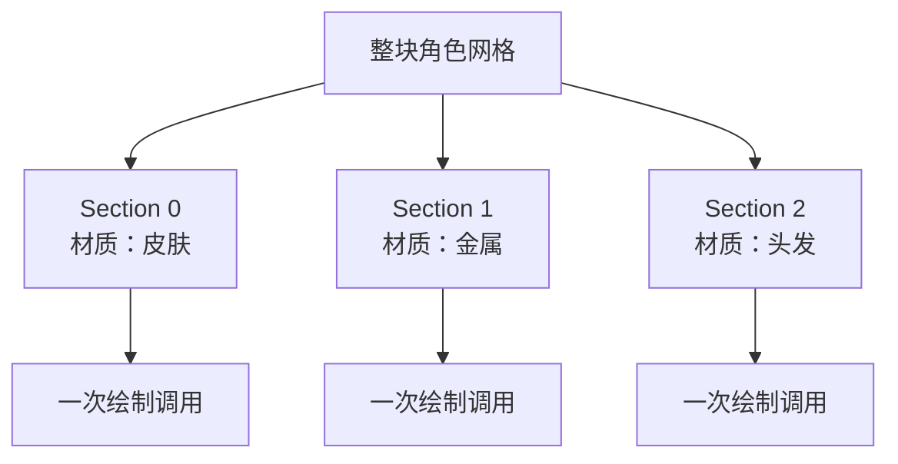

> [[Notes/动画系统/索引|← 返回 动画系统索引]]

# 骨骼网格的数据组织

> [!todo] 本篇核心问题
> 索引缓冲、材质分区、SkeletalMesh 与 Skeleton 如何关联？

> [!tip] 先回答一个更实际的问题：需要懂多深？
> 这一篇处在**资产准备阶段**——调动画时你不会直接打开它，但它决定了**你的角色为什么会卡**，也解释了资产管线里几条看着莫名其妙的规矩：
> 1. 网格是按材质切成几段的（Section），每一段就是一次绘制调用。
> 2. 顶点和三角形是分开两份数据存的（顶点表 + 索引表），顶点因为法线/UV 不同还会被拆成好几份。
> 3. 每顶点还要额外背一份权重数据，它是顶点侧最占内存的一份。
> 4. 网格和骨架是两份资产、网格引用骨架，所以换骨架要重绑、多副皮能共享同一套动画。
>
> 这四条的**后果与账面数字展开在下面各节**，这里只列清单。顶点缓冲怎么在 GPU 端布局、LOD 怎么生成，属于"知道即可"——不看完全不影响。

## 为什么需要解决这个问题

前面几篇讲的都是**单个顶点**和**单根骨骼**的事：顶点拴着几根骨骼、蒙皮矩阵怎么算、加权求和怎么得到最终位置。这些结论都对，但它们默认了一件已经被解决好的事——**运行时要按什么单位，把这些数据送给 GPU？**

最朴素的做法是"整个模型一次送过去"，一次绘制调用画完。它能跑，但会当场撞上墙：**一次绘制调用只能用一份材质**。所以只要角色身上用的是同一个材质，整块模型确实能一次画完——可一旦角色身上有块护甲用另一种材质、脸用第三种、头发用第四种，这个方法就只能二选一：要么全用同一个材质（美术不干），要么**整份网格的所有顶点在同一帧里被重传好几遍**（每换一次材质重传一次），带宽直接爆掉，帧率断崖式下跌。

那么反过来，一个顶点一次绘制调用呢？更荒谬：几万次绘制调用，每次画三个点——CPU 提交开销就能把帧率钉死在个位数。

所以真正的问题不是"怎么把网格送出去"，而是：**按什么单位切分这份网格，才能既让每个绘制调用只用一份材质，又不浪费顶点？** 这里先给一个数量级——一个真实的角色是**几万个顶点、几十根骨骼、几种材质**。本篇要回答的，就是这个切分单位长什么样，以及网格与骨架这两份资产是怎么挂到一起的。

## 直观理解：一本图册借给一个"一次只能拿一瓶颜料"的画家

用一个贯穿全篇的比喻。（法线和 UV 是顶点上的两项属性：**法线**是"这个点朝哪边"，光照靠它算出明暗；**UV** 是"这个点该取贴图上的哪一处"，决定了皮上贴的图案怎么铺——两者都与本条主线无关，只是先给个说法。）

**顶点缓冲是一本图册**：里面一页一个顶点，写着它搁在哪、朝哪边（法线）、贴着哪块图（UV）、以及拴着哪几根骨骼（权重）。**索引缓冲是另一本小册子**：每一行写三个页码——"第 5 页、第 12 页、第 7 页这三个点连成一个三角形"。GPU 拿着这两本册子，就能把几万个点拼成一张皮。

**画家每次只能拿一瓶颜料**。这就是绘制调用的硬规矩：他画一页之前先拿一瓶颜料（材质），画完这页，换下一瓶才能继续。所以整本书**必须按颜料切成几叠**——"这几页都用青铜色"，装订成一叠递给他；"这几页用肤色"，另一叠。这就是**材质分区（Section）**：不是美术按部位分的，是**流水线按颜料分的**。颜料种类越多，他要放下笔换瓶子的次数就越多——这就是章节里每一种材质都要多付一份开销的来源。

**骨架是另一本册子，而且是别人家的。** 图册（网格）自己只有"页码"（骨骼索引），不知道页码对应哪根骨头、这骨头又是谁的父级。它得去借"骨架那本册子"——册子上写着骨骼叫什么、谁是谁的父级、标准姿势长什么样。于是**同一本骨架册子可以借给好几本图册**：角色的普通版、破损版、换了装备的版本，各自一本图册，共用同一本骨架、同一套动画。


数据流位置：本篇处在**资产准备阶段**——它不产出一帧姿势，但决定了"姿势数据最终以什么单位被消费"。"顶点缓冲""索引缓冲"这两个词还完全没解释就先出现在比喻里，先记个印象就行，下面「核心机制」会正式讲它们。前一节 [[Notes/动画系统/蒙皮与骨骼网格/蒙皮矩阵：从骨骼姿势到顶点变形|蒙皮矩阵]] 算出的是"每根骨骼一个 3×4 矩阵"（几十项），本篇看到的是消费端的另一头：**几万个顶点、切成若干段、每段用自己的材质和骨骼子集**。两者接上，才有了 GPU 上的顶点变形。

## 核心机制

### Section：按材质切出来的绘制单位

先补两个上文一直借用、但还没正式交代的词（它们对应上文那两本"册子"）：

- **顶点缓冲（Vertex Buffer）** = 顶点表：每个顶点一条记录，写它的位置、朝向、贴图坐标，以及拴着哪几根骨骼。
- **索引缓冲（Index Buffer）** = 三角形表：每三个数拼一个三角形，数就是顶点表里的下标。
- **绘制调用（Draw Call）** = CPU 对 GPU 的一句"照这份顶点表、这份索引缓冲、配这份材质，画一次"。

先说清楚一段 Section 手里有什么。它是"网格的一个切片"，切完之后这段自带四样东西：

| Section 持有的 | 用来干什么 |
| :--- | :--- |
| 一个 **材质** | 这段的颜料。一次绘制调用只用这一个 |
| 一段 **索引缓冲** | 这段包含哪些三角形（用一个偏移 + 三角形个数表示） |
| 一段 **顶点范围** | 这堆三角形引用的顶点落在哪个区间 |
| 一张 **BoneMap**（骨骼子集表） | 这段顶点**可能用到**的骨骼，映射成段内的局部编号 |

```cpp
// flags: -O0 -g

// 网格被按材质切成的每一段（表达结构，不求可运行）
struct MeshSection {
    int32_t MaterialIndex;   // 本段用哪一份材质——一切切分的源头
    int32_t BaseIndex;       // 本段的三角形从索引表第几项开始
    int32_t NumTriangles;    // 本段有多少个三角形
    int32_t BaseVertex;      // 本段顶点在顶点表里的起始下标

    // 本段顶点可能用到的骨骼，映射到段内 0..N-1 的局部编号
    std::vector<int32_t> BoneMap;
};
```

**为什么切分的依据必须是材质，而不是"胳膊一段、腿一段"？** 因为绘制调用是**唯一能换材质的粒度**——材质是跟着绘制调用走的参数，不是跟着模型文件走的。于是"角色身上有几种材质"直接等于"画这个角色要几次绘制调用"。这就是那句工程结论的由来：

> **角色身上材质数越少越好。** 把头发、脸、衣服的材质合并成一张共用贴图（俗称"材质合并 / Atlas"），换来的是绘制调用次数成倍下降——这是"角色材质合并"这个优化项存在的全部理由。

这句结论会在这篇的每一节里反复兑现：Section 按它切、BoneMap 按它省、LOD 按它降。落到项目里就是一条评审动作：**做角色规格评审时先数一数材质数**。



### 索引缓冲：一个顶点被好几个三角形共用

现在看那个"没切之前"的问题：**顶点和三角形为什么不能写在同一条记录里？**

先补一个上文一直在用、却还没交代的词：**权重**是每个顶点额外背的一组数——"我这个点受哪几根骨骼影响、各占几成"（详见 [[Notes/动画系统/蒙皮与骨骼网格/顶点权重与蒙皮算法#权重是什么：每个顶点自带的一张小票|权重是什么]]）。记住这个，下面那张顶点表才读得通。

最直白的做法是"每个三角形写全它的三个顶点"，每条记录自带三个位置、三个法线、三个 UV。这样确实不需要索引表，但代价是**同一个空间位置会被好几份重复的记录描述**。一个立方体有 8 个角、12 个三角形：按"三角形自带顶点"的写法要写 36 份位置；按"顶点表 + 索引表"的写法，位置只写 8 份，另外 36 行只写"用第几号顶点"。**顶点越是被多个三角形共用，索引表省下来的就越多**，而真实角色身上绝大多数顶点都被 4~6 个三角形共用。

所以这两份数据是分开的：

```cpp
// flags: -O0 -g

// 顶点表：一页写一个顶点的全部属性
struct Vertex {
    Vec3     Position;
    Vec3     Normal;               // 法线：用于光照
    Vec2     UV;                   // 贴图坐标
    uint16_t BoneIndex[4];         // 拴住它的骨骼编号
    float    Weight[4];            // 每根骨骼的松紧
};

// 索引表：每三个数拼成一个三角形，数就是顶点表里的下标
struct IndexBuffer {
    std::vector<uint32_t> Indices;   // 长度 = 三角形个数 × 3
};
```

省内存只是它的一半好处，另一半更实用：**改一个顶点，等于改所有引用它的三角形**。想微调一下鼻子的形状，不用去 20 个三角形里各改一遍——改一次顶点表就够了。这也是编辑器里"框选几个点、整体拖一下"能立即生效的原因。

**但天下没有白拿的好处。** 索引表能成立的前提是"共享同一份顶点属性"——也就是那几个三角形对这个点的**法线、UV、权重都完全一样**。而现实里最常见的情况恰恰是不一样：

- **硬边**。想让立方体的棱角看起来是锋利的，就必须让那条棱在两侧各有**不同的法线**（一个朝左、一个朝上），否则光照会把它算成一个圆滑的过渡。同一个位置坐标、两个不同法线，**没法共用一条顶点记录**——只能**把顶点拆成两份**。
- **UV 接缝**。一张贴图在角色身上包一圈，接缝处左右两侧需要贴图的不同位置，UV 不同，同样得拆。

于是就有了那句常被新人误会的事：**"这个模型才 8 个角，怎么显示 24 个顶点？"**——因为"顶点数"统计的从来不是几何上有几个位置，而是**这条流水线要处理多少条顶点记录**。顶点被拆得越多，顶点着色器要跑的活就越多。所以美术让人"把硬边软掉一点、合并一下接缝"时，省下的正是这部分。

### 顶点权重住在哪：和位置法线并列的一等公民

权重（每个顶点拴着哪几根骨骼、各多紧）**是逐顶点的数据**，所以它和位置、法线一样，**住在顶点表里**——要么混在同一个顶点结构里（`Vertex` 的那个 `BoneIndex[4] / Weight[4]`），要么单独放一份"权重缓冲"，但仍按顶点下标一一对应。

**为什么值得单独说这件事？因为它是最占内存的那一份。** 位置 12 字节、法线 12 字节、UV 8 字节，而 4 组「索引 + 权重」就是 16~32 字节——**一份权重数据的体积跟位置、法线加起来差不多大**，而且它乘的是几万这个数：

| 每顶点骨骼数 | 每顶点绑定数据 | 3 万顶点的一个角色 |
| :-: | :-: | :-: |
| 4（索引 2 字节 + 权重按 8 位归一化） | 16 字节 | 0.5 MB |
| 4（索引 4 字节 + 权重按 32 位浮点） | 32 字节 | 1 MB |
| 8（同上，32 位） | 64 字节 | 2 MB |

这就是"每顶点骨骼数上限 4""权重用 8 位整数归一化表示"这类压缩方案存在的理由——也正是 [[Notes/动画系统/角色资产与骨骼基础/骨骼网格与蒙皮：顶点怎么绑到骨骼上#为什么要限制"每顶点最多几根骨骼"|每顶点骨骼数上限]] 说的那件事的另外一面：**在资产侧它是"每顶点最多几根"，在运行时侧它就是一个内存与带宽的账面数字。** 差别在于，8 位归一化的权重只有 256 级精度：关节附近那几个顶点，权重差 1% 就可能看出过渡的棱。（那篇的标题用的是中文引号 `“”`——如果这里的锚点跳不到位置，说明 Obsidian 对标题里的弯引号做了转义，直接翻到那篇的「核心机制」一节即可。）

### LOD：同一角色做几套网格

上面每一节的账都算在同一个数上——**顶点数**。既然贵在顶点，那就从顶点上省。

一个角色站在二十米外时，屏幕上只占几十个像素——却还在跑几万个顶点的蒙皮，纯属浪费。所以同一角色通常做几套网格：**高模（近景）、中模、低模（远景）**，按屏幕占比切换，这叫 **LOD（Level of Detail，细节层级）**。

这里有一条关键事实值得记住：**LOD 切换只换网格，不换骨架。** 顶点数从 3 万掉到 5 千，骨骼还是那 60 根，动画数据一个字都不用重做。

这件事能成立，靠的正是上一篇 [[Notes/动画系统/角色资产与骨骼基础/骨骼的本质：从骨架到 Skeleton 资产#关键决策：为什么必须把 Skeleton 拆成独立资产|为什么必须把 Skeleton 拆成独立资产]] 里讲的解耦：**动画描述的是运动，网格描述的是外形**。运动数据不知道也不关心这具身体有几万个顶点。反过来说，如果骨架是焊死在网格里的，那每降一级 LOD 就得重做一套动画——这就是"骨骼与网格解耦"带来的最实际的一笔收益。

> [!note]- 想深究：LOD 的边角
> 低模的顶点位置和权重是**重新生成的**（工具做简化），所以低模的关节过渡通常会比高模粗糙一点——远景看不出来，但如果你把镜头怼近一个远处角色，可能看到关节处有点塌。另外蒙皮开销本身也有 LOD（骨骼数多的角色在远处可能只更新部分骨骼）。这些属于"知道有这么回事"，项目里通常由引擎和资产管线的默认设置处理，不读不影响。

### Mesh 与 Skeleton：一份骨架，多副皮

切分单位（Section）、顶点数据（顶点表 + 索引表 + 权重）、省钱手段（LOD）都讲完了，还剩开头留下的最后半个问题：**网格和骨架这两份资产，到底是怎么挂到一起的？**

一句话：**Mesh 引用一个 Skeleton**，各出一半信息。

- **Skeleton 提供"骨骼 → 层级"的运动骨架**：骨骼叫什么名字、谁是谁的父级、参考姿势长什么样。动画资产挂在它身上。
- **Mesh 提供"顶点 → 骨骼"的绑定关系**：每个顶点拴着哪几根骨骼、权重多少，以及外形本身（位置、法线、UV、材质）。

因为骨骼的**名字和层级**是 Skeleton 出的，而权重里的骨骼索引是**相对于自己引用的那个 Skeleton** 的，所以：

> **一套 Skeleton 能被多个 Mesh 共享。** 同一角色的普通版 / 破损版 / 换装备版可以各是一份 Mesh，共用同一套骨架和同一套动画。这就是"换装备不用重做动画"的实现方式。

```cpp
// flags: -O0 -g

// 运动与外形各占一半：靠"引用同一份 Skeleton"接起来
struct SkeletonAsset {
    std::vector<BoneInfo>  Bones;      // 名字 + 父级索引
    std::vector<Transform> RefPose;    // 参考姿势（骨骼长度、比例也在这里）
};

struct MeshAsset {
    const SkeletonAsset*   Skeleton;   // 引用，不是拷贝——这是共享的关键
    std::vector<Vertex>    Vertices;   // 顶点表（含每顶点的骨骼索引 + 权重）
    std::vector<uint32_t>  Indices;    // 索引表
    std::vector<MeshSection> Sections; // 按材质切出来的段
};
```

**注意那个索引是相对的。** 权重里存的"第 7 根骨骼"，指的是**这份 Mesh 引用的那本骨架册子里的第 7 项**。由此推出两条项目里天天遇到的约束：

- **两个 Mesh 引用同一份 Skeleton 时**，同一个索引在两份 Mesh 里指的是同一根骨骼，权重可以互相参考；
- **一旦 Skeleton 被改了结构（改名 / 加骨骼 / 删骨骼 / 调整顺序）**，所有引用它的 Mesh **都要重新绑定**——因为索引是"册子上的页码"，册子换了内容，页码指的东西就变了。

## 边界与坑

- **BoneMap：只把用得上的骨骼传给 GPU。** 上面说 Section 自带一张"本段可能用到的骨骼"表，原因在这里：骨架可能有 **120 根**，但一段"金属护甲"只用到**其中 8 根**——胸口、肩膀、手臂。如果照直把 120 根骨骼的蒙皮矩阵全传上去，等于**为了 8 根骨头传了 15 倍的数据，每次绘制调用都这么传一遍**。

  所以顶点里的骨骼编号存成**段内局部编号**（0 表示"我这段用到的第 0 根骨骼"），渲染前再用 BoneMap 映射回骨架的全局编号。于是每次绘制调用只需要传**这几十根**用得上的蒙皮矩阵——**这是必须懂的性能细节**：它不是"省一点"，而是把每次绘制调用的常量数据量从"全骨架"压到"实际用到的子集"，绘制调用越多收益越大。

  ```cpp
  // flags: -O0 -g

  // 渲染一段时：段内局部编号 → 骨架全局编号 → 蒙皮矩阵
  // 只上传这一段真正用到的那几根，而不是全部骨骼
  void GatherBoneMatrices(const MeshSection& sec,
                          const std::vector<Matrix3x4>& allBoneMatrices,
                          std::vector<Matrix3x4>& outLocalMatrices) {
      outLocalMatrices.resize(sec.BoneMap.size());
      for (size_t i = 0; i < sec.BoneMap.size(); ++i)
          outLocalMatrices[i] = allBoneMatrices[sec.BoneMap[i]];
  }
  ```

  顺带一提，同一份 BoneMap 还能干第二件事：**骨骼裁剪**。哪些骨骼完全没被任何 Section 用到，这一帧就可以跳过它的动画求值与矩阵计算。

- **绑错了骨架 → 顶点乱飞。** 换了骨架（或改了骨架结构）却忘记给网格重新绑定，是最难一眼看出的资产事故之一：权重里的"第 7 根骨骼"在新骨架里指向了另一个部位，**每个顶点都按错误的骨头被拽**。表现不是崩溃，而是模型**整块扭曲、尖刺朝外炸开**——此时权重表看着一切正常，因为错的不是数值，而是它对应的对象。**"改骨架 → 重绑所有 Mesh"** 是硬规矩。

- **权重指向了不存在的骨骼。** 如果权重里的骨骼索引越界（数据损坏、版本不匹配、骨架被删了骨骼），那一项会被忽略或退化成不动——表现是**有几个顶点死死钉在原地**，角色跑远了它们还留在半空。

- **顶点数与骨骼数的量级差。** 角色常见是 **60~200 根骨骼、几千到几万顶点**——顶点是骨骼的**几十到几百倍**。这个数字决定了整条链路的性能分布：动画求值只需要处理几十根骨骼的变换（便宜），而蒙皮要对**几万个顶点**各算一次加权求和（见 [[Notes/动画系统/蒙皮与骨骼网格/顶点权重与蒙皮算法#LBS：先各自变换，再加权平均|加权求和]]）。**"蒙皮比动画求值贵得多"** 这个结论就是从这一页的数量级直接读出来的，也是后面求值管线篇里所有优化取舍的前提。

- **材质数 = 绘制调用数。** 承接上面那条工程结论：美术为了效果给角色加了第 7 种材质，代价是每个角色每次可见多一次绘制调用；场景里有 50 个角色，就是多 50 次。**不需要等到出问题才数，做角色规格评审时就该数一遍。**

## 参考实现（UE）

| 引擎 | 对应模块/数据结构 | 具体体现 |
| :--- | :--- | :--- |
| UE | `FSkeletalMeshLODRenderData`（`Rendering/SkeletalMeshLODRenderData.h`） | 承载单个 LOD 的全部渲染数据：这一级的顶点缓冲、索引缓冲与 `RenderSections`（Section 数组）——即本篇"按 LOD 做几套网格"的落地形态 |
| UE | `FSkelMeshRenderSection` | 就是本篇的 Section：`MaterialIndex`（材质）、`BaseIndex`（三角形在索引缓冲中的起始）、`NumTriangles`、`BaseVertexIndex`（本段顶点在顶点缓冲中的起始）、`NumVertices`，以及 `BoneMap`——Section 级骨骼子集表，供 GPU 蒙皮时只上传用得上的骨骼矩阵。另外还带 `ClothingData` / `ClothMappingDataLODs` 等布料绑定数据 |
| UE | `FSkinWeightVertexBuffer`（`Rendering/SkinWeightVertexBuffer.h`） | 承载"每顶点骨骼索引 + 权重"，支持多种精度配置——`SetMaxBoneInfluences` 定每顶点骨骼数、`Use16BitBoneIndex` / `Use16BitBoneWeight` 定索引与权重位宽，并按 LOD 切换——见 [[Notes/UE/第四阶段-客户端运行时层/UE-Engine-源码解析：骨骼与重定向\|UE 骨骼与重定向]] |
| UE | `USkeletalMesh` → `USkeleton` | Mesh 资产持有对 Skeleton 资产的引用，共享同一骨架的多副网格共用一套 `FReferenceSkeleton` 与动画资产；编辑器侧的 LOD / Section / Skin Weight 编辑与重建由 `FSkeletalMeshRenderData` 触发——见 [[Notes/UE/第五阶段-编辑器层/UE-SkeletalMeshEditor-源码解析：骨骼网格编辑器\|UE SkeletalMesh 编辑器]] |
| UE | `FBoneContainer` 的索引空间 | 骨架索引、网格索引、紧凑姿势索引三套索引空间各自强类型化，运行时做显式映射——本篇"Mesh 的骨骼索引相对自己的 Skeleton"这条约束，在 UE 里被拆成了三个明确的索引空间来防错，见 [[Notes/UE/第四阶段-客户端运行时层/UE-Engine-源码解析：骨骼与重定向\|UE 骨骼与重定向]] |

顺带对照下本篇的两个数：UE 里 Section 的 `MaxBoneInfluences` 默认值就是 **4**，而 `FSkinWeightVertexBuffer` 的索引与权重都可以缩到 **8 位**——本篇讲的"4 根上限"和"256 级精度"，在源码里就是这两个默认值。

## 一句话总结

网格不是"一坨顶点"直接送出去的：它按**材质切成若干 Section**（每种材质一次绘制调用，所以材质数越少越好），顶点与三角形分成**顶点表 + 索引表**两份以便复用（代价是硬边和 UV 接缝处的顶点必须拆成多份），每顶点还要额外背一份**权重数据**——它和位置法线同量级，是最占内存的一份；同时网格通过**引用一份 Skeleton** 来拿到骨骼层级，于是同一副骨架能共享给多副皮、LOD 降级也不必重做动画。**顶点是骨骼的几十到几百倍**这个数量级，就是"蒙皮比动画求值贵得多"的根源。

---

**下一篇**：[[Notes/动画系统/动画播放与混合/动画播放器：生命周期与时间模型|动画播放器：生命周期与时间模型]]——资产这边的账算清了（几万个顶点、切成几段、挂在哪副骨架上），接下来回到运行时：一段动画怎么被"播"起来，Play / Pause / Loop 的时间到底由谁推进。
