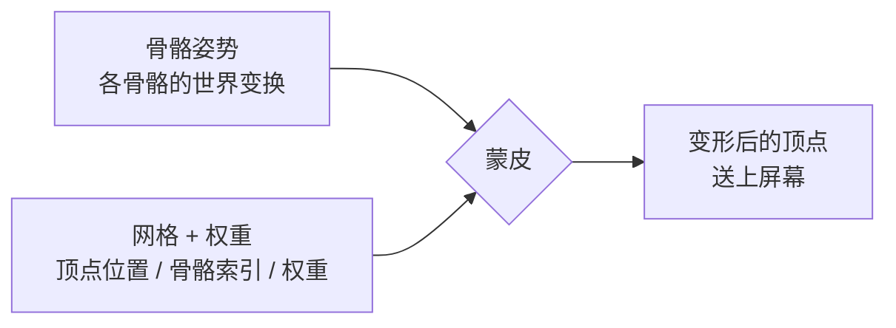

> [[Notes/动画系统/索引|← 返回 动画系统索引]]

# 骨骼网格与蒙皮：顶点怎么绑到骨骼上

> [!todo] 本篇核心问题
> 一堆顶点是怎么"绑"到骨骼上的？为什么一个顶点可以同时受多根骨骼影响？

> [!tip] 先回答一个更实际的问题：需要懂多深？
> 调动画时你对"蒙皮"的全部需求是：
> 1. **知道两套数据是分开存的**——骨骼是几十根骨架，网格是几万个顶点；"骨头动了顶点跟着动"不是天然成立的，是靠一层额外数据**绑**出来的。
> 2. **知道这层数据叫权重，是美术刷出来的**——所以关节塌陷、肩膀压瘪、手脚穿模，第一嫌疑人是权重而不是动画曲线。
> 3. **知道每顶点骨骼数有上限（常见 4 根）**，以及为什么要有上限。
>
> 至于权重在内存里怎么排布、DQS 怎么算，前者归"参考实现"，后者只值一句话——不看完全不影响调动画。

## 为什么需要解决这个问题

上一篇 [[Notes/动画系统/角色资产与骨骼基础/骨骼的本质：从骨架到 Skeleton 资产|骨骼的本质：从骨架到 Skeleton 资产]] 讲了骨架这件事：角色内部有几十根骨骼，一层套一层，每根存一个相对于父级的局部变换。但骨架终究只是**几十根坐标架**——而屏幕上一个角色是**几万个顶点**拼出来的一张皮。

问题就出在这个数量差上：**骨架动起来的时候，那张皮凭什么跟着动？**

最朴素的想法是：每根骨头分一块皮，"这根骨头负责这部分顶点，那根骨头负责那部分"。这个想法在**腿、胸口、脑门**这些地方完全够用——那些地方整块肉只属于一根骨头，跟着它走就好。

但在**肩膀**上，它会当场崩掉。抬起手臂的时候，肩膀这个位置既不属于大臂、也不属于胸腔：如果那里的顶点全归大臂管，抬臂时整块肩肉会跟着翻上去，腋下被撕开一道口子；如果全归胸腔管，抬臂时那里纹丝不动，大臂像**插进肩膀里捅出来**的一根棍子。表现出来就是关节处**撕成两半**——也就是老式机器人玩具给人的感觉，因为真人的关节处根本没有"纯粹属于某一块骨头"的皮肤。

所以需要一种机制，让关节附近的顶点**同时听两根（甚至更多）骨头的**——抬臂时肩上的顶点只抬起 60%，剩下 40% 还留在胸腔那边，皮就自然地"过渡"过去了。

这套机制就是 **蒙皮（Skinning）**，字面意思就是"给骨架糊上一层皮"；而"每个顶点分别听哪几根骨头、各听多少"这份记录，就叫 **蒙皮权重（Skin Weight）**，通常简称**权重**。把网格和骨架绑定起来建立这份记录的过程叫**绑定（Binding）**——建模软件里那个"给模型绑骨架"的按钮干的就是这件事。后面你会频繁看到"绑定数据""绑定姿势"这些词，它们都是从这里来的。

与之配套的还有一个必须钉死的词：**绑定姿势（Bind Pose）**，也叫**参考姿势**——就是"绑定发生的那一刻，角色摆的是什么姿势"。绝大多数是双臂水平打开的 T-Pose。为什么它重要？因为每个顶点记下的坐标，是**在绑定姿势下量出来的**（"我当时离这几根骨头多远"），所以后人每次要算"这个顶点现在该在哪"，都得拿它去和绑定姿势比对。这套换算的完整公式归 [[Notes/动画系统/蒙皮与骨骼网格/蒙皮矩阵：从骨骼姿势到顶点变形|下一篇]]，这里先记住它的身份：**绑定姿势是所有蒙皮计算的基准快照**。

## 直观理解：橡皮筋

用一个贯穿全篇的比喻：**每个顶点身上，都拴着几根看不见的橡皮筋，每根橡皮筋的另一头系在一根骨骼上。**

骨骼动，系在它上面的橡皮筋那头就跟着走，顶点被**拽**过去一段。拴的橡皮筋不止一根时，顶点最终的落点，取决于**谁的皮筋更"强势"**——也就是权重：

- 某根骨骼的**权重是 0.9**，它动多少，顶点几乎就跟着走多少（皮筋拉得紧，顶点基本听它的）；
- 某根骨骼的**权重是 0.1**，它动 10 厘米，顶点只挪 1 厘米（皮筋很松，几乎拽不动）。

这里藏着一条调动画时天天要用的规律，值得单独拎出来：**顶点被拽动的距离 = 骨骼的位移 × 权重**。所以一个骨骼 50% 权重、50% 权重的顶点，在这根骨骼位移 50 厘米时会挪动 25 厘米——**它永远只走一半的路，永远追不上这根骨头**。后面你会看到，很多"皮被拉扯"的怪相都是这条规律直接推出来的后果。

于是"一个顶点受多根骨骼影响"这件事，就变成"这个顶点身上拴了几根皮筋、每根多紧"。肩膀上的顶点，就是在大臂（0.6）和胸腔（0.4）之间被两边一起拽——抬臂时它抬起六成，皮就这样过渡过去了，腋下不会被撕开。

最后说明这份数据存在哪儿：**它和骨骼数据是分开存的两套东西。** 骨架那边存的是"每根骨骼此刻的变换"（几十根，由动画驱动）；网格那边存的是"每个顶点的坐标"（几万个，建模时定死）；而**权重是挂在顶点上的第三份数据**——骨骼数组里没有"我影响了哪些顶点"这种字段，是**顶点反过来记着"我听哪几根骨骼的"**。这个方向很关键，因为后面很多结论（比如权重不会随动画传播、换角色要换网格）都是从"权重住在网格里"推出来的。



数据流位置：本篇是**资产准备阶段**——动画还没跑起来的时候就定好的一层数据。它不参与播放，但它决定了"骨骼姿势"和"屏幕上的皮"怎么挂钩。下一站 [[Notes/动画系统/蒙皮与骨骼网格/蒙皮矩阵：从骨骼姿势到顶点变形|蒙皮矩阵]] 就是这条链路的执行者：拿骨骼姿势和这里存的权重，把顶点真正算到新位置。

## 核心机制

### 顶点多了两组数：骨骼索引 + 权重

先看清楚这一站吃的和吐的是什么：输入的**骨骼那一侧**是每根骨骼一个世界变换（几十个）；输入的**网格那一侧**是每个顶点的位置、法线、UV 等建模时就定死的属性（几万个）；输出则是**每个顶点变形后的位置**。中间那层把两侧接起来的数据，就是本篇的主角——**每个顶点额外存的若干组「骨骼索引 + 权重」**。

把它和上一篇的骨架对照一下，"两套数据分开"这件事就清楚了：

| | 骨架（Skeleton） | 网格（Mesh） |
| :--- | :--- | :--- |
| 存的是什么 | 每根骨骼的名字、层级、参考姿势 | 每个顶点的位置、法线、UV |
| 谁在用 | 动画曲线按名字驱动它 | 蒙皮要变形的是它 |
| 数据量级 | 几十到一百多根 | 几千到几万个顶点 |
| 结构 | **规则的**——每根骨骼的数据规格一模一样，只差数值 | **不规则的**——每个顶点的索引、权重分布、UV 都是这一副皮专属的 |

最后一行是理解后面所有取舍的关键：**骨架是规则数据，网格是不规则数据**——所以换一副皮，顶点那侧的任何一个数字都沿用不了；而换一个角色，只要骨骼规格一致，动画照样能用。权重住在**不规则**的那一侧，这就是它不能跟着动画走的原因。

顶点额外存的东西就是两组数：**一根骨骼的编号（索引），加上一根橡皮筋的松紧（权重）**。因为一个顶点可以拴多根，所以这两组数是**成对出现的若干份**：

```cpp
// flags: -O0 -g

// 一个顶点最朴素的全部信息（UV、法线等与蒙皮无关，略）
struct SkinVertex {
    Vec3 Position;                 // 绑定姿势下的位置（建模时的样子）
    // 以下是"绑定数据"：成对出现，最多 MaxInfluences 组
    uint16 BoneIndex[4];           // 拴住这个顶点的骨骼编号
    float  Weight[4];              // 每根骨骼的松紧，四条加起来必须 = 1
};
```

**权重之和必须是 1，这不是风格要求，是数学要求。** 直觉上很好理解：橡皮筋的总"牵引力"被规定为 1，如果加起来是 0.5，这个顶点就只被拽了一半——**骨骼动 10 厘米，它只跟 5 厘米**，于是身上的皮和骨架逐渐脱节、**这块皮像是没跟上，向原地塌回去**；如果加起来是 1.5，它会被拽过头——表现成**往外鼓、发胖**。所以绑定数据在导出时会被归一化，读入时也要检查。

### 为什么要限制"每顶点最多几根骨骼"

上面写死了 4。这个 4 不是随便定的，它是一道**内存与性能的硬约束**，而算这笔账的人算的不是骨骼数，是顶点数。

关键在于**数量级的差距**：一个角色典型是**几千到几万个顶点**、**几十到一百多根骨骼**。骨骼比顶点少两三个数量级。而"额外能影响的骨骼"这件事，代价全记在**顶点那一侧的数据**上——顶点多，账就贵：

每多允许一根骨骼，**每个顶点**就多一份"索引 + 权重"（4 字节的索引 + 4 字节的权重，按 8 字节算）：

| 每顶点骨骼数 | 每顶点绑定数据 | 一个 3 万顶点角色 | 200 个角色的场景 |
| :-: | :-: | :-: | :-: |
| 2 | 16 字节 | 0.5 MB | 96 MB |
| **4** | **32 字节** | **1 MB** | **192 MB** |
| 8 | 64 字节 | 2 MB | 384 MB |
| 16 | 128 字节 | 4 MB | 768 MB |

这还只是内存。渲染时每个顶点都要把这几根骨骼挨个算一遍，**每顶点骨骼数直接乘在顶点着色器的工作量上**。所以工程上的取舍是：**4 根够用**——真实角色身上，绝大多数顶点只需要 1~2 根骨骼（大腿中段只跟大腿走），只有关节附近的顶点才需要挤满 4 根。用 4 已经能把关节过渡做得很顺，再往上加，代价翻倍而质量提升微乎其微。

于是渲染管线里常见几档精度，是按"每顶点骨骼数 + 数值用多少位存"分的：

| 档位 | 每顶点骨骼数 | 典型用途 |
| :--- | :-: | :--- |
| 低/中精度 | 1~4 根（权重按 8 位整数存，骨骼索引按 8 位存） | 小怪、远景角色、LOD 后几级 |
| 高精度 | 4~8 根（权重按 16 位存） | 主角、特写镜头里的脸部与手部 |

这里还有一个会真咬人的坑：**骨骼索引的位数要够装下你的骨骼总数**。8 位索引最多表示 256 根骨骼——超过这个数就必须切到 16 位，否则索引会在 256 处绕回去，导致**某几根骨骼莫名其妙地去驱动了别人的皮**。这不是你手动改的，是导入/构建时算出来的（见文末「参考实现」里的 `Use16BitBoneIndex`），但反过来，**加载时骨骼数对不上、索引越界的报错，往往就是从这类精度档位不匹配来的**。

### 权重是美术刷出来的

这一节只有一句话，但它大概是本篇最能省下你时间的一句：

> **权重不是自动算出来的，是美术在 DCC 工具里亲手刷出来的。**

导出时工具会提供一个自动算法给出初始权重（大致相当于"离哪根骨头近就多听谁的"），但那只是**起点**。自动算法在关节处给出的结果往往塌陷，真正的可用权重靠美术用笔刷**一笔一笔涂**：这块皮该多听大臂一点、那块该少听一点。

为什么这句话重要？因为它**改变了你排查问题的方向**：

- 角色**抬手时肩膀压瘪、手肘内弯时鼓成一个球、转腰时腰上的皮拧成一团**——第一嫌疑人是**权重**，不是动画曲线的数值。你调那条曲线调一天也没用，得让美术回去刷这几十个顶点。
- 同一套动画换到另一个体型不同的角色上就穿模——也常见是**两套网格的权重是分开刷的**，其中一套刷得不到位。
- **权重是网格资产的一部分，不会随动画资产传播**。所以"这套动画在 A 角色上好看、在 B 角色上难看"，把动画复制来复制去是没用的，要看 B 的网格。

> [!warning] 一个新手常有的误解
> "自动生成权重"的按钮点下去，出来的东西看起来能用——**直到关节弯曲角度大起来**。自动算法擅长处理"皮离哪根骨头近"，却处理不好"皮该以什么比例分摊给两根骨头"。绑定的质量要在**极端姿势下检查**（手臂抬到最高、膝盖弯到最深），而不是在绑定姿势下看。

### 线性混合蒙皮：加权求和

现在把橡皮筋的比喻翻译成算法。

结合上一节的表格，蒙皮做的事可以一句话说清：**顶点最终位置 = 各骨骼的变换分别作用在顶点上，再按权重加权求和**。

```cpp
// flags: -O0 -g

// 线性混合蒙皮（Linear Blend Skinning，LBS）
// Bone[i].SkinMatrix 是该骨骼"从绑定姿势到当前姿势"的变换（下一站详解）
Vec3 SkinVertex(const SkinVertex& v, const Bone* bones) {
    Vec3 result = { 0, 0, 0 };
    for (int i = 0; i < 4; ++i) {
        if (v.Weight[i] <= 0.f) continue;      // 权重为 0 的骨骼：省掉这次矩阵乘法
        const float w = v.Weight[i];
        result += w * (bones[v.BoneIndex[i]].SkinMatrix * v.Position);
    }
    return result;
}
```

读这段代码只需要抓两件事：

1. **每一根拴住它的骨骼，都独立算一次"如果只由我拉，顶点会去哪"**——`SkinMatrix * v.Position` 算的就是这个"如果"。
2. **然后按权重加权平均**。权重 0.6 的骨骼，就占最终结果的六成。

这也是"一个顶点受多根骨骼影响"的正面回答：**它不选一根骨头，它把候选答案按比例混合**。权重为 0 的骨骼连算都不用算——这是绑定数据里最常见的优化，因为大多数顶点其实只有 1~2 根有效骨骼。

顺带回答一个常见疑问：为什么权重是**相加等于 1**、而不是别的数？因为加权平均的语义就是"把这份总量按比例分下去"——总量必须恰好是 1，分完才不亏不溢。

### LBS 的经典缺陷：弯肘时塌陷

这套方案有个**看得见**的老毛病，而且是新手最容易误判成"模型做坏了"的那种：

> **手肘弯曲角度一大（比如弯到 120°），肘窝内侧的皮就往关节轴心里"吸"进去——手臂变细、像被拧紧的糖纸；肩膀抬起来时，肩膀的皮被压瘪成一个坑。**

老动画玩家对这个现象很熟悉：早期 3D 游戏里角色弯肘时手臂会明显变细。

**为什么会这样？** 关键在于 LBS 混合的是"**结果**"，而不是"旋转"。

设想一个正好站在肘关节上的顶点，权重一半归大臂、一半归小臂。现在小臂相对大臂弯 120°：

- 如果让大臂拉它，它会待在大臂原来的方向上；
- 如果让小臂拉它，小臂转了 120°，它会跟着转过去；
- LBS 的做法是：**把这两个"落点"连成一条直线，取中间点**。

这就是问题所在——**它走的是弦，不是弧**。两个落点之间，最"正确"的路径是沿着关节画一道弧（真的转 60° 过去），而弦会**从圆弧的内部抄近路**：弯得越狠，弦离弧越远，这个顶点就被从关节表面拽向旋转中心。多个这样的顶点一起抄近路，皮就整体往轴心里塌，看着像被吸进去。

这个"弦 vs 弧"的直觉，和 [[Notes/动画系统/旋转与变换基础/四元数插值：Slerp与归一化|Slerp 与归一化]] 篇里"直接对四元数做 Lerp 会离开球面、沿弦走而不是沿弧走"是**同一回事**：线性混合天生只会走弦，而旋转是球面上的东西。这个现象有个专门的名字：**candy-wrapper effect**（糖纸效应——拧糖纸时中间那段会被拧细）。

那么，把这里的"加权平均"换成 Slerp 不就解决了吗？**解不了**，而这正是它和四元数那篇的分水岭：那篇混合的是**两个旋转**（球面上的两个点，Slerp 沿着球面大圆弧走过去，路径合法）；这里要混合的是**两个落点**（空间里的两个点，Slerp 根本无从下手）。DQS 的做法是把问题重新表述回旋转那一侧——**不混合落点，改混合"变换本身"**——于是弧又回来了。

**工程上的对策有三条，按使用频率排：**

- **靠美术刷权重缓解**（最常用）。把肘关节那圈皮**只给单根骨骼**、不给混合权重，塌陷就没有了；代价是那里的过渡会硬一点。这本质上是用"关节处少混合"换"不塌陷"，靠细节（模型的面数、关节处的褶皱造型）盖过去。
- **在多边形密度上做文章**。关节处顶点越密，"抄近路"的单点位移越小，整体看起来就越不明显——但这也意味着更贵的网格。
- **换蒙皮算法**（见下）。

### DQS：知道有这么回事就够

有一个算法上的改进方案，叫做 **DQS（Dual Quaternion Skinning，双四元数蒙皮）**。

一句话说清它：**把"混合顶点位置"换成"混合旋转本身"** ——它用一对双四元数来表示每根骨骼的变换，然后对这对数做插值，于是混合出来的路径是**弧**而不是弦，肘窝不会再被吸进去，弯肘时手臂保持圆润。

**知道这一句就够了**，因为：

- 多数项目**不会**去动蒙皮算法。它由引擎的渲染管线实现（GPU 上的蒙皮路径），做项目的人通常没机会选；
- 它自己也有副作用：DQS 在某些姿势下会让关节**鼓起来**（反过来"膨胀"），而且每顶点骨骼数、权重的存储与计算都更贵；
- 真正影响你下手的还是**权重**——同一套 DQS 管线，权重刷得烂照样塌。

所以在你的决策清单里，它属于"**见过这个词、知道它解决什么问题**"那一档：哪天引擎的渲染设置里出现"Use Dual Quaternion Skinning"的开关，你知道那是在用质量换一点开销就行。

> [!note]- 想深究：为什么双四元数能走"弧"
> 单四元数只能表示**旋转**，表示不了"转到哪 + 平移了多少"的完整刚体变换；双四元数把旋转与平移打包成一对数，可以直接对这对数做"球面插值"。代码里它长这样，具体机制不展开——不清楚也不影响你调动画：
>
> ```cpp
> // flags: -O0 -g
>
> // 每根骨骼的变换打包成一对数
> struct DualQuat {
>     Quat Real;    // 旋转本身
>     Quat Dual;    // 旋转与平移的耦合项（Real 的一半乘上平移）
> };
> ```

## 边界与坑

- **权重加起来不等于 1**：小于 1 时顶点跟不上骨骼的位移（**动得比骨头少**，皮逐渐和骨架脱节），大于 1 时会被拽过头、往外鼓。绑定数据导出时会被归一化，但**手改过权重、或从别处合并数据之后，一定要重新检查归一化**。
- **权重全是 0 的顶点**：它一根皮筋都没有，于是**永远停在原地**。表现是模型上有一小块皮**钉在半空不动**，角色走远了它还在原位——排查"模型上挂着一块碎片"时第一个要看的就是它。同理，权重指向的骨骼索引越界（数据损坏或版本不匹配），也常常表现为顶点乱飞或粘在一个点上。
- **绑定姿势（Bind Pose）改动会连锁**：绑定数据里的顶点位置、以及每根骨骼的"参考姿势"，都是在**某个特定姿势**下建立的。如果美术改了绑定姿势却没重新导出权重，所有以旧姿势为基准的顶点都会整体错位、关节扭在一起。所以"骨骼加一根、或者动了参考姿势之后要重新蒙皮"是资产管线里的常识。
- **关节点上的权重分布决定质量上限**：关节处如果权重过渡得**太快**（从 1 直接跳到 0），弯曲时会看到明显的**棱**；过渡得**太慢**（一大片区域都是 0.5/0.5），弯曲时会看到**整块凹陷**。这两类问题都不会报错，只会"难看"。
- **同一个顶点绑的骨骼互相离得远**（比如肩顶点同时绑了手和脊柱）：局部看是"过渡更平滑"，但骨骼一分开，这个顶点会被拉到两者中间去——典型表现是**腋下、裆部出现一条拉长的皮筋状破面**。这也是"每顶点最多 4 根"之外的一条经验规矩：**绑的骨骼要在层级上挨着**。

## 参考实现（UE）

| 引擎 | 对应模块/数据结构 | 具体体现 |
| :--- | :--- | :--- |
| UE | 骨骼权重缓冲（`FSkinWeightVertexBuffer`） | 承载"每顶点骨骼索引 + 权重"的存储载体，`SetMaxBoneInfluences` / `Use16BitBoneIndex` / `Use16BitBoneWeight` 提供精度与每顶点骨骼数配置（对应本篇的 4 根 / 8 位权重这类取舍），并按 LOD 切换 |
| UE | 网格 LOD 数据（`FSkelMeshComponentLODInfo`） | 挂在组件上的逐 LOD 蒙皮数据（顶点位置偏移与权重数据），对应"绑定数据随 LOD 精度变化" |
| UE | 网格 Section（`FSkelMeshRenderSection`） | 每个 Section 记录自己这段顶点用到的**骨骼范围**（`BoneMap` 这类映射）——本篇"每顶点 4 根"是逐顶点的上限，Section 级另外给出这一段整体用到哪些骨骼，供蒙皮与裁剪使用 |
| UE | 绑定职责链路 | 参考姿势与骨骼层级由 `FReferenceSkeleton` / `USkeleton` 定义，动画求值的输出是 `FCompactPose`（各骨骼在组件空间的姿势），两者结合才进入蒙皮——见 [[Notes/UE/第四阶段-客户端运行时层/UE-Engine-源码解析：骨骼与重定向\|UE 骨骼与重定向]] |
| UE | 编辑器侧的权重与替换 | 骨骼网格编辑器负责 LOD/Section/Skin Weight 数据的编辑，并有"替换蒙皮权重预览"（Alternate Skin Weight）这类机制，对应本篇"权重是美术刷出来、并且可以整份替换"的叙述——见 [[Notes/UE/第五阶段-编辑器层/UE-SkeletalMeshEditor-源码解析：骨骼网格编辑器\|UE SkeletalMesh 编辑器]] |

## 一句话总结

骨骼只有几十根，顶点有几万个，两者之间靠一层**绑定数据**接起来：每个顶点额外存"最多 4 组骨骼索引 + 权重"，权重和为 1，最终位置是各骨骼独立算出的落点按权重的**加权求和**；权重是美术刷出来的，所以关节塌陷（线性混合走的是弦不是弧）、模型上钉着一块不动的皮、穿模这类问题，第一嫌疑人都是它。

---

**下一篇**：[[Notes/动画系统/蒙皮与骨骼网格/蒙皮矩阵：从骨骼姿势到顶点变形|蒙皮矩阵]]——这一篇里那个反复出现的 `SkinMatrix`（把顶点从绑定姿势带到当前姿势的变换）究竟是怎么由骨骼姿势算出来的，以及为什么它必须乘上一个"绑定姿势的逆"。
