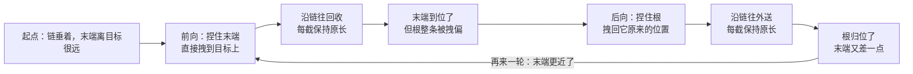

> [[Notes/动画系统/索引|← 返回 动画系统索引]]

# FABRIK与脚部IK

> [!todo] 本篇核心问题
> FABRIK 迭代怎么收敛？走斜坡/台阶时脚不穿地、不悬空怎么落地？

## 为什么需要解决这个问题

上一篇 [[Notes/动画系统/逆向运动学/逆向运动学：从末端反推骨骼姿势|逆向运动学：从末端反推骨骼姿势]] 讲了 **CCD**（Cyclic Coordinate Descent，循环坐标下降）：从末端关节开始，一根一根地拧——每次只转一根，让"末端到目标"的连线跟"当前关节到末端"的连线对齐，从尾拧到头，反复几轮就逼近目标。

它的直觉是**"一根一根地拧"**，好懂，但有两个脾气：

- **整条链容易拧成一条蛇**。每根骨骼都在自己那一圈里转，问题从哪一段来就在哪一段解决，转量全堆在末端附近那几节上。三五节的胳膊看不出来（反正外形就是弯的），**十节以上的尾巴、脊椎、触手就露馅了**：姿态像被揉过的铁丝。
- **长链上收敛慢**。每一轮只处理"当前关节→目标"这一对连线，末端每轮只挪一点，"IK 没算到位"的残留随骨头数量一起放大。

于是有人问了一个更朴素的问题：**链子够到目标，本来就是几何问题，能不能不碰角度，直接摆位置？**

**FABRIK**（Forward And Backward Reaching Inverse Kinematics，前向后向到达式逆运动学）就是对这个问题的回答。名字里的 Forward / Backward 说的是它迭代的两个方向，Reaching 说的是"伸手去够"这件事的几何本质——它整篇不讲角度，只挪关节的位置。

这篇要回答两件事：**FABRIK 怎么迭代、怎么收敛**，以及**脚部 IK 要怎么做才真的能用**——因为脚 IK 在项目里的难点从来不是"逆运动学解不出来"，而是"踩在哪、什么时候踩、踩上去像不像"。

## 直观理解：一条由小棍子串成的链子，两头来回拽

用一个贯穿全篇的比喻。

**链子由固定长度的小棍子首尾相接组成**：大腿一截、小腿一截，接头（膝、踝）就是关节。棍子长度是建模定死的常量——**这正是 FABRIK 不必碰角度的原因**：只要每根棍子的长度不变，它该怎么转，是"位置算完之后自动读出来的"。

现在你要把另一端（末端）够到目标点。想象你两只手捏住链子的两头：



- **前向阶段（Forward）**：**把末端关节整个拽到目标点上**，然后从末端往回收，每根棍子保持自己那一截的长度，依次决定上一截的接头在哪。
- **后向阶段（Backward）**：**把根关节拽回它原来的位置**，然后从根往外送，同样保持每截长度，依次决定下一截的接头在哪。

拽末端时根跑偏了，拽根时末端又跑了——**但每来回一次，末端就离目标更近一点**（它为什么会收敛，见下文"为什么姿态更自然"）。

数据流位置：本篇仍然处在动画链路「混合 → **IK 后处理** → 蒙皮」的后处理站——输入是**已经混合完成的整条腿的姿势**，输出是**同一批骨骼被修正后的姿势**。但本篇比上一篇多推了一小步：它要回答"这个姿势里每根骨骼到底该转多少"（也就是把位置翻译回旋转），还要回答"这个目标点是从哪来的"。

## 核心机制

### FABRIK：不转角度，只挪位置

先说清楚 FABRIK 的输入输出，这是它跟所有"角度型"解法的分水岭。

**输入**：一条关节位置序列 + 每根骨骼的长度 + 目标点。
**输出**：每个关节的新位置。

注意它跟动画系统的姿势数据格式**不一致**——[[Notes/动画系统/旋转与变换基础/变换层级与复合变换|变换层级与复合变换]] 讲过，姿势里每根骨骼存的是"相对父级的平移 + 旋转 + 缩放"，**根本没有存关节的世界位置**。所以用 FABRIK 得先把姿势翻成"关节位置"这种临时表示。

这里顺带交代一个后面反复出现的词：**组件空间**（Component Space）就是"以角色自己为原点的坐标系"——它比骨骼各自的局部空间大一层，比世界空间小一层。用它的理由很实在：**IK 的目标点（地面、靶子）是关卡里按世界坐标给的**，而角色的姿势是局部变换存的，两者对不上；组件空间是把这个角色内部的关节位置统一到一起之后的结果，所以它成了 IK 求解的默认工作台（详见 [[Notes/动画系统/求值管线/一帧动画求值管线#第 5 站 · 后处理：在姿势上做最后的修正|一帧动画求值管线 · 后处理那一站]]）：

```cpp
// flags: -O0 -g

// FABRIK 的链：只记关节位置和每段长度，不记角度
struct ChainLink {
    Vec3  Position;      // 该关节的当前位置（世界/组件空间）
    float Length;        // 它到父关节的距离，固定常量（骨骼长度）
};
// 注意：裸 FABRIK 不修改 Position[0]
Vec3 Solve(const std::vector<ChainLink>& chain, const Vec3& root, const Vec3& target);
// 而项目里的求解器通常会顺带调整根关节，把结果写回 root
Vec3 Solve(std::vector<ChainLink>& chain, Vec3& root, const Vec3& target);
```

**两个阶段，各扫一遍链子。** 前向阶段从末端走向根，后向阶段从根走回末端，两边做的是同一件事的镜像：

```cpp
// flags: -O0 -g

constexpr float kEpsilon   = 1e-4f;  // 收敛阈值：位置误差小于它就算到位
constexpr int   kMaxIter   = 8;      // 迭代上限：防死循环，也防"卡帧"

void SolveFabrik(std::vector<ChainLink>& chain, Vec3& root,
                 const Vec3& target, float totalLength) {
    const int tip = static_cast<int>(chain.size()) - 1;

    // 目标够不着：直接收敛到"整条链拉直指向目标"（见下文"够不着"一节）
    if (Length(target - root) > totalLength) {
        for (int i = 1; i <= tip; ++i)
            chain[i].Position = chain[i - 1].Position
                + Normalize(target - chain[i - 1].Position) * chain[i].Length;
        return;
    }

    for (int iter = 0; iter < kMaxIter; ++iter) {
        // ── 前向：末端直接拽到目标，然后一路往回"拉直"
        chain[tip].Position = target;
        for (int i = tip - 1; i >= 1; --i) {
            // 保持 chain[i+1].Length 这段的长度：从子关节出发，朝父关节的方向走回原长
            const Vec3 dir = Normalize(chain[i].Position - chain[i + 1].Position);
            chain[i].Position = chain[i + 1].Position + dir * chain[i + 1].Length;
        }

        // ── 后向：根拽回原位，然后一路往外"送"
        chain[0].Position = root;
        for (int i = 1; i <= tip; ++i) {
            const Vec3 dir = Normalize(chain[i].Position - chain[i - 1].Position);
            chain[i].Position = chain[i - 1].Position + dir * chain[i].Length;
        }

        if (Length(chain[tip].Position - target) < kEpsilon)
            break;
    }
}
```

读代码抓三件事：

① **全程没有出现过角度、矩阵、求导**。两个循环体都只有一句话："从这头出发，朝原来那个方向走，走固定长度"——**方向取自当前摆法，长度取自骨骼常量**。这就是 FABRIK 的全部机制。

② **两个阶段的顺序不能反**。前向阶段的意义是**先把末端放到正确的位置上**，后向阶段再去修根；反过来的话，最后一步落在末端上，末端的位置就没人保证了。

③ **`kMaxIter` 与 `kEpsilon` 是两个必须显式给出的常数**，不是可选优化——这是本篇「边界与坑」的第一条。

### 为什么姿态更自然：余量被摊平了

目标够得着的时候（根到目标的距离 `d` ≤ 总长），FABRIK 有一个很讨人喜欢的性质：**多出来的长度（`总长 − d`）会均匀摊到每个关节上**，而不是集中砸在末端几节。

原因就藏在两个循环的写法里：前向阶段给每根骨骼留的长度都是它**自己的原长**，等到后向阶段再走一遍，每一节都在"补"同一份多余的量——**没有任何一节被特殊对待**。所以手臂够一个不远的目标时，肩、肘、腕会分掉这份弯折，看起来像人自然伸手；CCD 则容易把这份弯折挤到肘和腕上，长链里就变成"蛇"。

> 这条是 FABRIK 最常被引用的优点。把它理解成"**欠约束的解有无数个，FABRIK 挑的是摊得最平的那个**"就够了，不必追究它为什么恰好均匀。

### 够不着怎么办：FABRIK 天生的降级行为

这是 FABRIK 相对解析法最漂亮的一条。

**目标够不着**（`d > 总长`）：迭代不会收敛到目标——**因为它物理上办不到，末端永远到不了**。但 FABRIK 会收敛到另一个东西：**整条链拉直、指向目标**。

看前向阶段的第一句就明白了：`chain[tip].Position = target` 把末端硬拽到目标上，接下来往回拉直时，每一节都被拉成"朝目标方向"的一条直线。第二轮后向阶段从根出发，也是朝这个方向走——**两个阶段在"拉直指向目标"这个状态上互不冲突，于是它就是一个不动点**。

这件事的价值在于：**这就是我们想要的降级表现**。

想象角色伸手去够墙上的开关，但角色太矮——**正确的表现是手臂伸直到极限、指尖朝向开关**，而不是手臂突然弹到一个莫名其妙的角度。FABRIK 什么都不用做，迭代自己就跑到这个结果上；上一篇的两关节解析解则必须**显式写一个钳制分支**（`d > 臂长` 时把目标挪到臂长球面上再解），漏了这一支就会算出负数开根号或者手臂反向折叠。

### 从"关节位置"回到"骨骼旋转"：最容易被忽略的一步

到这里 FABRIK 已经算完了，但**动画系统还不认识这个结果**。

FABRIK 给的是**关节的位置**，而姿势里存的是**每根骨骼的旋转**（原因见 [[Notes/动画系统/旋转与变换基础/变换层级与复合变换|变换层级与复合变换]]：姿势是局部变换的数组，旋转才是动画系统的通用货币）。所以求解完之后还有一道翻译工序：

**一根骨骼要转成什么样，由"它到下一个关节的方向"决定。** 拿这根骨骼当前的方向和它该有的方向一比，差多少就转多少：

```cpp
// flags: -O0 -g

// 把 FABRIK 算出的关节位置，翻译回每根骨骼的旋转
for (int i = 0; i < tip; ++i) {
    const Vec3 newDir = Normalize(chain[i + 1].Position - chain[i].Position);  // 计算出的新朝向
    const Vec3 oldDir = Normalize(pose[i].ChildPos   - pose[i].Pos);          // 当前姿势里的朝向

    // 最小旋转：把 oldDir 转到 newDir 上（只用一次旋转，不引入自旋）
    const Quat delta = Quat::FindBetweenNormals(oldDir, newDir);

    // 用"撤销"把世界空间的差值反解回这根骨骼的局部空间（四元数第二招，见前几篇）
    pose[i].Rotation = pose[i].ParentWorldRot.Inverse() * delta * pose[i].WorldRot;
}
```

这段代码里藏着**"FABRIK 明明算对了、模型上却是反的/扭曲的"的绝大多数原因**：

- **方向搞反**：`child − self` 写成 `self − child`，骨头就指向反面。
- **没反解回局部空间**：delta 是在世界/组件空间量出来的，直接塞进局部旋转就是错位。
- **自旋没约束**：上面用的是"最小旋转"，它不控制骨骼绕自己长度轴的自旋。膝、肘这种铰链关节**每次求解都可能被拧出一个随机的自旋**，表现为小腿每隔几帧"翻一下"——这是 IK 里非常经典的一类视觉 bug。

> [!note]- 想深究：为什么用 FindBetweenNormals 而不是直接构造一个完整朝向
> 因为它只回答"从 A 方向转到 B 方向"这一件事，是满足条件的最小旋转，不会额外引入绕轴自旋。要真正控制自旋，得再补一个"极向量/关节目标"约束（给定膝窝朝哪边），这也是各家 IK 节点里 `JointTarget` / `PoleVector` 这类参数存在的原因。日常使用只要知道"**光有 IK 目标不够，还得给一个提示方向的参数**"就够了。

到这一步，FABRIK 才算真正落地。**求解器给你的是位置，能用的是旋转**——这条分工在下一篇脚部 IK 里会反复出现。

### 脚部 IK：目标不是"踩到点"，而是"看起来在走路"

现在进入本篇的实用部分。**脚 IK 在项目里的难点从来不是"逆运动学解不出来"，而是"踩在哪、什么时候踩、踩上去像不像"**——下面每一条对应的都是具体的工程环节，而不是算法本身：

- **探测**：向下打射线拿地面高度与法线，打不中必须有兜底。
- **该不该贴地**：按动画曲线决定这只脚此刻是否参与，否则摆动腿会被按在地上拖着走。
- **目标点加工**：抬高一个脚掌厚度、并把脚掌对齐到坡面。
- **权重淡入淡出**：让 IK 和动画姿势之间平滑交接。

#### 第一步：探测地面

从脚的位置向下打一条**射线**（Raycast，从一点沿某方向射出去、返回第一个挡路的碰撞体），拿到两样东西：

- **落点**：目标高度就从这里来。
- **地面法线**（Normal，那个面的朝向）：脚掌该以什么角度贴上去。

**射线打不中时一定要有兜底**。脚下是空气（走到悬崖外）、射线打到角色自己的大腿（碰撞通道没排除自身）时，落点会退化成"脚底下 0 米"或者某个离谱的位置——表现就是**脚突然被拽到身后/身体里**。**"打不中就保持上一帧的目标点"**是常见的兜底，或者干脆把这只脚的 IK 权重设成 0。

#### 第二步：判断这只脚此刻该不该贴地

**这是整件事里最关键、也最容易被漏掉的设计。**

走路的动画里，一只脚贴地的时候另一只在摆动——**如果无脑让两只脚都死死踩向地面，摆动的那条腿就会被按在地上拖着走**，角色看起来像在蹒跚、踉跄、步伐短小。

所以需要一个信号回答"这只脚现在该贴地吗"。最常见的做法是**在动画资产里标一条曲线（Curve）**：曲线就是一条挂在动画时间轴上的值随时间变化的通道（美术可以在动画里随手加一条叫 `LeftFootPlant` 的曲线，落地那段拉成 1、抬脚那段压成 0），运行时按当前播放时间采样它的值，**直接当作这只脚的 IK 权重**。

这样 IK 的开关时机就**跟着动画本身走**——不同步态、不同动作各标各的曲线，代码一行都不用改。这是一个"用资产解决问题而不是用代码解决问题"的漂亮例子：

```text
脚 IK 权重 = 动画采样出来的曲线值
    1 → 这只脚完全贴地（站立、支撑相）
    0 → 完全不干预（摆动相、腾空）
```

#### 第三步：把目标点算出来

目标点不是"射线落点"，而是射线落点再加工一下：

- **往上抬一个"脚掌厚度"**。IK 的目标通常打在**脚踝**骨骼上，而踝关节在脚掌的上方——直接把踝关节送到地面上，脚掌就会被压进土里。所以目标高度要加上踝到脚底的距离。
- **让脚掌贴合地面法线**。斜坡上如果脚保持水平，画面上就像"人被抬起来悬在坡上"，或者脚跟在土里、脚尖悬空。正确做法是**把脚的目标旋转对齐到地面法线**：上坡脚尖翘、下坡脚尖压，脚掌才像"踩"在坡面上。
- **对齐轴用脚趾轴而不是脚掌法线**。踩在斜坡上时，脚掌法线本来就不跟地面法线一致（脚是斜搭着的），拿它去对齐会得到奇怪的姿态；用"脚踝到脚趾"这根轴去对齐坡面的起伏，看起来才自然。

#### 第四步：用权重淡入淡出

第一步到第三步算的是一个**理想目标**，第四步决定**要不要、以及多大程度去够它**。方法就是上一篇讲的权重平滑：**让 IK 权重在零点几秒内从 0 淡入到 1，抬脚时再淡出**，让动画重新接管。

```text
目标点（射线）→ 平滑 → 淡入淡出权重 → 与动画姿势做加权混合 → 写回姿势
```

注意最后一步的"加权混合"：IK 结果不是直接覆盖动画姿势，而是按权重跟原姿势插值。**权重为 0 时 IK 完全不生效**——这条保证了 IK 出问题（射线打空、地面法线乱跳）时最多是"没效果"，而不是"角色炸了"。

### 腿伸不直了？调骨盆

斜坡上两条腿要够到的距离不一样：**下坡那条腿要伸得更长**。把骨盆想象成一条水平的杠子架在坡上——坡越陡，坡下那条腿离地面的垂直距离越大，直到**腿完全伸直也够不着**。

这时候有三个选择：

- 让脚悬空（看起来像漂浮，不能接受）；
- 让腿"变形"去够（膝盖超伸、腿被拉长，更难看）；
- **把骨盆压低，让整个身体沉下去**。

工程上的答案是第三个：**脚 IK 要和"骨盆高度"一起调**。做法是：先量出两条腿各自需要多长，如果有一条超出了它的最大长度（大腿 + 小腿 + 脚掌），就把骨盆**沿竖直方向下移**，直到两条腿都够得着为止。

这个取舍必须点明：**骨盆高度不是"角色该多高"的设定值，而是被腿的最长距离反推出来的一个结果**。压了骨盆，角色的站姿会变矮，上半身的动画高度也跟着变——这是它的代价，也是它能换来"两条腿都踩实"的原因。

## 边界与坑

- **目标够不着**：FABRIK 天然收敛到"拉直指向目标"，不需要额外分支（见上文"够不着怎么办"）。但**如果求解器要求你必须区分这两种情况**（比如你得知道"现在腿是极限伸直状态"去做别的判断），就得自己比一次距离。
- **迭代次数没有上限**：极端情况下（链很长、目标反复横跳）迭代可能不收敛。**必须给最大迭代次数**。排查"某帧莫名卡顿"时，IK 求解的循环次数是一个值得看一眼的地方。
- **收敛阈值没调**：阈值太大，脚总是差一点点没到位（表现为"脚悬空一丝"）；太小，白烧迭代次数。数毫米的级别通常够用。
- **射线打在台阶侧面**：这是台阶场景的经典坑，也是"射线打空"的一种变体。台阶边缘的竖直面上，射线也会命中，法线是**水平的**；照单全收的话脚就会"贴"在竖直面上，画面上像脚嵌进台阶里。**过滤办法：地面法线必须朝上（与世界上方向夹角小于某个阈值）才接受**，否则丢弃这次检测（或改用上一次的目标）。
- **两只脚的目标点冲突**：站在很窄的台阶/横杆上时，两只脚的目标点可能近到腿要交叉——腿穿模。这个没有通解，工程上一般靠限制两只脚的最小间距，或者干脆在这种地形上关掉脚 IK。
- **目标点抖动**：两个来源——物理体在抖，或者地面法线在两个面之间反复切换。**脚会跟着抖**，而且抖得很显眼，因为脚是接触点。需要对目标位置和法线都做平滑滤波（低通/插值）。
- **和上半身 IK 打架**：同时开着"保持骨盆高度"的 IK、又开着"脚要踩地"的脚 IK，两者会互相拆台——骨盆被按下去、脚又被抬起来。多个 IK 同时存在时，**执行顺序就是语义**（谁先解、谁的目标要基于谁的结果算），这也是为什么动画图里 IK 节点得摆在正确的求值位置。这条坑在上一篇里已经出现过一次。

> [!note]- 想深究：FABRIK 与 CCD 该选哪个
> FABRIK 姿态更自然（余量摊平）、迭代更快，代价是**中间关节无法分别加限制**；CCD 每一根骨骼都能单独限位（比如膝盖只能往后弯、肘不能反向折），代价是长链上姿态容易拧巴、收敛慢。**两骨链（大腿+小腿）根本轮不到它们俩**——解析解（余弦定理）一次算完、又快又准，脚 IK 的默认选择是解析解，FABRIK/CCD 是"骨头更多、或者需要通用性"时的选项。不知道这条不影响你调脚 IK，但选节点的时候会用到。

## 参考实现（UE）

| 引擎 | 对应模块/数据结构 | 具体体现 |
| :--- | :--- | :--- |
| UE | `AnimationCore::SolveFabrik`（`FABRIK.h` / `Private/FABRIK.cpp`） | 本篇机制的直线落地：输入 `TArray<FFABRIKChainLink>`（每节存 `Position` / `Length` / `BoneIndex`），带 `Precision`、`MaxIterations` 两个常数，并且**真的**在"目标超出链长"时走一条"直接拉直"的快捷分支。见 [[Notes/UE/第四阶段-客户端运行时层/UE-AnimationCore-源码解析：动画系统总览\|UE AnimationCore 动画系统总览]] |
| UE | `FAnimNode_Fabrik` | FABRIK 的动画图节点外壳（`BoneControllers/AnimNode_Fabrik.h`），负责把 `FBoneReference` 组成的骨骼链转成 `FFABRIKChainLink` 交给求解器。见 [[Notes/UE/第四阶段-客户端运行时层/UE-Engine-源码解析：IK、Motion Matching 与 RootMotion\|UE IK / Motion Matching / RootMotion]] |
| UE | `FAnimNode_TwoBoneIK` | **脚 IK 的实际默认选择**：走 `AnimationCore::SolveTwoBoneIK` 解析解（余弦定理），不是 FABRIK——印证了折叠区里"两骨链用解析解"的取舍 |
| UE | `FAnimNode_LegIK` | 把"脚部 IK"这件事打包成的节点：内部维护 `FIKChain`，**两骨链（链节数恰好为 3）走 `FIKChain::SolveTwoBoneIK`，其余情况走 `FIKChain::SolveFABRIK`**（两种解法在同一个节点里共存，且两骨快捷路径默认由一个 `a.AnimNode.LegIK.EnableTwoBone` 开关控制），另带 `AdjustKneeTwist` 处理膝盖自旋——正是"从位置翻译回旋转"那一步里提到的自旋问题 |
| UE | 脚能不能踩到：`FIKChain::ReachTarget` 的"够不着"分支 | 目标超出最大伸展距离时，LegIK **不走 FABRIK 迭代，而是把整条链直接朝向目标摆成直线**——正是本篇「够不着怎么办」那一节"拉直指向目标"的落地点。UE 在这里也是"显式判断 + 拉直"，而不是指望迭代自己收敛过去 |
| UE | `FAnimNode_FootPlacement`（`AnimationWarping` 插件） | **本篇「四步」在 UE 里真的被整合成了一个专门节点**，而且一步不落：`FFootPlacementTraceSettings` 做向下扫掠检测并带 `MaxGroundPenetration` 容差（第一步）、`FPlantData` / `EPlantType::Planted` 配合 `SpeedCurveName` / `DisableLockCurveName` 这类曲线决定"这只脚此刻该不该贴地"（第二步）、`FFootPlacementInterpolationSettings` 用弹簧阻尼做目标平滑与淡入淡出（第四步），`FPelvisRuntimeData` + `FFootPlacementRootDefinition::PelvisBone` 则负责骨盆高度（"调骨盆"那一节）。注意它**不在主 Runtime 模块里，而在 AnimationWarping 插件**中——所以查文档或搜索时按 `FAnimNode_FootPlacement` 找，别按"Foot IK"找 |
| UE | 动画曲线与姿势上下文 | 曲线随姿势一起在求值管线里流动：本地空间姿势上下文 `FPoseContext` 持有 `FCompactPose`（姿势）与 `FBlendedCurve`（曲线容器）；到组件空间阶段换成 `FComponentSpacePoseContext`，同样带一份 `FCSPose<FCompactPose> Pose` 与 `FBlendedCurve Curve`。见 [[Notes/UE/第八阶段-跨领域专题/UE-专题：动画评估管线\|UE 动画评估管线专题]] |
| UE | IK 节点的求值位置 | 所有 IK 节点继承 `FAnimNode_SkeletalControlBase`，在动画图的 **组件空间阶段**（`FComponentSpacePoseContext` 里那份 `FCSPose`）执行：`EvaluateSkeletalControl_AnyThread` 把结果写进 `TArray<FBoneTransform>`，再由 `LocalBlendCSBoneTransforms(BoneTransforms, ActualAlpha)` 按 `Alpha` 混回 `Output.Pose`——正是"权重为 0 时 IK 完全不生效"那一条的实现方式 |

## 一句话总结

FABRIK 把逆运动学从"算角度"改写成了"摆位置"：把末端拽到目标、沿链保持每段长度收回；再把根拽回原位、沿链保持每段长度送出；来回几轮，末端逼近目标、余量被摊平到每个关节，够不着时还会自动收敛到"拉直指向目标"这个天然的正确降级；而真正让脚 IK 能用起来的不是求解器，是它外面那圈工程——射线找地面并过滤掉竖直面、按动画曲线决定这只脚此刻该不该贴地、把脚踝抬到地面之上并对齐坡度、用权重淡入淡出避免瞬移，以及必要的时候把骨盆压下去替腿"补长度"。

---

**下一篇**：[[Notes/动画系统/动画数据与采样/动画重定向：一套动画复用到不同骨架|动画重定向：一套动画复用到不同骨架]]——IK 这一块收尾了。这一路都在"修正一个已有姿势"，而重定向要解决的是另一个方向的复用问题：一套动画资产怎么套到骨骼比例完全不同的角色身上，以及这件事在哪些地方必然出差错。
