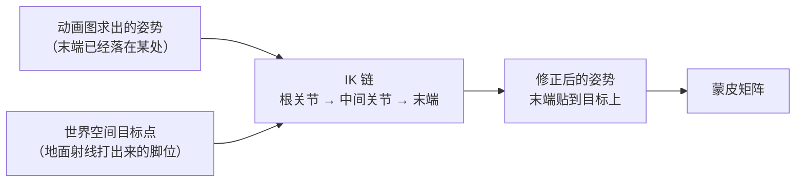

> [[Notes/动画系统/索引|← 返回 动画系统索引]]

# 逆向运动学：从末端反推骨骼姿势

> [!todo] 本篇核心问题
> 已知脚/手的目标位置，怎么反推整条骨骼链的转角？

> [!tip] 先回答一个更实际的问题：需要懂多深？
> 这一篇真正要装进脑子的是三样东西：
> 1. **动画是"照着平地做的固定姿势"，它不知道地面在哪**——要满足「末端必须落在某处」，就必须额外引入一套反推机制，这套机制叫 IK。
> 2. **IK 改的是姿势，不是姿势的来源**——所以它只能做微调，幅度一大腿就扭曲。
> 3. **几个一定会撞上的退化**：够不着、完全折叠、权重瞬变、多个 IK 抢同一根骨头。
>
> 至于余弦定理那一步具体的代数展开、以及迭代法每一轮的数学收敛性，属于**知不知道都不影响你调动画的内部机制**，本篇只给几何直觉，不做推导。

## 为什么需要解决这个问题

先看一个每个人都在项目里见过的场景。

美术在平地上做了一套「站立待机」动画，脚稳稳踩在 y=0 的地板上，很漂亮。关卡美术把角色往斜坡上一摆——**一只脚悬空，另一只脚陷进地面半只鞋**。

这不是动画做坏了，也不是斜坡建错了。问题出在一件很根本的事上：

> **动画是"照着平地做的固定姿势"，它根本不知道地面在哪。**

美术 K 的是**转角**：髋关节转几度、膝盖弯几度、脚踝压几度。这些数字在平地上恰好让脚落在 y=0。可角色一旦挪到斜坡上，或者踩上台阶、踩进一个坑，同一组转角算出来的脚就悬在半空或者埋进土里了——因为**那组角度是按平地那套几何关系配出来的**，换个地形就失效。

要理解为什么，得先给这两件事各起一个名字：

- **正向运动学（Forward Kinematics，FK）**：**已知每根骨骼的转角，算出末端（脚、手）最终落在哪。** 这正是前面所有笔记在做的事——动画给的就是转角，姿势算出来末端自然就在某处，至于那个"某处"是不是你要的位置，FK 管不着。骨骼层级逐级连乘出世界位置，就是一次 FK（见 [[Notes/动画系统/旋转与变换基础/变换层级与复合变换|变换层级与复合变换]]）。
- **逆向运动学（Inverse Kinematics，IK）**：**反过来——已知末端要在哪，求每根骨骼该转多少。** 本篇讲的就是这个"反过来"。

一句话点明本篇存在的理由：**动画本质是 FK，所以只要出现"末端必须落在某个指定位置"的需求，就非引入 IK 不可。** 脚要踩实地面、手要扶住墙、视线要盯住一个移动的目标，全是同一件需求的不同说法。

## 直观理解：从"照着稿子念"到"看着靶子调"

用两个比喻串起全篇。

**FK 是照稿念。** 每一根骨骼的转角都是稿子上写好的数字，从头念到尾，念完那个姿势是什么样就是什么样。稿子自己不会重写。

**IK 是看着靶子往回拧。** 让脚去够地上那个靶子（目标点）。靶子够不着，就把中间那几个关节一节一节地拧，直到末端贴上靶子。注意这里的关键差别：**靶子是靶子，稿子还是稿子**——IK 不是重新写一份稿子，它是**在你念完之后，把已经摆好的姿势再掰一下**。

先把 IK 要操作的那条骨骼链讲清楚（零假定）：

- **骨骼**：游戏里的"骨骼"不是一根有长度的骨头，**它是一个坐标系——一个原点加一个朝向**。所谓"大腿长 40 厘米"，在数据里是"膝盖骨骼的原点比髋骨骼的原点远了 40 厘米"，长度活在两个骨骼的关系里，不在任何一根骨骼身上。没建立这条认知的话，下面"转动中间那根骨骼"会读得很别扭——IK 转的从来不是一根棍子，是**棍子末端那个坐标系**，挂在它下面的小腿跟着被带走。展开见 [[Notes/动画系统/角色资产与骨骼基础/骨骼的本质：从骨架到 Skeleton 资产|骨骼的本质：从骨架到 Skeleton 资产]]。
- **IK 链（IK Chain）**：IK 不作用于全身，只作用于**一条从根到末端的骨骼链**，比如「髋 → 大腿 → 小腿 → 脚」。
  - **根关节**：链的起点，IK **不动它**（大腿不能自己飞起来，它挂在髋上）。它是这条链的"挂载点"，整条链是绕着它被掰的。
  - **中间关节**：链里可被转动的关节（这里是膝盖）。IK 改的就是它。
  - **末端 / 末端执行器（End Effector）**：链的最末那根骨骼，就是你想放到目标点上的那个"手/脚"本身。~={red}注意：**末端是骨头，不是那个点**——目标点才是"你想要的位置"，末端是要被移过去的东西。=~



数据流位置：IK 是**后处理**，跑在动画图求值出姿势**之后**、蒙皮**之前**。输入端是**一个已经存在的姿势**加**一个世界空间的目标点**，输出端是**同一个姿势的修正版**。记住这个位置——本篇后面一半的坑，都是"输入是姿势而非角度"这件事带来的。

## 核心机制

### 两关节链：唯一值得给的数学，和一个几何直觉

一条腿简化到最小，是「大腿（长 $L_1$）+ 小腿（长 $L_2$）」两段，两段之间的关节是膝盖。这是工程上最常见的 IK 链形状，也是唯一有**闭式解**（直接一代公式算出角度，不需要一步步试）的情形。

**先记几何，别急着记公式。**

从根关节（髋）到目标点，拉一条想象的直线——这条线加两段骨骼，凑成一个三角形：三条边分别是 $L_1$、$L_2$ 和 $d$（**$d$ 是"根关节到目标点的直线距离"，也就是"脚要伸多远"**——注意它不是坐标，是一个长度标量；坐标再怎么算，只有换算成这个距离才进得了余弦定理）。

于是问题变成三角形求角：**三边已知，三个角都能唯一确定**——这正是中学的余弦定理干的事：

$$
\cos\theta_{knee} = \frac{L_1^2 + L_2^2 - d^2}{2 L_1 L_2}
$$

膝盖该弯多少（$\theta_{knee}$ 是"两段骨骼之间的夹角"）直接算出来。髋要抬多高、朝哪个方向抬，由这条直线相对根关节的方向决定——也是同一套三角形关系，两步代数的事。

**比公式更重要的是那个平面。** 膝盖是个**只在一个方向能弯**的铰链——它不会往侧面翻。所以先要在脑子里摆出一个平面：

> 一个平面由三个东西确定：**根关节、目标点、以及"膝盖朝哪一侧"**。膝盖只能在这个平面里弯。

有了这个平面，问题就从"三维里找角度"塌缩成"平面里解三角形"，闭式解才存在。没有这个平面约束，同一条腿有无穷多种弯法，根本无从算起。这就是后面那个"膝盖朝向参考向量"的来历——**它不是补丁，它是几何前提**。

用结构代码表达一遍（不追求可运行，读的是步骤）：

```text
// flags: -O0 -g

// 两关节链的解析解：只处理"髋 → 大腿 → 小腿"这一条腿
// 前提：膝盖只朝一个方向弯，且我们已构造出"膝盖所在的平面"
struct TwoBoneResult {
    HipAngle;      // 大腿相对根关节方向要转多少
    KneeAngle;     // 大小腿之间的夹角
};

TwoBoneResult SolveTwoBone(L1, L2, d) {
    // ① 数值退化第一关：够不着。钳到物理最大可达距离，
    //    不然反余弦的参数会超出 [-1,1]，算出 NaN，腿会整个消失或抽长
    clamped = min(d, L1 + L2 - 1e-4);

    // ② 余弦定理：d 已知，膝盖夹角直接解出来，不用迭代
    cosKnee = (L1*L1 + L2*L2 - clamped*clamped) / (2 * L1 * L2);
    cosKnee = clamp(cosKnee, -1, 1);          // 再兜一次底
    knee    = acos(cosKnee);

    // ③ 髋角：同样靠余弦定理求出"根到目标连线与大腿的夹角"
    cosHip = (L1*L1 + clamped*clamped - L2*L2) / (2 * L1 * clamped);
    hip    = acos(clamp(cosHip, -1, 1));

    // ④ 把算出的两个角度，按"膝盖所在平面"的朝向摆进三维空间
    return { hip, knee };
}
```

读这段抓住四件事：**目标是距离 $d$ 不是坐标**（坐标要先投影成"到根关节多远"）、**夹角是一代公式解出来的**（没有任何循环）、**两处 clamp 是保命的**、**最后一步才是把平面里的角度摆回三维**。第 ④ 步依赖平面，这是它和纯数学题唯一的区别。

### 链条更长时：从"一把算出"退到"慢慢逼近"

三根、四根、十根骨骼串成的链（脊柱、尾巴、触手、长发），闭式解基本求不出来——多条骨骼可以有无穷多种弯法，方程写不出封闭形式。工程上的答案是**迭代法**：先猜一个姿势，再一轮轮把它往目标方向挪，直到够近为止。

两种思路最常用，这里各给一个直觉，细节留给下一篇：

- **CCD（Cyclic Coordinate Descent，循环坐标下降）**：**从末端往前一根根倒着转**——先转最靠末端的那一根，让它尽量把末端带向目标；然后往前退一根，重复；一轮走完回到末端再来一轮，几轮之后末端就贴上目标了。直觉是**像一节一节地拧支架——每次都让末端再靠近一点**。实现简单、每轮代价低，代价是靠近关节根部的时候容易"甩"，姿势不算自然。**注意最末尾那一根骨骼转不出任何效果**：它转起来，它自己的起点（也就是整条链的末端位置）纹丝不动，所以迭代是从倒数第二根开始的——配链时如果只填了两根骨骼，解算器会"一动不动"，原因就在这儿。
- **FABRIK（Forward And Backward Reaching IK）**：**完全不碰角度**——"把链拽直拉到目标上"是往前一遍：暂时忘掉每段骨骼的真实长度，从根出发让每根骨骼的末端都落在"根到目标"这条直线上，链就被想象成一根**总长可以伸缩的橡皮筋**；然后从末端往根走第二遍，按每段骨骼的真实长度把链一折一折地收回原样（**这一步之后，末端已经精确落在目标上，代价是中间关节被挪了位置**）；再从头往后走第三遍修正。直觉更简单，收敛通常也更快。这里面**"每段骨骼必须保持真实长度、只有关节角度能变"**是 IK 的铁律：骨骼被拉长拉伸就是"橡皮人"，后面讲"够不着"时会看到违反它的后果。

不打算深挖也没关系，这一层属于**知道即可**：你只要知道"长链没有一把算出的解，是靠迭代逼近的"就够了。真到要选算法、要调收敛参数的时候，下一篇 [[Notes/动画系统/逆向运动学/FABRIK与脚部IK|FABRIK 与脚部 IK]] 会把这两条路走完。

### IK 在管线里的位置：它是修复，不是生成

再强调一遍那个数据流位置，因为它解释了一堆日常现象：**IK 修改姿势，不生成姿势。** 这直接推出三条实操结论：

1. **IK 通常只影响局部**——一条腿、一只手，因为它只改链上那几根骨骼的转角。
2. **IK 必须"不破坏其他部分"**——脚下的地不平，该动的是腿，不该把整个骨盆拖下去。除非你**故意**要"腿 IK 带着骨盆下沉"（角色蹲低时常见），那才是有意为之的联动。
3. **IK 拿不到动画的意图，只看得到数字。** 它不知道"这一帧角色正在起跳"，它只知道"脚的目标点在这"。所以目标点给错了，姿势就掰错了。

### IK 和动画的关系：只能微调，不能救场

这是本篇最容易被忽略、但最影响项目决策的一条。

**IK 的修正幅度不能大。** 如果基础动画里脚离目标差半米，硬掰过去会让腿看起来**扭曲、膝盖外翻、大腿和骨盆的连接处拧成一团**——因为 IK 只会解几何，它不在乎肌肉和关节限制长什么样。所以：

- **IK 只做"微调"**。差异在几厘米量级时，IK 是无感的胶水；差异到几十厘米，IK 就变成一场灾难。
- **大范围的位置问题要靠改基础动画，或者靠[[Notes/动画系统/动画数据与采样/动画重定向：一套动画复用到不同骨架|动画重定向]]**（把一套动画按骨骼比例正确搬到另一个体型上），而不是指望 IK 掰回来。

工作里还有两个配套动作：

- **给 IK 加权重（0~1）**，而不是非开即关；
- **权重要平滑过渡**，别让它在几帧之内、尤其是单独一帧里跳变（为什么见下面代码）。

权重平滑听起来像要自己写计时器，其实不用：**给权重背后的那个参数做一次低通（指数趋近）就够了**，引擎里的插值节点和状态机的过渡也都提供同样性质的"输入阻尼"。

再看权重具体作用在哪一层：

```text
// flags: -O0 -g

// IK 的日常：先算出链上每根骨骼的"IK 后转角"，
// 再按权重把它和"动画原本的转角"混回去——权重是淡入淡出的闸门
ApplyIKWithWeight(pose, chain, solved, weight) {
    if (weight <= 0) return;              // 权重 0：整条链原地不动（不是"算完后乘 0"）

    for (i = 0; i < chain.BoneCount; ++i) {
        bone = chain.Bones[i];

        // 按权重在"动画姿势"和"IK 姿势"之间插值
        //   权重 1 → 完全听 IK；权重 0.5 → 一半一半
        pose.Local[bone].Rotation =
            Slerp(pose.Local[bone].Rotation, solved.Rotation[i], weight);

        // IK 之后的最后一道关：关节限制。
        // 不钳的话，膝盖会翻到人正常弯不到的角度上去（膝盖外翻、小腿反向折）
        pose.Local[bone].Rotation = ClampToChainLimits(bone, pose.Local[bone].Rotation);
    }
}
```

读这段抓两件事：**权重作用在"插值"这一层，而不是"算完之后乘一下"**（顺序错了，姿势会先被拉歪再按比例缩回来）——这也正是"跳变的权重会让脚瞬移"的根源：姿势没经过过渡就换了来源；以及**IK 出来之后必须再钳一次关节限制**，否则膝盖会翻到人正常弯不到的角度上去。

## 边界与坑

- **够不着（$d > L_1 + L_2$）**：腿没那么长，目标点在外太空。此时余弦定理"无解"——$\cos\theta_{knee}$ 会算成小于 -1 的数。**不兜底就是 NaN**：NaN 顺着姿势数据一路传下去，那条腿的骨骼变换全是无效值，屏幕上表现为**整条腿闪没、或者模型瞬间炸成一团尖刺**。稍微好一点的实现兜住了 NaN 但没钳制距离，代价是**腿被"抽长"**去够那个点——骨骼长度被违反，橡皮人。**角色下台阶、从高处落地那一瞬间最容易撞上**——目标点突然跑到脚够不到的地方。处理方式就是把 $d$ 钳到略小于 $L_1+L_2$ 的值，让腿伸直去够。
- **完全折叠（$d \to 0$）**：目标点几乎贴在根关节上。此时膝盖角趋近 180°，腿叠成一团，而且**弯曲方向彻底失去参照**——三维里绕直线的弯法有无数种，数学上把这个位置叫 **singularity（奇异点）**。视觉表现非常吓人：**膝盖突然翻向反方向，腿像骨折一样扭过去**。解法是给一个明确的**膝盖朝向参考向量（Pole Vector）**——一个额外的世界空间点或方向，告诉解算器"膝盖往这边弯"。**这一类"目标突然跑到根关节附近"的情况，会从上一秒的合理姿势直接跳到这种歧义状态，是最容易出现骨折感的瞬间。**
- **链里只有 0 根或 1 根骨骼**：退化了。0 根 → 配链就没配上，静默不生效；1 根 → 没有任何中间关节可转，解算器只能什么都不做（和 CCD 从倒数第二根开始迭代是同一个原因）。
- **权重为 0 时要完全不生效，且不能跳变**：直接跳变就是脚瞬移，平滑办法见上文。
- **多个 IK 抢同一根骨骼**：脚部 IK 和另一个"保持骨盆高度"或"手部 IK"同时作用到共享的骨骼上时，会**互相打架**——各自都想把姿势掰向自己的目标，结果就是抖动或者姿势异常。工程上要靠**约定链的边界**（哪条 IK 管哪一段）和**固定执行顺序**来隔离，顺序本身也会影响最终结果。
- **目标点来自物理体或射线检测，本身就会抖**：射线打在地面碰撞体边缘、或者角色站在两个碰撞体接缝上时，目标点在相邻两帧之间可能跳好几厘米——脚就跟着抖。实践里会给目标点做**平滑**（低通滤波），代价是脚会稍微"跟得慢一点"。
- **地面检测失败时目标点突变**：射线没打到地面，目标点可能落到角色原点或者很远的地方，脚会瞬间飞出去。**"打不中就保持上一帧的目标点"**是常见的兜底。

## 参考实现（UE）

| 引擎 | 对应模块/数据结构 | 具体体现 |
| :--- | :--- | :--- |
| UE | `FAnimNode_TwoBoneIK`（`AnimGraphRuntime`，底层调 `AnimationCore` 的 `SolveTwoBoneIK`） | 就是本篇的"两关节链解析解"。暴露 `EffectorLocation` + `EffectorLocationSpace`（目标点及其坐标空间：世界 / 组件 / 骨骼空间）、`JointTargetLocation`（**就是 pole vector，膝盖朝向参考**）、`bAllowStretching`（允许把骨骼拉长去够——正好是"够不着"那一条的开关，默认关）、`bTakeRotationFromEffectorSpace`（让末端骨骼的朝向也跟随目标空间）。见 [[Notes/UE/第四阶段-客户端运行时层/UE-Engine-源码解析：IK、Motion Matching 与 RootMotion\|UE IK / Motion Matching / RootMotion]] |
| UE | `FAnimNode_CCDIK`（以及同族的 FABRIK 节点） | CCD 迭代解算的落地形态：可配 `RootBone` / `TipBone`（链的两端）、`MaxIterations`、`Precision` 等参数——正是 `kMaxIter` / `kEpsilon` 那两个必给常数在引擎里的位置 |
| UE | `AnimationCore` 模块（`TwoBoneIK.h` / `CCDIK.h` / `FABRIK.h` / `AngularLimit.h`） | 解算算法的落地处：`SolveTwoBoneIK` / `SolveCCDIK` / `SolveFabrik` 三个求解入口，配套角度限制检查（如 `AngularLimit.h` 的 `ConstrainAngularRangeUsingEuler`）与「把目标点换算到链的局部空间」这类空间转换。见 [[Notes/UE/第四阶段-客户端运行时层/UE-AnimationCore-源码解析：动画系统总览\|UE AnimationCore 动画系统总览]] |
| UE | IK Rig 插件（`UIKRigDefinition`，`Engine/Plugins/Animation/IKRig`） | 把"链的划分、根关节、末端、骨骼朝向、限制"这些**配置**从代码里抽出来变成资产：一个 `UIKRigDefinition` 里装 `FBoneChain`（链名 + 起止骨骼）与一组 `UIKRigEffectorGoal`（每个 goal 自带 `PositionAlpha` / `RotationAlpha`，即本篇说的 0~1 权重）；求解侧分几种 solver，比如两骨骼链的 Limb Solver、通用迭代的 Full Body IK（`FIKRigFBIKGoalSettings` 提供 `StrengthAlpha` / `PullChainAlpha` 这类强度参数），另外还有专门对齐 pole vector 的 retarget op。对应本篇反复强调的那句：**IK 的效果一半取决于配置（链怎么划、膝盖朝哪），而不是算法本身** |
| UE | 权重与求值顺序 | 几乎所有骨骼控制节点都继承同一个基类，它把节点自己的 `Alpha` 经由 `AlphaScaleBias`（缩放+偏移）和 `AlphaScaleBiasClamp`（其中 `bInterpResult` 就是"在几帧内平滑趋近"）算成最终权重，再对骨骼变换做一次局部混合——落地形态正是本篇"权重作用在插值这一层，不在算完之后乘一下"。IK 节点在动画图中位于混合之后、输出之前，姿势进入前先解算到组件空间，完成后才进入蒙皮。见 [[Notes/UE/第八阶段-跨领域专题/UE-专题：动画评估管线\|UE 动画评估管线专题]] |

> [!note]- 想深究：那"内部几何推导"到底长什么样
> `AnimationCore` 的 `SolveTwoBoneIK` 接收 `RootPos / JointPos / EndPos / JointTarget / Effector`，输出解算后的关节与末端位置（而不是直接回一个角度），并带一个"允许拉伸 + 起始拉伸比例 + 最大拉伸倍率"的可选参数；它内部确实是把"目标点相对根关节的位置"换算成链自己的一套坐标系，再按本篇这套余弦定理解出膝盖与髋。**细节不必背**——知道"引擎把同一个三角形放进链的局部空间去解"就足够解释平时遇到的现象了。不读不影响本篇任何结论。

## 一句话总结

动画本质是 FK——美术 K 的是转角，姿势算出来脚落在哪是"顺带的结果"，所以只要出现"脚必须踩在这里、手必须扶在那里"，就必须引入 IK 把姿势**掰**过去；两段链有闭式解（余弦定理 + 一个膝盖所在平面），更长的链靠 CCD / FABRIK 迭代逼近，而不管用哪种，IK 能做的都只是**小幅微调**——够不着要钳制、完全折叠要给 pole vector、权重必须淡入淡出，剩下的差异请回去改动画或做重定向。

---

**下一篇**：[[Notes/动画系统/逆向运动学/FABRIK与脚部IK|FABRIK 与脚部 IK]]——本篇只做到"把末端放到一个点上"，下一篇处理真正的落地问题：长链怎么迭代收敛，以及走斜坡、上台阶时，脚怎么既不穿地也不悬空。
