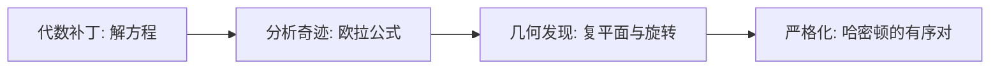

> [[索引|← 返回 复分析与傅里叶变换索引]]

# 虚数 i 的起源：从代数补丁到几何旋转

> 一个核心问题的回答：**数学家第一次提出 $i$ 时，并不是为了表示旋转。** 旋转是后人在复平面上才发现的几何意义。

## Why：为什么要追问 $i$ 的来历？

在傅里叶分析中，我们用复指数 $e^{i	heta}$ 来描述旋转，进而将信号拆解为不同频率的简谐振动。这个工具如此优美，以至于容易让人产生一种错觉：

> "$i$ 是不是数学家为了描述旋转而天才发明的？"

**事实恰好相反。** $i$ 诞生于一个远比"旋转"更朴素、也更无奈的动机：

> **让代数运算在形式上不自相矛盾。**

理解这一点，才能明白为什么复数在数学史上被抵制了两百多年，以及为什么它最终会成为分析振动和频率最自然的语言。

---

## What：$i$ 到底是什么？——三条认知脉络

### 1. 代数补丁：解方程时"不得不"出现的中间产物（16-17世纪）

$i$ 最早出现在三次方程的求根公式中。1545年卡尔达诺解 $x^3 = 15x + 4$ 时，中间步骤不可避免地出现了 $\sqrt{-121}$。诡异的是，如果硬着头皮继续运算，这些"怪物"最终会在式子中相互抵消，给出正确的实数根 $x = 4$。

这说明什么？

> **$i$ 最初不是为了创造新数学，而是为了修补已有代数公式的"断裂"。** 如果不承认这些中间步骤，连本来有实数解的方程都求不出来。

17世纪的邦贝利系统化了这些数的运算规则，笛卡尔则给它起了个贬义的名字 "imaginary"——当时数学界普遍认为这只是纸面上的形式技巧，没有几何意义。

### 2. 分析奇迹：欧拉公式把指数与三角函数统一起来（18世纪）

欧拉将 $i$ 作为 $\sqrt{-1}$ 的简写，并发现了著名的欧拉公式：

$$
e^{i\theta} = \cos\theta + i\sin\theta
$$

（详细推导见：[[欧拉公式-泰勒级数的奇迹]]）

这个公式第一次把指数函数、三角函数和虚数联系在了一起。但即使在欧拉眼中，这也主要是一个**惊人的分析恒等式**，他并没有明确将 $e^{i\theta}$ 解释为"复平面上的旋转"。

### 3. 几何真身与严格化：$i$ 是 $90^\circ$ 旋转操作符（19世纪）

18世纪末到19世纪初，韦塞尔、阿根德、高斯等人先后将复数 $a+bi$ 与平面上的点 $(a,b)$ 对应起来。一旦放到二维平面上，一切都豁然开朗：

> **复数乘法等价于"模长相乘、辐角相加"。乘 $i$ 就是模长不变、辐角加 $90^\circ$ —— 逆时针旋转 90 度。**

但认知的转折不止于此。1833年，哈密顿做了一件更深刻的事：他把复数从"$\sqrt{-1}$ 这种神秘对象"中彻底解放出来，**用纯实数代数严格定义了复数**。

---

## 哈密顿的严格化：复数作为有序对

### 核心思想

哈密顿将复数定义为**实数有序对** $(a, b)$，并直接规定加法和乘法规则：

$$
\begin{aligned}
(a, b) + (c, d) &= (a+c,\; b+d) \\
(a, b) \cdot (c, d) &= (ac - bd,\; ad + bc)
\end{aligned}
$$

这看起来像是人为规定，但它实际上是**把 $i^2 = -1$ 的代数运算严格翻译成有序对语言**的自然结果：

$$
(a + bi)(c + di) = ac + adi + bci + bdi^2 = (ac - bd) + (ad + bc)i
$$

去掉 $i$ 的符号，写成有序对，就恰好得到 $(ac - bd,\; ad + bc)$。

### 验证：$i$ 就是 $(0, 1)$

在有序对语言中，$i$ 不需要被"发明"，它就是 $(0, 1)$。验证它的"平方为 $-1$"。

- 实数 $a$ 对应有序对 $(a, 0)$
- 因此 $1 \to (1, 0)$，$-1 \to (-1, 0)$
- 而 $i \to (0, 1)$

于是：

$$
(0, 1) \cdot (0, 1) = (0 \cdot 0 - 1 \cdot 1,\; 0 \cdot 1 + 1 \cdot 0) = (-1, 0)
$$

**$i^2 = -1$ 不再是神秘的天赋，而是乘法规则的自然推论。**

### 为什么这个规则能表示旋转？

取任意复数 $(a, b)$ 乘以 $i = (0, 1)$：

$$
(a, b) \cdot (0, 1) = (a \cdot 0 - b \cdot 1,\; a \cdot 1 + b \cdot 0) = (-b, a)
$$

这正是二维向量 **逆时针旋转 $90^\circ$** 的变换公式：
- 原向量：$(a, b)$
- 旋转后：$(-b, a)$

> [!question] 哈密顿的规则不是向量的点积吗？
> 不是。向量的点积 $(a,b)\cdot(c,d) = ac+bd$ 的结果是一个**标量**，描述的是投影关系，输出不再是二维向量，不可能表示旋转。哈密顿的规则保留了二维结构，并且天然编码了旋转。

### 更一般的旋转：极坐标视角

将复数写成极坐标形式 $z = r(\cos\theta, \sin\theta)$，两个复数相乘：

$$
\begin{aligned}
&r_1(\cos\theta_1, \sin\theta_1) \cdot r_2(\cos\theta_2, \sin\theta_2) \\
=&\; r_1r_2(\cos\theta_1\cos\theta_2 - \sin\theta_1\sin\theta_2,\; \cos\theta_1\sin\theta_2 + \sin\theta_1\cos\theta_2) \\
=&\; r_1r_2(\cos(\theta_1+\theta_2),\; \sin(\theta_1+\theta_2))
\end{aligned}
$$

这就是**模长相乘、角度相加**。

### 哈密顿构造的深远意义

| 哈密顿之前 | 哈密顿之后 |
|-----------|-----------|
| $i$ 是"负数的平方根"，逻辑上的怪物 | $i$ 只是有序对 $(0,1)$，没有神秘性 |
| 复数建立在"接受一个不可能的数"之上 | 复数完全建立在坚实的实数代数之上 |
| 几何意义是"发现"的 | 代数结构是"构造"的，几何意义自然涌现 |

这个构造还启发了后来的**四元数**、**向量空间**和**域的公理化**——它证明了一个重要思想：

> **如果我们想扩展一个数学结构，不需要去寻找新的"神秘对象"，只需要在已有对象上定义新的运算规则。**

---

## How：这段历史对学习有什么启发？

### 历史顺序 vs 认知顺序

从历史的角度看，复数意义的发现经历了这样一条曲折的路径：

但从**现代学习的认知顺序**来看，完全可以反过来理解：

> 先理解 $i$ 是**旋转操作符**（几何直观）→ 再理解欧拉公式是**旋转的指数表示**（分析工具）→ 最后看傅里叶变换如何用这些旋转来**拆解任意信号**（工程应用）。

### 核心洞察

- $i$ 最初被发明出来，是因为数学家**不得不**接受它（否则代数公式就会断裂）。
- 两百年后，人们才发现它原来是**描述旋转最自然的语言**。
- 而在傅里叶分析中，这种语言又恰好是**分析振动和频率最完美的工具**。

数学中许多最伟大的结构，最初都不是作为"几何工具"被发明的。它们往往诞生于代数或分析的困境中，却在后来被证明深刻地对应着自然界的某种几何或物理本质。复数就是最典型的例子。

---

## 总结

| 问题 | 答案 |
|------|------|
| 数学家最初提出 $i$ 是为了表示旋转吗？ | **不是**。$i$ 最初是为了让代数公式在形式上自洽。 |
| 旋转意义是什么时候被发现的？ | 19世纪初，当人们终于把复数放到**二维平面**上。 |
| 哈密顿做了什么？ | 用实数有序对和运算规则**严格构造**了复数，消除了 $i$ 的神秘性。 |
| 为什么复数乘法能表示旋转？ | 因为 $(a,b)\cdot(0,1)=(-b,a)$，这正是向量逆时针旋转 $90^\circ$ 的公式。 |

---

> "数学中最不可理解的，是数学竟然是可以理解的。" —— 尤金·维格纳
