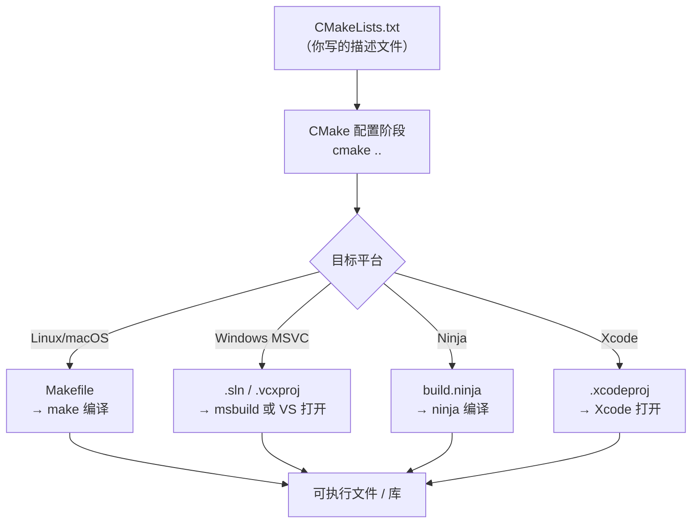
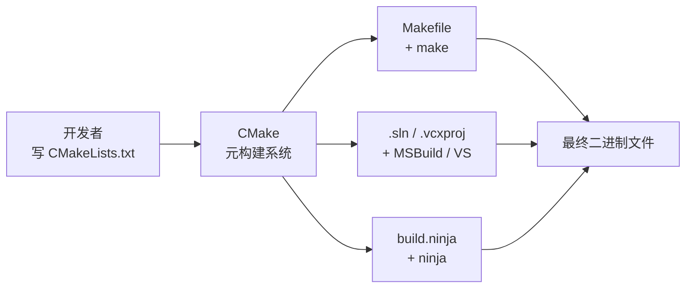

> [[索引|← 返回 构建系统索引]]

# 构建系统：make 与 CMake

## 一句话总结

> `make` 解决了**重复编译**问题；`CMake` 解决了**跨平台构建描述**问题，并能生成 Makefile、Visual Studio 解决方案等各种构建文件。

---

## 一、为什么需要构建工具？

### 手动编译的痛苦

假设项目有 100 个 `.cpp` 文件，每次改动一个文件就要手动重新编译所有文件：

```bash
g++ -c a.cpp -o a.o
g++ -c b.cpp -o b.o
# ... 100 次
g++ a.o b.o ... -o my_app
```

问题很快暴露出来：

| 问题 | 描述 |
|------|------|
| **效率极低** | 改一行代码，所有文件都要重编 |
| **依赖难管** | 手动维护哪个 `.o` 依赖哪个 `.h` 极易出错 |
| **命令难记** | 编译选项、链接顺序全靠记忆 |
| **协作困难** | 每个人本地操作不一致 |

这就是构建工具出现的根本动机：**自动化、增量、可重复**。

---

## 二、make —— 第一代解决方案

### 历史背景

`make` 诞生于 **1976 年**，由 Stuart Feldman 在贝尔实验室（Bell Labs）开发，最初发布在 Unix 系统上。它是第一个被广泛使用的构建自动化工具。

> [!info] 历史小故事
> Feldman 写 make 的直接原因：一个同事花了整整一天调试一个 bug，最后发现只是忘记重新编译某个文件——新的源码根本没生效。这件事促使他设计了一套能**追踪文件依赖和时间戳**的工具。

### make 的核心思想

make 的关键机制只有两点：
1. **依赖图**：描述"要生成 A，需要先有 B 和 C"
2. **时间戳比较**：只有当源文件比目标文件**更新**时，才重新执行命令

```
目标文件 比 源文件 旧 → 重新编译
目标文件 比 源文件 新 → 跳过（无需重编）
```

### Makefile 基本语法

```makefile
# 语法结构：
# 目标: 依赖1 依赖2
# <TAB>命令   ← 注意：必须是 TAB，不能是空格！

my_app: main.o utils.o math.o
	g++ main.o utils.o math.o -o my_app

main.o: main.cpp utils.h
	g++ -c main.cpp -o main.o

utils.o: utils.cpp utils.h
	g++ -c utils.cpp -o utils.o

math.o: math.cpp math.h
	g++ -c math.cpp -o math.o

# 伪目标（不对应真实文件）
clean:
	rm -f *.o my_app
```

> [!tip] TAB 的历史遗留问题
> Makefile 规定命令行**必须以 TAB 开头**，这是 make 最臭名昭著的设计缺陷之一。Feldman 后来承认这是一个错误，但由于用户量太大无法修改。

### make 的变量与函数

```makefile
# 变量定义
CXX    = g++
CFLAGS = -Wall -O2 -std=c++17
TARGET = my_app
SRCS   = main.cpp utils.cpp math.cpp
OBJS   = $(SRCS:.cpp=.o)   # 字符串替换：将 .cpp 替换为 .o

# 使用变量
$(TARGET): $(OBJS)
	$(CXX) $(OBJS) -o $(TARGET)

# 模式规则：所有 .cpp → .o 的通用规则
%.o: %.cpp
	$(CXX) $(CFLAGS) -c $< -o $@
#                         ↑    ↑
#                    $< = 依赖的第一个文件（源文件）
#                    $@ = 目标文件名

clean:
	rm -f $(OBJS) $(TARGET)
```

### make 的局限性

make 解决了增量编译问题，但随着项目的跨平台需求出现，新的问题浮出水面：

| 局限 | 说明 |
|------|------|
| **平台绑定** | Makefile 依赖 Unix shell 命令（`rm`、`cp`）；Windows 上无法直接用 |
| **IDE 无关** | 无法生成 Visual Studio、Xcode 等 IDE 的项目文件 |
| **语法混乱** | 大型项目的 Makefile 极难维护和阅读 |
| **移植繁琐** | 为每个平台手写一套构建脚本，重复劳动 |

---

## 三、CMake —— 构建系统的构建系统

### 历史背景

`CMake` 诞生于 **2000 年**，最初由 Kitware 公司为 ITK（医学图像分析库）项目开发，目的是让一套源码能在 Windows（MSVC）、Linux（GCC）、macOS（Clang/AppleClang）上构建。

CMake 的名字取自 **"Cross-platform Make"**（跨平台 Make）。

> [!info] CMake 的定位
> CMake **不是**直接的编译工具，而是**元构建系统（Meta Build System）**——它读取 `CMakeLists.txt`，然后**生成**目标平台的原生构建文件（Makefile、.sln、.xcodeproj 等），再交由原生工具编译。

### CMake 的工作流程



## CMake 生成器的本质

> [!important] 核心概念：CMake 本身不编译代码
> CMake 是**元构建系统（Meta Build System）**，它只生成「构建描述文件」，再由**另一种工具**去实际调用 g++ 进行编译。

### 完整工具链组合

当你说"用 GCC + CMake"时，工程上实际是：

```
CMake + 某个生成器 + 实际编译工具(g++)
```

**生成器（Generator）**决定了输出什么格式的构建描述，以及后续用什么工具执行：

| 生成器 | 输出文件 | 实际构建工具 | 典型场景 |
|--------|----------|--------------|----------|
| `Ninja` | `build.ninja` | `ninja` | 极速构建，CI/CD 首选 |
| `Unix Makefiles` | `Makefile` | `make` | Linux/macOS 默认 |
| `MinGW Makefiles` | `Makefile` | `mingw32-make` | Windows + MinGW/GCC 经典组合 |
| `Visual Studio 17 2022` | `.sln/.vcxproj` | `MSBuild` 或 VS IDE | Windows 开发 |

### Windows + MinGW 的特殊说明

在 Windows 上使用 GCC（通过 MinGW/MSYS2）时，你**不一定非要 Ninja**。

使用 `MinGW Makefiles` 生成器配合 `mingw32-make` 是完全合理的：

```powershell
# 配置：指定 MinGW Makefiles 生成器
cmake -S . -B build -G "MinGW Makefiles"

# 构建：调用 mingw32-make（不是 make！）
cmake --build build
# 或直接用：
mingw32-make -C build
```

> [!tip] 为什么叫 mingw32-make？
> 这是 MinGW 项目提供的 GNU make 的 Windows 移植版，与 MinGW 工具链配套使用。虽然名字里有"32"，但它支持 64 位编译。

### 选择合适的生成器

- **追求速度** → 用 Ninja（跨平台，最快）
- **Windows + GCC/MinGW 且不想装 Ninja** → 用 `MinGW Makefiles` + `mingw32-make`
- **需要 Visual Studio IDE** → 用 `Visual Studio 17 2022` 等
- **Linux/macOS 简单项目** → 用默认的 `Unix Makefiles`

---

### CMakeLists.txt 基本写法

```cmake
# 最低 CMake 版本要求
cmake_minimum_required(VERSION 3.20)

# 项目名称和语言
project(MyProject VERSION 1.0 LANGUAGES CXX)

# 设置 C++ 标准
set(CMAKE_CXX_STANDARD 17)
set(CMAKE_CXX_STANDARD_REQUIRED ON)

# 收集源文件
set(SOURCES
    src/main.cpp
    src/utils.cpp
    src/math.cpp
)

# 定义可执行目标
add_executable(my_app ${SOURCES})

# 添加头文件搜索路径
target_include_directories(my_app PRIVATE include/)

# 链接库（如果有）
# target_link_libraries(my_app PRIVATE some_lib)
```

#### `PUBLIC` / `PRIVATE` / `INTERFACE` 是什么？

这三个关键字控制**编译属性/依赖的传递方向**。

| 关键字 | 自己用 | 链接我的目标也用 | 典型场景 |
|--------|--------|------------------|----------|
| `PRIVATE` | ✅ | ❌ | 内部实现细节（如 `.cpp` 里用的第三方库） |
| `INTERFACE` | ❌ | ✅ | 纯头文件库；我本身不用，但调用方需要 |
| `PUBLIC` | ✅ | ✅ | 接口的一部分（头文件路径、公共链接库） |

> [!tip] 快速判断口诀
> 看**头文件**就够了：
> 1. 头文件里出现了第三方库的类型 → 用 `PUBLIC`
> 2. 头文件里完全没出现 → 用 `PRIVATE`
> 3. 库只有头文件，没有 `.cpp` → 用 `INTERFACE`

---

##### 基础示例

**示例 1：`PRIVATE` —— 内部实现细节**

假设你写了一个数学库，内部用 `fmt` 库打印调试日志，但头文件里完全不暴露 `fmt`：

```cmake
# mymath/CMakeLists.txt
add_library(mymath STATIC mymath.cpp)

# fmt 只在 mymath.cpp 内部使用，头文件里没有任何 fmt 的类型
target_link_libraries(mymath PRIVATE fmt::fmt)
target_include_directories(mymath PUBLIC include/)  # 调用方需要 include/
```

```cpp
// mymath/include/mymath.h
#pragma once
// 头文件里完全没有 fmt 的痕迹
namespace mymath {
    double add(double a, double b);
    double multiply(double a, double b);
}

// mymath/src/mymath.cpp
#include "mymath.h"
#include <fmt/format.h>  // 只在 .cpp 里用 fmt

namespace mymath {
    double add(double a, double b) {
        fmt::print("add called: {} + {}\n", a, b);  // 内部日志
        return a + b;
    }
    // ...
}
```

```cmake
# 主项目 CMakeLists.txt
add_subdirectory(mymath)
add_executable(my_app main.cpp)

# my_app 只链接 mymath，不需要知道 fmt 的存在
target_link_libraries(my_app PRIVATE mymath)
# 等价于：g++ main.cpp -lmymath -o my_app
# fmt 不会出现在链接命令中
```

---

**示例 2：`PUBLIC` —— 公共接口依赖**

假设 `core_lib` 的头文件里直接使用了 `networking` 的类型，调用方必须也能访问 `networking`：

```cmake
# networking/CMakeLists.txt
add_library(networking STATIC socket.cpp)
target_include_directories(networking PUBLIC include/)

# core/CMakeLists.txt
add_library(core_lib STATIC core.cpp)

# PUBLIC：core_lib 的头文件里引用了 networking 的头文件
target_link_libraries(core_lib PUBLIC networking)
target_include_directories(core_lib PUBLIC include/)
```

```cpp
// core/include/core.h
#pragma once
#include <networking/socket.h>  // 头文件里直接用了 networking!

namespace core {
    class Server {
        networking::Socket socket_;  // 成员变量暴露 networking 类型
    public:
        void start(int port);
    };
}
```

```cmake
# 主项目 CMakeLists.txt
add_subdirectory(networking)
add_subdirectory(core)
add_executable(editor main.cpp)

# editor 会自动获得 networking 的链接和头文件路径！
target_link_libraries(editor PRIVATE core_lib)
# 等价于：g++ main.cpp -lcore_lib -lnetworking -Icore/include -Inetworking/include
```

**如果改成 `PRIVATE` 会怎样？**

```cmake
target_link_libraries(core_lib PRIVATE networking)  # 改成 PRIVATE
```

```cpp
// editor/main.cpp
#include <core.h>
// 编译错误：找不到 networking/socket.h！
// 因为 networking 的 include 路径没有传递给 editor
```

---

**示例 3：`INTERFACE` —— 纯头文件库**

纯头文件库只有 `.h` 文件，没有 `.cpp` 文件，本身不需要编译：

```cmake
# utils/CMakeLists.txt
add_library(my_utils INTERFACE)  # 没有源文件！

# INTERFACE：设置传给调用方的属性，自己不用编译
target_include_directories(my_utils INTERFACE include/)
target_compile_definitions(my_utils INTERFACE USE_UTILS)
```

```cpp
// utils/include/utils/helpers.h
#pragma once
#include <vector>
#include <algorithm>

namespace utils {
    // 全是模板函数，头文件内实现
    template<typename T>
    void sort_unique(std::vector<T>& vec) {
        std::sort(vec.begin(), vec.end());
        vec.erase(std::unique(vec.begin(), vec.end()), vec.end());
    }
}
```

```cmake
# 主项目 CMakeLists.txt
add_subdirectory(utils)
add_executable(my_app main.cpp)

# my_app 自动获得 include/ 路径和 USE_UTILS 宏定义
target_link_libraries(my_app PRIVATE my_utils)
# 等价于：g++ -DUSE_UTILS -Iutils/include main.cpp -o my_app
```

---

##### 进阶示例

**示例 4：混合使用 `PUBLIC` + `PRIVATE`**

实际项目中，一个库往往既有公共接口也有内部实现：

```cmake
# game_engine/CMakeLists.txt
add_library(game_engine STATIC
    src/engine.cpp
    src/renderer.cpp
    src/physics.cpp
)

# 公共头文件：调用方需要知道
target_include_directories(game_engine PUBLIC include/)

# 内部实现用的第三方库：调用方不需要知道
target_link_libraries(game_engine
    PUBLIC glfw           # 头文件暴露了 GLFWwindow* 类型
    PUBLIC glm            # 头文件使用了 glm::vec3 等类型
    PRIVATE glad          # 只在 .cpp 里加载 OpenGL 函数指针
    PRIVATE stb_image     # 只在 .cpp 里加载纹理
    PRIVATE fmt           # 只在 .cpp 里打印日志
)
```

```cpp
// game_engine/include/engine.h
#pragma once
#include <GLFW/glfw3.h>      // PUBLIC 依赖，调用方需要
#include <glm/glm.hpp>       // PUBLIC 依赖，调用方需要

namespace engine {
    class GameEngine {
        GLFWwindow* window_;             // 暴露 GLFW 类型
        glm::vec3 clear_color_ = {0, 0, 0};
    public:
        bool init(int width, int height);
        void run();
    };
}
```

---

**示例 5：多层库的传递链**

```cmake
# 底层库：只依赖系统库
add_library(base_io STATIC io.cpp)
target_link_libraries(base_io PRIVATE Threads::Threads)

# 中间层：PUBLIC 继承 base_io
target_link_libraries(network_lib PUBLIC base_io)  
# 使用 network_lib 的代码会自动链接 base_io

# 上层库：可以选择性暴露
target_link_libraries(game_network PRIVATE network_lib)
# game_network 内部用 network_lib，但不暴露给最终用户
```

传递效果：
```
my_game
    └── game_network (PRIVATE network_lib)
            └── network_lib (PUBLIC base_io)
                    └── base_io (PRIVATE Threads::Threads)

最终链接：my_game → game_network → network_lib → base_io
（注意：Threads::Threads 不会传给 my_game，因为 base_io 用 PRIVATE）
```

---

**示例 6：`target_include_directories` 的不同用法**

```cmake
add_library(my_lib STATIC my_lib.cpp)

# 这3行对应不同的使用场景：
target_include_directories(my_lib
    PUBLIC 
        $<BUILD_INTERFACE:${CMAKE_CURRENT_SOURCE_DIR}/include>
        $<INSTALL_INTERFACE:include>    # 安装后的路径
    PRIVATE 
        src/internal                    # 内部实现用的私有头文件
    INTERFACE 
        $<BUILD_INTERFACE:${CMAKE_CURRENT_SOURCE_DIR}/compat>
        # 纯兼容性头文件，库本身不用，调用方可能需要
)
```

**目录结构对应：**
```
my_lib/
├── CMakeLists.txt
├── include/my_lib/
│   ├── api.h          # PUBLIC：调用方必须包含
│   └── types.h        # PUBLIC：调用方必须包含
├── src/
│   ├── my_lib.cpp
│   └── internal/
│       └── helper.h   # PRIVATE：只在 .cpp 里用
└── compat/
    └── legacy.h       # INTERFACE：库本身不用，兼容旧代码用
```

---

**示例 7：错误对比 —— `PRIVATE` vs `PUBLIC`**

```cmake
# 错误写法 ❌
add_library(json_parser STATIC parser.cpp)
target_include_directories(json_parser PRIVATE include/)
# 头文件 parser.h 里 #include "nlohmann/json.hpp"

target_link_libraries(json_parser PUBLIC nlohmann_json::nlohmann_json)
```

问题：`include/` 是 `PRIVATE` 的，调用方找不到头文件！

```cmake
# 正确写法 ✅
add_library(json_parser STATIC parser.cpp)
# 头文件路径必须是 PUBLIC，因为 parser.h 在 include/ 里
target_include_directories(json_parser PUBLIC include/)
target_link_libraries(json_parser PUBLIC nlohmann_json::nlohmann_json)
```

---

##### 总结表

| 关键字 | 适用场景 | 典型例子 |
|--------|----------|----------|
| `PRIVATE` | 只在 `.cpp` 用的实现细节 | 日志库、单元测试框架、内部工具函数 |
| `PUBLIC` | 头文件暴露的依赖 | OpenGL 窗口库、数学库、序列化库 |
| `INTERFACE` | 纯头文件、编译开关、兼容性层 | 工具函数头文件、配置宏定义 |

### 典型目录结构

```
my_project/
├── CMakeLists.txt        ← 根构建描述
├── include/
│   └── utils.h
├── src/
│   ├── main.cpp
│   └── utils.cpp
├── libs/
│   └── mathlib/
│       ├── CMakeLists.txt   ← 子模块也有自己的 CMakeLists
│       ├── include/
│       └── src/
└── build/               ← 构建输出目录（不提交到 git！）
```

### 外部构建（Out-of-source Build）

CMake 强烈推荐将构建文件放在独立目录，不污染源码树：

```bash
# 在项目根目录
mkdir build
cd build

# 配置阶段：CMake 读取 CMakeLists.txt，生成构建文件
cmake ..

# 构建阶段：调用原生工具编译
cmake --build .

# 或者直接用
make        # Linux/macOS
```

> [!tip] 把 `build/` 加入 `.gitignore`
> 构建目录是生成物，不应提交到版本库。

---

## 四、CMake 生成 Visual Studio .sln 文件

这是工作中常见的需求：用同一套 CMake 脚本，在 Windows 上生成可以直接用 VS 打开的解决方案。

### 工作原理

CMake 通过**生成器（Generator）**来决定输出什么类型的构建文件。Visual Studio 系列是 CMake 内置支持的生成器之一。

```bash
# 查看本机所有可用生成器
cmake --help
# 末尾会列出类似：
# * Visual Studio 17 2022
#   Visual Studio 16 2019
#   Visual Studio 15 2017
#   Unix Makefiles
#   Ninja
#   ...
```

### 生成 .sln 的完整工作流

**第一步：打开 Developer Command Prompt（或普通 PowerShell/CMD 均可）**

```powershell
# 进入项目目录
cd C:\my_project

# 创建构建目录
mkdir build_vs
cd build_vs

# 指定生成器：生成 VS2022 的 x64 解决方案
cmake .. -G "Visual Studio 17 2022" -A x64

# 完成后，build_vs/ 目录下会出现：
# MyProject.sln     ← 双击用 VS 打开
# MyProject.vcxproj
# ...
```

**第二步：用 Visual Studio 打开**

直接双击 `.sln` 文件，或：

```powershell
start MyProject.sln
```

VS 打开后，你会看到完整的项目结构，可以直接按 `F5` 编译运行、设置断点调试。

**第三步（可选）：不打开 VS，直接命令行编译**

```powershell
# 在 build_vs 目录下
cmake --build . --config Release
# 等价于让 msbuild 编译 .sln，输出在 Release/ 子目录
```

### 常用生成器速查

| 生成器命令 | 说明 |
|-----------|------|
| `"Visual Studio 17 2022"` | VS 2022，默认 x86 |
| `"Visual Studio 17 2022" -A x64` | VS 2022，x64 架构 |
| `"Visual Studio 16 2019" -A x64` | VS 2019，x64 架构 |
| `"Ninja"` | Ninja 构建（快速，常用于 CI） |
| `"Unix Makefiles"` | 标准 Makefile（Linux/macOS 默认） |
| `"MinGW Makefiles"` | MinGW + GCC 在 Windows 上的经典组合 |
| `"Xcode"` | macOS Xcode 项目 |

### 配置类型：Debug vs Release

Visual Studio 是多配置生成器，配置类型在**编译时**选择，不在配置阶段：

```powershell
# 配置阶段不需要指定 Debug/Release
cmake .. -G "Visual Studio 17 2022" -A x64

# 编译时指定
cmake --build . --config Debug    # Debug 版本
cmake --build . --config Release  # Release 版本
```

> [!warning] 与 Linux Makefile 的区别
> 在 Linux 用 `cmake .. -DCMAKE_BUILD_TYPE=Release` 是在**配置阶段**决定的（单配置生成器）；Visual Studio 是多配置生成器，`-DCMAKE_BUILD_TYPE` 无效，必须在 `--build` 时用 `--config` 指定。

---

## 五、CMake 核心指令速查

按照**工程化使用 CMake** 的实际流程组织：先定义目标 → 配置属性 → 引入依赖 → 打包安装。

### 1. 定义目标（Target）

目标（Target）是 CMake 的核心概念，指**最终要构建的东西**。

```cmake
# 可执行文件
add_executable(my_app src/main.cpp src/utils.cpp)

# 静态库（.a / .lib）
add_library(mymath STATIC src/mymath.cpp)

# 动态库（.so / .dylib / .dll）
add_library(mystr SHARED src/mystr.cpp)

# 纯头文件库（无 .cpp 文件）
add_library(my_utils INTERFACE)
```

### 2. 配置目标属性

为已定义的目标添加编译选项、头文件路径等。

```cmake
# 添加头文件搜索路径（相对于 CMakeLists.txt 的路径）
target_include_directories(my_app PRIVATE include/)
target_include_directories(mymath PUBLIC include/)  # PUBLIC：调用方自动继承

# 添加编译选项
target_compile_options(my_app PRIVATE -Wall -O2)

# 添加宏定义
target_compile_definitions(my_app PRIVATE DEBUG_MODE)

# 设置 C++ 标准（推荐在根 CMakeLists.txt 中全局设置）
set(CMAKE_CXX_STANDARD 17)
set(CMAKE_CXX_STANDARD_REQUIRED ON)
```

### 3. 处理依赖关系

#### 3.1 链接库（Linking）

```cmake
# 链接自定义子模块
target_link_libraries(my_app PRIVATE mymath mystr)

# 链接第三方库（通过 find_package 查找）
find_package(OpenSSL REQUIRED)
target_link_libraries(my_app PRIVATE OpenSSL::SSL OpenSSL::Crypto)

# 链接多个库（fmt + spdlog，通过 Conan/vcpkg 管理）
target_link_libraries(myapp PRIVATE fmt::fmt spdlog::spdlog)
```

#### 3.2 引入子目录（Subdirectory）

```cmake
# 将子目录纳入构建，子目录必须有 CMakeLists.txt
add_subdirectory(libs/mathlib)
add_subdirectory(libs/mystr)

# 然后链接子目录定义的目标
target_link_libraries(my_app PRIVATE mathlib mystr)
```

> [!info] `add_subdirectory()` 的限制
> 只能引入**当前目录的子目录**（相对路径），无法直接引用外部路径。

#### 3.3 引入外部 CMake 文件（Include）

当需要引入**非子目录**的 CMake 文件时使用：

```cmake
# 直接包含任意路径的 CMake 文件
include(/absolute/path/to/config.cmake)

# 典型场景：游戏引擎的代理 CMakeLists.txt
set(REAL_SOURCE_DIR "E:/engine/source/base")
include(${REAL_SOURCE_DIR}/CMakeLists.txt)
```

| 特性 | `add_subdirectory()` | `include()` |
|------|----------------------|-------------|
| 目录要求 | 必须是当前目录的子目录 | 可以是任意绝对/相对路径 |
| 变量作用域 | 子目录独立作用域 | 在当前作用域执行 |
| 典型用途 | 子模块构建、项目分层 | 加载配置、代理文件 |

### 4. 查找系统库（Find Package）

```cmake
# 查找系统已安装的库
find_package(Threads REQUIRED)          # 线程库
find_package(OpenSSL REQUIRED)          # OpenSSL
find_package(Boost COMPONENTS filesystem REQUIRED)

# 使用查找结果
target_link_libraries(my_app PRIVATE 
    Threads::Threads 
    OpenSSL::SSL 
    Boost::filesystem
)
```

### 5. 安装与打包（Install）

```cmake
# 安装可执行文件
install(TARGETS my_app DESTINATION bin)

# 安装库文件
install(TARGETS mymath 
    ARCHIVE DESTINATION lib      # 静态库
    LIBRARY DESTINATION lib      # 动态库
    RUNTIME DESTINATION bin      # Windows DLL
)

# 安装头文件
install(FILES include/utils.h DESTINATION include)

# 安装整个目录
install(DIRECTORY include/ DESTINATION include)
```

构建后执行安装：

```bash
cmake --install . --prefix /usr/local    # 指定安装路径
cmake --install .                        # 使用默认路径（CMAKE_INSTALL_PREFIX）
```

### 6. 测试（Testing）

```cmake
enable_testing()

# 添加测试可执行文件
add_executable(test_math tests/test_math.cpp)
target_link_libraries(test_math PRIVATE mymath)

# 注册测试
add_test(NAME MathTest COMMAND test_math)
```

运行测试：

```bash
ctest           # 运行所有测试
ctest -V        # 显示详细输出
ctest -R Math   # 只运行名称匹配 "Math" 的测试
```

---

## 六、CMake 命令行速查

| 阶段 | 命令 | 说明 |
|------|------|------|
| **配置** | `cmake -S . -B build` | 源码在当前目录，构建目录为 build/ |
| | `cmake .. -G "Ninja"` | 指定生成器为 Ninja |
| | `cmake .. -DCMAKE_BUILD_TYPE=Release` | 设置构建类型（单配置生成器） |
| | `cmake .. -DCMAKE_INSTALL_PREFIX=/usr/local` | 设置安装路径 |
| | `cmake -LAH ..` | 列出所有可配置选项（带帮助信息） |
| **构建** | `cmake --build build` | 执行构建 |
| | `cmake --build build --config Release` | 多配置生成器指定构建类型 |
| | `cmake --build build --target my_app` | 只构建特定目标 |
| | `cmake --build build -j8` | 并行 8 个作业 |
| **安装** | `cmake --install build` | 执行安装规则 |
| | `cmake --install build --prefix /opt` | 指定安装路径 |
| **其他** | `cmake --version` | 查看 CMake 版本 |
| | `ctest` | 运行测试 |
| | `ccmake ..` / `cmake-gui` | 交互式配置工具 |

---

## 七、总结：三者关系一览



| 工具 | 层次 | 解决的问题 |
|------|------|-----------|
| **make** | 原生构建工具 | 增量编译、依赖追踪 |
| **CMake** | 元构建系统 | 跨平台构建描述、生成各种构建文件 |
| **MSBuild/VS** | 原生构建工具（Windows） | 实际编译链接，IDE 集成 |
| **Ninja** | 原生构建工具 | 极速增量构建，常用于 CI |

> [!quote] 核心思想
> 你只需要维护**一套** `CMakeLists.txt`，CMake 负责把它翻译成各个平台的"母语"——Linux 用 Makefile，Windows 用 .sln，macOS 用 Xcode 项目。这就是现代 C++ 工程跨平台构建的基础。

---

## 相关笔记

- [[Notes/C++编程/C++编译过程原理]]
- [[Notes/C++编程/静态库与动态库]]
- [[Notes/C++编程/C++编译选项]]
- [[Notes/游戏引擎/build-system-explained-simple|引擎构建系统通俗解读]] —— 包含代理 CMakeLists.txt 的实际应用案例
