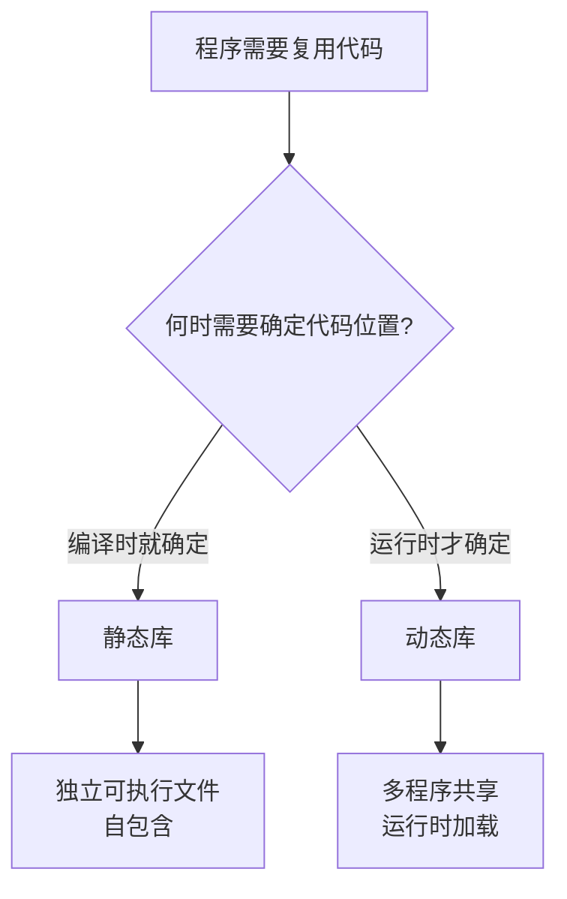
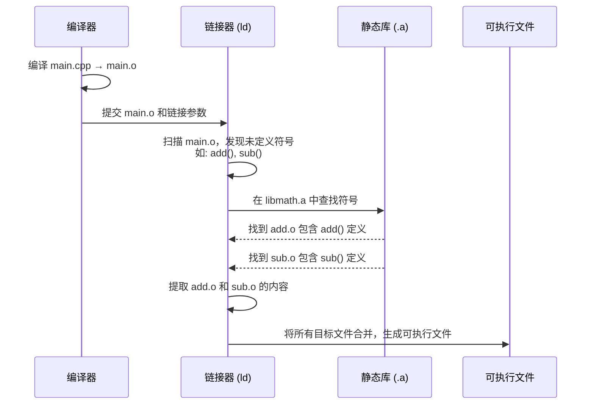
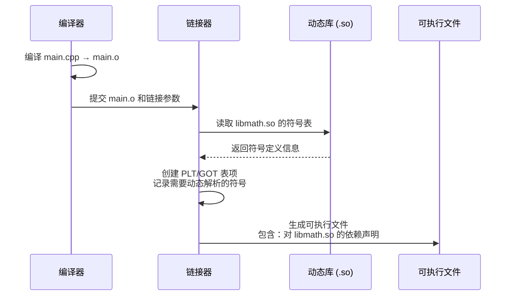
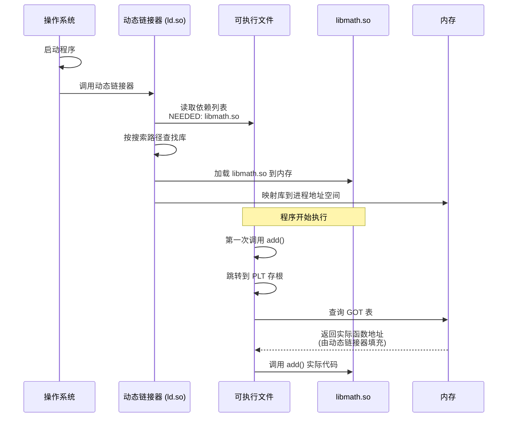
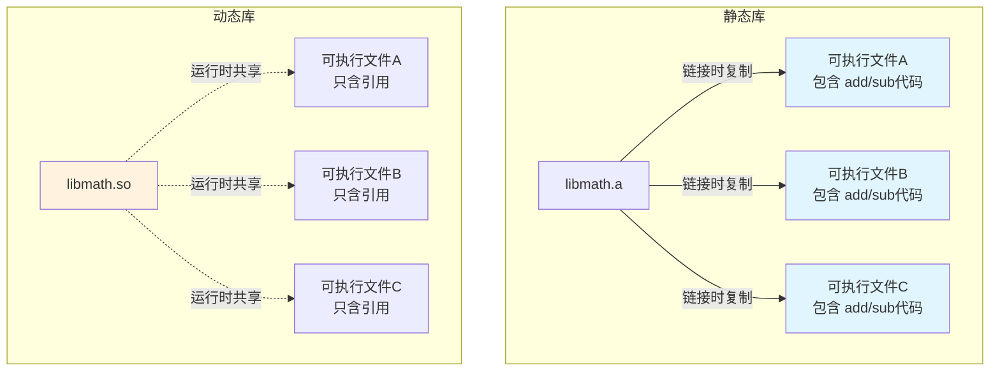
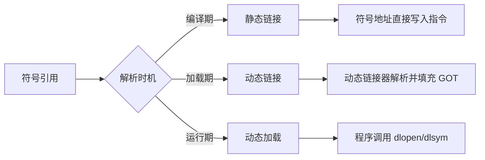
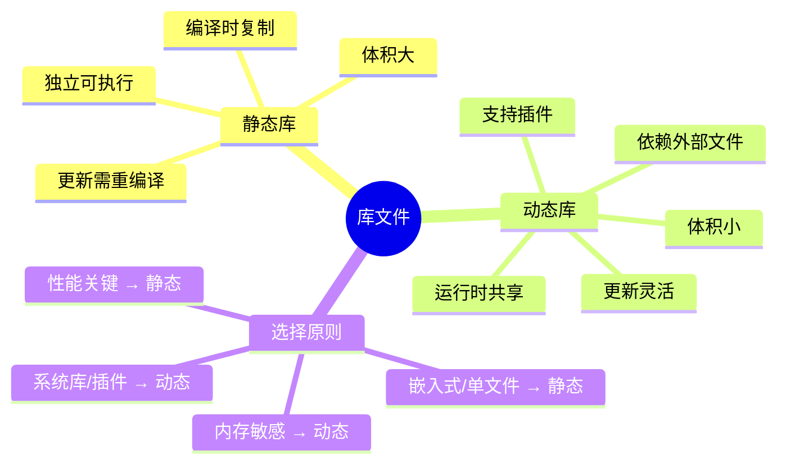

> [[索引|← 返回 构建系统索引]]

# 静态库与动态库

## 一句话总结

> 静态库是**编译时复制**，动态库是**运行时共享**。

---

## 为什么需要分两种库？

### 与 npm 的对比

你提到 npm 只有一个"包"的概念，这是因为 **JavaScript 的运行模型与 C/C++ 完全不同**：

| 维度 | C/C++ | JavaScript (npm) |
|------|-------|------------------|
| **编译/解释** | 预编译成机器码 | 解释执行或 JIT 编译 |
| **运行时** | 直接调用操作系统 API | 运行在虚拟机（V8/Node.js）上 |
| **内存模型** | 直接操作内存地址 | 由垃圾回收器管理内存 |
| **链接时机** | 编译期决定代码如何组合 | 运行时动态 `require`/`import` |

npm 包的"动态性"是语言特性带来的，而 C/C++ 需要在**编译阶段**就确定代码如何被组织和加载。

### C/C++ 分两种库的根本原因



C/C++ 是**系统级编程语言**，直接运行在硬件之上，没有虚拟机层。因此：
- 程序启动时，**所有代码必须在内存中有确定的地址**
- 链接器需要在编译或加载时[[#什么是解析符号引用？|解析符号引用]]
- 两种库代表了两种不同的**符号解析策略**

---

## 静态库 (Static Library)

### 是什么

静态库是**目标文件的集合**，在**链接阶段**被完整地复制到可执行文件中。

```
┌─────────────────────────────────────────────────────┐
│                    静态链接过程                        │
├─────────────────────────────────────────────────────┤
│                                                      │
│   main.o     +    libmath.a     →    executable     │
│   ┌─────┐        ┌─────────┐       ┌─────────────┐  │
│   │main │   +    │add.o    │  →    │main + add   │  │
│   │     │        │sub.o    │       │     + sub   │  │
│   │     │        │mul.o    │       │     + mul   │  │
│   └─────┘        └─────────┘       │     + ...   │  │
│                                     └─────────────┘  │
│                                                      │
│   特点：所有代码都被复制进可执行文件                      │
└─────────────────────────────────────────────────────┘
```

### 文件格式

| 平台      | 扩展名    | 说明                    |
| ------- | ------ | --------------------- |
| Linux   | `.a`   | Archive 文件，本质是目标文件的打包 |
| Windows | `.lib` | Static Library        |
| macOS   | `.a`   | 与 Linux 相同            |

### 工作原理



> [!info] 链接器的行为细节
> 链接器采用**按需提取**策略：只从静态库中提取**被引用**的目标文件，未使用的代码不会被打包进最终可执行文件。

### 创建和使用

```bash
# 1. 编译目标文件
g++ -c add.cpp -o add.o
g++ -c sub.cpp -o sub.o

# 2. 打包成静态库
ar rcs libmath.a add.o sub.o

# 3. 使用静态库编译程序
g++ main.cpp -L. -lmath -o myapp
```

> [!info] `-l` 选项的命名转换规则
> 链接器会自动将 `-l<name>` 转换为 `lib<name>.a` 或 `lib<name>.so`：
> ```
> -lmath  →  查找 libmath.a 或 libmath.so
> -lssl   →  查找 libssl.a 或 libssl.so
> -lc     →  查找 libc.a 或 libc.so (C标准库)
> ```
> 这是 Unix/Linux 的惯例：所有库文件以 `lib` 前缀命名，`-l` 参数只需写后面的部分。

### 优缺点

| 优点                       | 缺点                        |
| ------------------------ | ------------------------- |
| ✅ **独立性强** - 可执行文件不依赖外部库 | ❌ **体积大** - 每个可执行文件都有一份库代码副本 |
| ✅ **部署简单** - 只有一个文件，复制即用 | ❌ **更新困难** - 库更新需重新编译所有程序 |
| ✅ **启动快** - 无需运行时解析      | ❌ **内存浪费** - 多个程序同时运行时，内存中有重复的代码 |
| ✅ **性能确定** - 编译期确定所有地址   | ❌ **编译时间长** - 链接过程需要复制库代码到可执行文件 |

> [!warning] "每个程序都有一份副本"是什么意思？
>
> 这里的"每个程序"指的是**多个不同的可执行文件**，不是"同一个程序内部多处调用"。
>
> ```
> 场景：程序 A 和程序 B 都使用了 libmath.a
>
> 静态库链接结果：
> ┌─────────────────┐     ┌─────────────────┐
> │   程序 A 可执行文件  │     │   程序 B 可执行文件  │
> │   ┌───────────┐ │     │   ┌───────────┐ │
> │   │ 自己的代码  │ │     │   │ 自己的代码  │ │
> │   ├───────────┤ │     │   ├───────────┤ │
> │   │ libmath.a │ │     │   │ libmath.a │ │  ← 两份独立的副本
> │   │ 代码副本  │ │     │   │ 代码副本  │ │
> │   └───────────┘ │     │   └───────────┘ │
> └─────────────────┘     └─────────────────┘
>
> 运行时内存占用：
> ┌──────────────┐        ┌──────────────┐
> │   程序 A 内存   │        │   程序 B 内存   │
> │   (libmath代码) │        │   (libmath代码) │  ← 内存中有两份
> └──────────────┘        └──────────────┘
> ```
>
> 对比动态库（运行时共享同一份物理内存）：
> ```
> 程序 A 可执行文件 ──┐
>                   ├──→ 运行时加载同一份 libmath.so ←── 物理内存只有一份
> 程序 B 可执行文件 ──┘         ↑
>                         通过内存映射共享
> ```

---

## 动态库 (Dynamic Library / Shared Library)

### 是什么

动态库在**编译时只记录引用信息**，在**程序启动或运行时才加载到内存**。

```
┌────────────────────────────────────────────────────────────┐
│                     动态链接过程                             │
├────────────────────────────────────────────────────────────┤
│                                                             │
│   编译时:                                                    │
│   main.o     +    libmath.so    →    executable            │
│   ┌─────┐        ┌──────────┐       ┌─────────────┐         │
│   │main │   +    │  不复制   │  →    │main + 引用  │         │
│   │     │        │  只记录   │       │add@libmath  │         │
│   │     │        │  符号信息 │       │sub@libmath  │         │
│   └─────┘        └──────────┘       └─────────────┘         │
│                                                             │
│   运行时:                                                    │
│   ┌─────────────┐        加载        ┌──────────┐          │
│   │  executable │  ───────────────→  │libmath.so│          │
│   │             │   系统找到并加载      │          │          │
│   │ 调用 add()  │  ←───────────────  │提供 add()│          │
│   └─────────────┘    函数地址解析      └──────────┘          │
│                                                             │
│   特点：运行时共享同一份库代码                                │
└────────────────────────────────────────────────────────────┘
```

### 文件格式

| 平台      | 扩展名      | 说明                   |
| ------- | -------- | -------------------- |
| Linux   | `.so`    | Shared Object        |
| Windows | `.dll`   | Dynamic Link Library |
| macOS   | `.dylib` | Dynamic Library      |

### 工作原理

#### 编译时（符号引用）



> [!question] 链接器怎么知道要读取 `libmath.so`？
> 关键是**编译命令**，不是代码本身！
>
> ```bash
> g++ main.cpp -L. -lmath -o myapp
> #            ↑    ↑
> #          搜索路径  "去找 libmath 这个库"
> ```
> `-lmath` 告诉链接器去找 `libmath` 这个库。链接器会按顺序查找：
> 1. 先找 `libmath.so`（动态库，**默认优先**）
> 2. 再找 `libmath.a`（静态库）
>
> 所以**同名情况下动态库优先被使用**。找到 `.so` 后，链接器读取它的符号表来验证 `main.o` 中引用的函数（如 `add()`）确实存在。

> [!info] `main.cpp` 里并没有声明"我要用动态库"
> ```cpp
> // main.cpp 只写函数调用的名字（符号引用）
> #include "math.h"
> int main() {
>     add(1, 2);  // ← 只是"我要调用 add"
> }
> // 代码层面完全不关心 add 在哪个库里！
> ```
> **是静态还是动态，完全由编译命令决定：**
> ```bash
> # 命令A：找到 libmath.a → 静态链接
> g++ main.cpp -L. -lmath -o myapp
>
> # 命令B：强制静态（即使存在 .so）
> g++ main.cpp -L. -Wl,-Bstatic -lmath -o myapp
>
> # 命令C：强制动态
> g++ main.cpp -L. -Wl,-Bdynamic -lmath -o myapp
> ```
>
> 同样的 `main.cpp`，不同的编译命令 → 不同的链接方式。

#### 运行时（延迟绑定）



> [!tip] PLT/GOT 机制
> - **PLT** (Procedure Linkage Table): 过程链接表，跳转跳板
> - **GOT** (Global Offset Table): 全局偏移表，存储实际地址
> - **延迟绑定**: 第一次调用时才解析地址，后续直接通过 GOT 跳转

### 创建和使用

```bash
# 1. 编译位置无关代码 (Position Independent Code)
g++ -c -fPIC add.cpp -o add.o
g++ -c -fPIC sub.cpp -o sub.o

# 2. 生成动态库
g++ -shared add.o sub.o -o libmath.so

# 3. 使用动态库编译程序（-lmath 对应 libmath.so）
g++ main.cpp -L. -lmath -o myapp

# 4. 运行时需要找到动态库
export LD_LIBRARY_PATH=.:$LD_LIBRARY_PATH
./myapp
```

### 优缺点

| 优点 | 缺点 |
|------|------|
| ✅ **体积小** - 可执行文件只包含引用 | ❌ **部署复杂** - 需要确保运行时能找到库 |
| ✅ **内存共享** - 多个程序共用一份物理内存 | ❌ **启动稍慢** - 需要加载和链接过程 |
| ✅ **更新方便** - 替换库文件即可生效 | ❌ **版本问题** - 可能出现 DLL Hell |
| ✅ **插件系统** - 支持运行时加载 (dlopen) | ❌ **性能开销** - 首次调用有间接跳转开销 |

---

## 核心对比



### 详细对比表

| 特性 | 静态库 (.a) | 动态库 (.so) |
|------|-------------|--------------|
| **链接时机** | 编译时 | 运行时/启动时 |
| **代码位置** | 复制到可执行文件 | 独立文件，内存共享 |
| **可执行文件大小** | 较大 | 较小 |
| **内存占用** | 多份副本 | 单份共享 |
| **部署方式** | 单文件即可运行 | 需同时部署依赖库 |
| **更新库** | 需重新编译程序 | 替换库文件即可 |
| **版本控制** | 编译时确定 | 运行时可能冲突 |
| **启动速度** | 快 | 稍慢（需加载库） |
| **运行性能** | 最优（直接调用） | 接近最优（PLT/GOT） |
| **调试** | 简单 | 需处理符号问题 |

---

## 技术原理深度解析

### 为什么需要 -fPIC？

```c
// 非 PIC 代码（位置相关）
// 编译时假设加载到固定地址 0x400000
mov 0x400100, %rax    // 直接写死地址

// PIC 代码（位置无关）
// 使用相对寻址，可在内存任意位置加载
mov (%rip + offset), %rax   // RIP 相对寻址
```

> [!warning] 关键概念
> **位置无关代码 (PIC)** 允许动态库被加载到进程的任意虚拟地址，这是实现共享的必要条件。

### 什么是解析符号引用？

**符号引用**（Symbol Reference）就是代码中对函数、变量等"名字"的调用，而**解析**就是链接器把这些"名字"替换成实际内存地址的过程。

#### 举个例子

```cpp
// main.cpp
#include <stdio.h>

int main() {
    printf("Hello");  // ← 这里使用了 printf
    return 0;
}
```

**编译阶段**（生成 `main.o`）：
- 编译器看到 `printf("Hello")`，但**不知道** `printf` 具体在哪
- 只在目标文件中记录一条**未解析的符号引用**："我需要 `printf` 这个符号"

```
编译后（地址未知）:
  call  ???          ← printf 在哪里？
```

**链接阶段**（解析符号引用）：
- 链接器查找：`printf` 在哪个库中定义？
- 找到后，把 `printf` 的**实际内存地址**填入调用位置

```
链接后（地址已确定）:
  call  0x7fff1234   ← printf 的实际地址
```

> [!note] 一句话总结
> **解析符号引用 = 链接器把"名字"（如 `printf`）映射到"内存地址"的过程。**

#### 为什么 C/C++ 需要解析符号？

因为 C/C++ 采用**分离编译**模式：

```
a.cpp 编译成 a.o  ──┐
b.cpp 编译成 b.o  ──┼──→ 链接器统一解析符号引用 → 可执行文件
c.cpp 编译成 c.o  ──┘        ↑
                             │
                        静态库/动态库提供符号定义
```

每个 `.o` 文件只知道"我调用了什么函数"，但不知道"函数具体在哪"。**链接器的工作就是把这些"名字"和"地址"对应起来**。

#### 两种库的解析时机

| 库类型 | 解析时机 | 特点 |
|--------|----------|------|
| **静态库** | **编译链接时** | 代码直接复制进可执行文件，地址在编译期就确定 |
| **动态库** | **程序加载/运行时** | 代码不在可执行文件里，启动时才去内存找地址 |

### 符号解析的三种方式



### 加载时重定位 vs 位置无关代码

| 方式 | 原理 | 问题 |
|------|------|------|
| **加载时重定位** | 修改代码中的地址 | 无法共享（每个进程需独立副本） |
| **PIC** | 使用 GOT/PLT 间接寻址 | 稍许性能开销，但可共享 |

现代系统**强制动态库使用 PIC**，确保物理内存共享。

---

## 实际应用场景

### 什么时候用静态库？

```bash
# 场景1: 嵌入式系统，存储空间宝贵但内存更少
g++ -static app.cpp -o app  # 全部静态链接

# 场景2: 分发独立工具，不想处理依赖
# 如: 命令行工具、安装程序

# 场景3: 性能极度敏感的核心组件
# 如: 高频交易系统、游戏引擎核心
```

### 什么时候用动态库？

```bash
# 场景1: 系统库（libc、libstdc++）
# 所有程序共享，节省大量内存

# 场景2: 插件架构
void* handle = dlopen("./plugin.so", RTLD_LAZY);
void* func = dlsym(handle, "plugin_init");

# 场景3: 热更新（无需重启程序）
# 游戏资源、配置文件解析库等

# 场景4: 大型应用模块化
# 浏览器（渲染引擎、JS引擎分开）
```

---

## 常见问题

### DLL Hell / 版本冲突

```
程序A需要: libssl.so.1.0
程序B需要: libssl.so.1.1
系统只安装了 1.1 → 程序A崩溃
```

**解决方案**:
- 版本化命名: `libssl.so.1.0`、`libssl.so.1.1`
- 使用容器隔离
- 静态链接关键依赖

### 如何查看依赖

```bash
# Linux: 查看可执行文件依赖的动态库
ldd myapp
# 输出示例:
# linux-vdso.so.1 => ...
# libmath.so => ./libmath.so (0x00007f...)
# libc.so.6 => /lib/x86_64-linux-gnu/libc.so.6

# 查看动态库的符号
nm -D libmath.so
readelf -s libmath.so

# macOS
otool -L myapp

# Windows
dumpbin /DEPENDENTS myapp.exe
```

### 强制使用静态/动态链接

```bash
# 强制静态链接（尽可能）
g++ -static main.cpp -o myapp

# 强制使用静态版本的特定库
g++ main.cpp -Wl,-Bstatic -lmath -Wl,-Bdynamic -o myapp

# 查看静态库内容
ar -t libmath.a    # 列出生成的目标文件
ar -x libmath.a    # 解压静态库
```

---

## 总结



| 选择依据 | 推荐 |
|---------|------|
| 嵌入式/容器 | 静态库 |
| 桌面应用 | 混合（系统库动态，私有库静态） |
| 服务器程序 | 动态库（方便更新和安全补丁） |
| 游戏开发 | 引擎静态，资源/脚本动态 |
| 插件系统 | 必须使用动态库 |

---

## 参考链接

- [[Notes/C++编程/C++编译选项.md|C++ 编译选项]]
- [[Notes/C++编程/C++编译过程原理.md|C++ 编译过程原理]]
- [Program Library HOWTO](https://tldp.org/HOWTO/Program-Library-HOWTO/)
- [Linkers and Loaders](https://linker.iecc.com/)