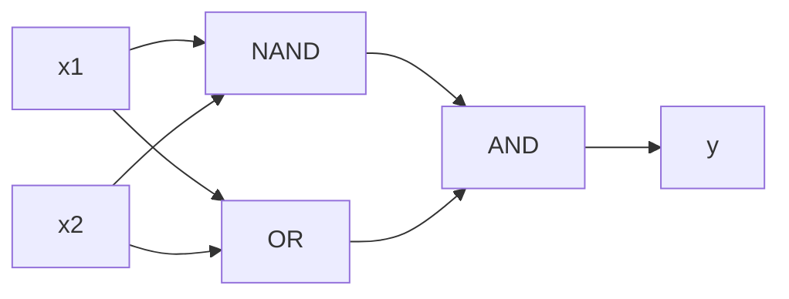

> [[Notes/深度学习入门/Roadmap|← 返回 深度学习入门路线图]]

# 感知机

如果每个证据都有自己的分量，所有证据加起来超过某个门槛就通过——这就是感知机的基本想法。它是最简单的神经网络单元，理解了它，就能自然过渡到更复杂的神经网络。

---

## 感知机在做什么

想象一个决定是否批准的流程：有两个输入条件 $x_1$ 和 $x_2$，分别对应权重 $w_1$ 和 $w_2$。权重越大，说明这个条件越重要。把所有输入按权重加权求和，再加上一个**偏置**（bias）$b$，如果结果大于 0 就输出 1，否则输出 0。

用公式写就是：

$$
y = \begin{cases}
0 & \text{if } w_1 x_1 + w_2 x_2 + b \le 0 \\
1 & \text{if } w_1 x_1 + w_2 x_2 + b > 0
\end{cases}
$$

这里 $w_1, w_2$ 叫**权重**（weight），表示每个输入信号的重要性；$b$ 叫**偏置**，表示神经元有多容易被激活。偏置越大，越容易让输出变成 1。

---

## 用感知机实现逻辑门

逻辑门只有 0 和 1 两种输入，正好适合用感知机来模拟。只要找到合适的权重和偏置，就能实现与门、与非门、或门。

```python
import numpy as np

def AND(x1, x2):
    x = np.array([x1, x2])
    w = np.array([0.5, 0.5])
    b = -0.7
    tmp = np.sum(w * x) + b
    return 1 if tmp > 0 else 0

print(AND(0, 0))  # 0
print(AND(1, 0))  # 0
print(AND(0, 1))  # 0
print(AND(1, 1))  # 1
```

与门要求两个输入都为 1 时才输出 1。上面的参数满足：只有 $(1, 1)$ 时加权和 $0.5 + 0.5 - 0.7 = 0.3 > 0$。

与非门（NAND）和或门（OR）只需要换一组参数：

```python
def NAND(x1, x2):
    x = np.array([x1, x2])
    w = np.array([-0.5, -0.5])
    b = 0.7
    tmp = np.sum(w * x) + b
    return 1 if tmp > 0 else 0

def OR(x1, x2):
    x = np.array([x1, x2])
    w = np.array([0.5, 0.5])
    b = -0.2
    tmp = np.sum(w * x) + b
    return 1 if tmp > 0 else 0
```

---

## 单层感知机的局限：异或门

异或门（XOR）的规则是：两个输入相同输出 0，不同输出 1。

| $x_1$ | $x_2$ | $y$ |
|------|------|-----|
| 0 | 0 | 0 |
| 1 | 0 | 1 |
| 0 | 1 | 1 |
| 1 | 1 | 0 |

单层感知机无法表示 XOR。原因是感知机输出的是一条直线把平面分成两块，而 XOR 的四个点中，$(1, 0)$ 和 $(0, 1)$ 为一类，$(0, 0)$ 和 $(1, 1)$ 为另一类，**无法用一条直线把它们分开**。这种问题叫做**非线性可分**。

---

## 多层感知机：用两层实现 XOR

虽然单层感知机做不到，但把感知机叠起来就可以。XOR 可以拆成：

$$
\text{XOR}(x_1, x_2) = \text{AND}\big(\text{NAND}(x_1, x_2), \text{OR}(x_1, x_2)\big)
$$

第一层由 NAND 和 OR 组成，第二层由 AND 把第一层的输出组合起来。这就是**多层感知机**（Multi-Layer Perceptron，MLP），也是神经网络的雏形。

```python
def XOR(x1, x2):
    s1 = NAND(x1, x2)
    s2 = OR(x1, x2)
    return AND(s1, s2)

print(XOR(0, 0))  # 0
print(XOR(1, 0))  # 1
print(XOR(0, 1))  # 1
print(XOR(1, 1))  # 0
```



---

## 小结

- **感知机**根据输入的加权求和加上偏置，决定输出 0 还是 1。
- 调整**权重**和**偏置**，可以用单层感知机实现 AND、NAND、OR 等线性可分的逻辑门。
- **单层感知机无法表示 XOR**，因为它只能用一条直线划分平面。
- 把感知机**叠加成多层**（多层感知机），就可以解决非线性问题，这也是神经网络强大能力的起点。

---

> [[Notes/深度学习入门/Roadmap|← 返回 深度学习入门路线图]]
