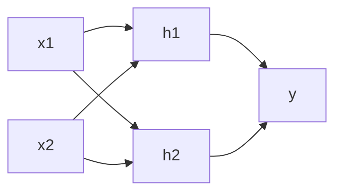

> [[Notes/深度学习入门/Roadmap|← 返回 深度学习入门路线图]]

# 神经网络结构与激活函数

感知机已经能表示 XOR，但它用的阶跃函数太"硬"了：输入稍微变一点，输出就从 0 跳到 1，没法用数值方法一点一点调整权重。**神经网络**基本上就是把感知机的激活函数换成更平滑的函数，从而让"学习"成为可能。

---

## 从感知机到神经网络

感知机的输出规则是：

$$
y = \begin{cases}
0 & \text{if } \sum_i w_i x_i + b \le 0 \\
1 & \text{if } \sum_i w_i x_i + b > 0
\end{cases}
$$

神经网络保留了"加权求和加偏置"这个结构，但把最后的阶跃函数换成一个**平滑的激活函数** $h$：

$$
a = \sum_i w_i x_i + b \\
y = h(a)
$$

这样输出的变化是连续的，我们就可以通过观察输出误差，反过来微调每个权重。

---

## 神经网络的三层结构

一个典型的神经网络由三层组成：

- **输入层**（input layer）：接收原始数据，比如一张图片的像素值。
- **隐藏层**（hidden layer）：输入层和输出层之间的层，负责提取特征。
- **输出层**（output layer）：输出最终结果，比如图片属于哪个数字。



层数越多，网络能表示的函数越复杂。但注意，"层数"通常只算隐藏层加输出层，输入层不计数。比如上图是一个 2 层神经网络（隐藏层 + 输出层）。

---

## 常见的激活函数

### 阶跃函数

感知机用的就是阶跃函数。它不平滑，所以神经网络里基本不用。

```python
import numpy as np

def step_function(x):
    return np.array(x > 0, dtype=int)

x = np.array([-1.0, 1.0, 2.0])
print(step_function(x))  # [0 1 1]
```

### Sigmoid 函数

Sigmoid 是神经网络早期最常用的激活函数，它把任意实数压缩到 0 和 1 之间：

$$
\sigma(x) = \frac{1}{1 + e^{-x}}
$$

```python
import numpy as np

def sigmoid(x):
    return 1 / (1 + np.exp(-x))

x = np.array([-1.0, 1.0, 2.0])
print(sigmoid(x))  # [0.269 0.731 0.881]
```

Sigmoid 是平滑、可导的，所以适合用来学习权重。但它的输出不是以 0 为中心的，而且在输入很大或很小时梯度会变得非常小，导致训练变慢。

### ReLU 函数

ReLU（Rectified Linear Unit，线性整流函数）是目前最常用的激活函数之一：

$$
\text{ReLU}(x) = \max(0, x)
$$

```python
import numpy as np

def relu(x):
    return np.maximum(0, x)

x = np.array([-1.0, 1.0, 2.0])
print(relu(x))  # [0. 1. 2.]
```

ReLU 计算简单，而且在正数区域梯度恒为 1，不容易出现梯度消失的问题，所以在深层网络中很受欢迎。

---

## 为什么激活函数必须是非线性的

这是一个容易忽略但至关重要的问题。假设我们用线性函数作为激活函数，比如 $h(x) = x$，那么一个两层的网络就是：

$$
y = W_2 (W_1 x + b_1) + b_2 = (W_2 W_1) x + (W_2 b_1 + b_2)
$$

无论叠多少层，最终都可以化简成一个线性变换。换句话说，**线性激活函数让多层网络退化成了单层网络**，和感知机一样只能表示线性可分的函数，无法解决 XOR 这类问题。

所以激活函数必须是非线性的，这样多层网络才能表示复杂的非线性函数。

---

## 小结

- 神经网络和感知机结构相似，区别主要在于激活函数从阶跃函数换成了平滑的非线性函数。
- 常见的激活函数有 **sigmoid** 和 **ReLU**，其中 ReLU 在现代网络中更常用。
- 神经网络通常分为 **输入层、隐藏层、输出层**。
- 激活函数必须是**非线性**的，否则多层网络会退化成单层网络，失去表示复杂函数的能力。

---

> [[Notes/深度学习入门/Roadmap|← 返回 深度学习入门路线图]]
