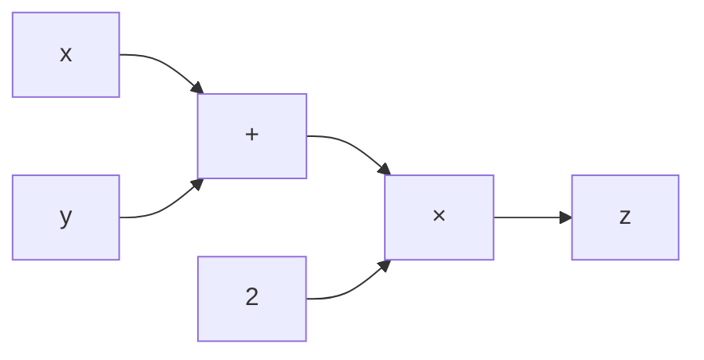
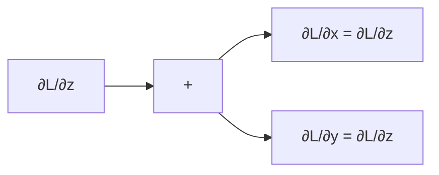
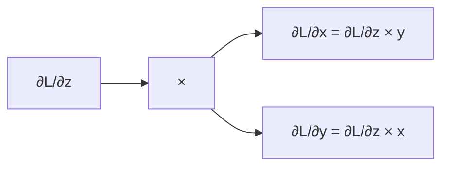

> [[Notes/深度学习入门/Roadmap|← 返回 深度学习入门路线图]]

# 计算图与链式法则

数值梯度虽然直观，但计算量太大——每更新一个参数都要重新算一遍损失。对于拥有成千上万参数的神经网络，这根本不可行。**反向传播**通过复用中间结果，让梯度计算效率大幅提升。要理解反向传播，先要学会画**计算图**。

---

## 什么是计算图

计算图把一次计算拆成多个节点，每个节点只做一件简单的事。节点之间用边连接，数据沿着边流动。

比如计算 $z = (x + y) \times 2$：



这种画法有两个好处：

1. **正向传播**：从输入走到输出，得到最终结果。
2. **反向传播**：从输出往回走，利用链式法则高效计算每个输入的梯度。

---

## 链式法则

链式法则是反向传播的数学基础。如果 $z$ 依赖 $t$，而 $t$ 又依赖 $x$，那么 $z$ 对 $x$ 的导数可以拆成两步相乘：

$$
\frac{\partial z}{\partial x} = \frac{\partial z}{\partial t} \cdot \frac{\partial t}{\partial x}
$$

计算图中的每条边都对应这样一个局部导数。反向传播时，从输出端开始，把上游传来的梯度乘以当前节点的局部导数，再传给下游节点。

---

## 加法节点的反向传播

假设节点做加法：$z = x + y$。

正向传播很简单。反向传播时，因为：

$$
\frac{\partial z}{\partial x} = 1, \quad \frac{\partial z}{\partial y} = 1
$$

所以上游传来的梯度会**原封不动地传给两个分支**。



---

## 乘法节点的反向传播

假设节点做乘法：$z = x \times y$。

反向传播时：

$$
\frac{\partial z}{\partial x} = y, \quad \frac{\partial z}{\partial y} = x
$$

所以上游梯度要**乘以另一个输入的值**，再传给对应分支。



这是乘法和加法最大的不同：乘法节点需要记住正向传播时的输入，反向传播时交换使用。

---

## 用代码实现加法节点和乘法节点

把每个节点封装成类，每个类有 `forward` 和 `backward` 两个方法：

```python
class MulLayer:
    def __init__(self):
        self.x = None
        self.y = None

    def forward(self, x, y):
        self.x = x
        self.y = y
        out = x * y
        return out

    def backward(self, dout):
        dx = dout * self.y  # 交换
        dy = dout * self.x
        return dx, dy


class AddLayer:
    def forward(self, x, y):
        out = x + y
        return out

    def backward(self, dout):
        dx = dout * 1
        dy = dout * 1
        return dx, dy
```

---

## 一个完整的例子：买苹果和橘子

书里的经典例子：苹果 100 元一个，买了 2 个；橘子 150 元一个，买了 3 个；还要加 10% 消费税。求最终价格，以及各变量对总价的梯度。

```python
apple = 100
apple_num = 2
orange = 150
orange_num = 3
tax = 1.1

# 层
mul_apple_layer = MulLayer()
mul_orange_layer = MulLayer()
add_apple_orange_layer = AddLayer()
mul_tax_layer = MulLayer()

# 正向传播
apple_price = mul_apple_layer.forward(apple, apple_num)
orange_price = mul_orange_layer.forward(orange, orange_num)
all_price = add_apple_orange_layer.forward(apple_price, orange_price)
price = mul_tax_layer.forward(all_price, tax)

print(price)  # 715.0

# 反向传播
dprice = 1
dall_price, dtax = mul_tax_layer.backward(dprice)
dapple_price, dorange_price = add_apple_orange_layer.backward(dall_price)
dorange, dorange_num = mul_orange_layer.backward(dorange_price)
dapple, dapple_num = mul_apple_layer.backward(dapple_price)

print(dapple_num, dapple, dorange, dorange_num, dtax)
# 110.0 2.2 3.3 165.0 650.0
```

这些梯度的含义是：如果多买一个苹果，总价增加 110 元；如果苹果单价涨 1 元，总价增加 2.2 元；消费税涨 0.1（即 10% → 20%），总价增加 650 元。

---

## 小结

- **计算图**把复杂计算拆成简单节点，方便理解正向和反向传播。
- **链式法则**让反向传播可以逐节点传递梯度，避免重复计算。
- **加法节点**反向传播时把上游梯度原样传给所有分支。
- **乘法节点**反向传播时把上游梯度乘以另一个输入的值，因此需要保存正向传播时的输入。
- 把节点封装成类后，可以像搭积木一样组装更复杂的网络。

---

> [[Notes/深度学习入门/Roadmap|← 返回 深度学习入门路线图]]
