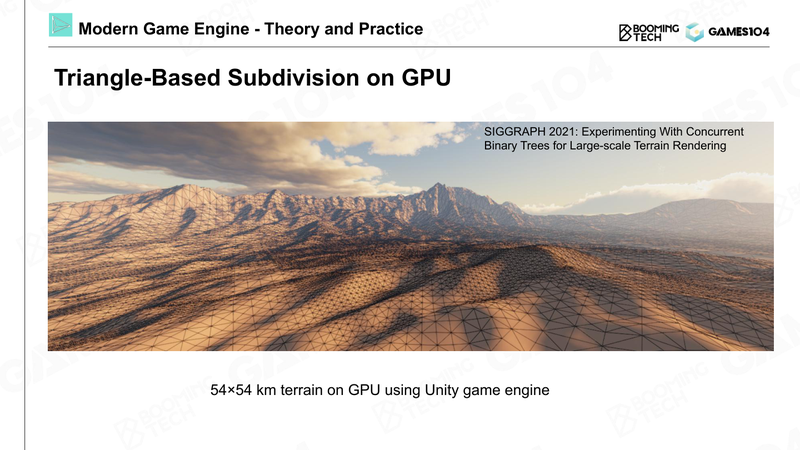
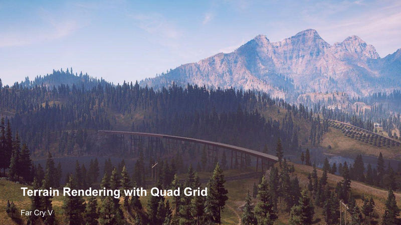
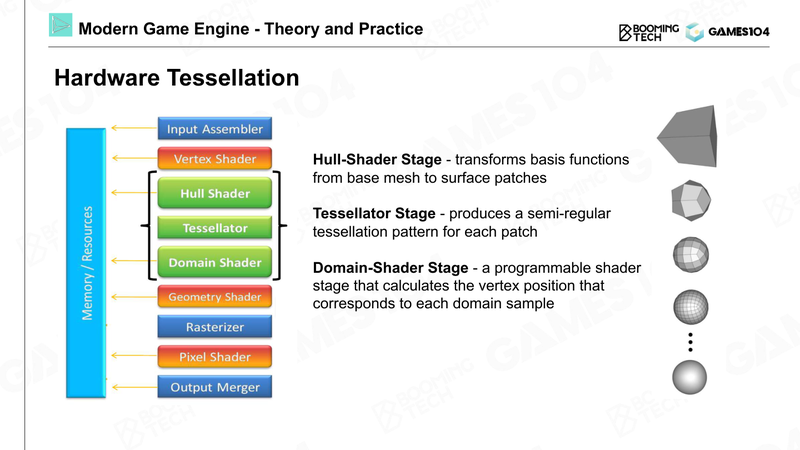
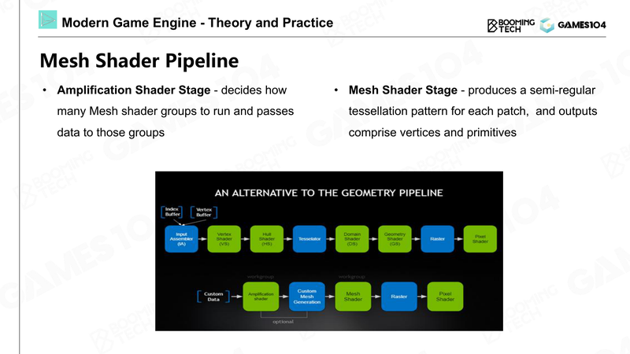
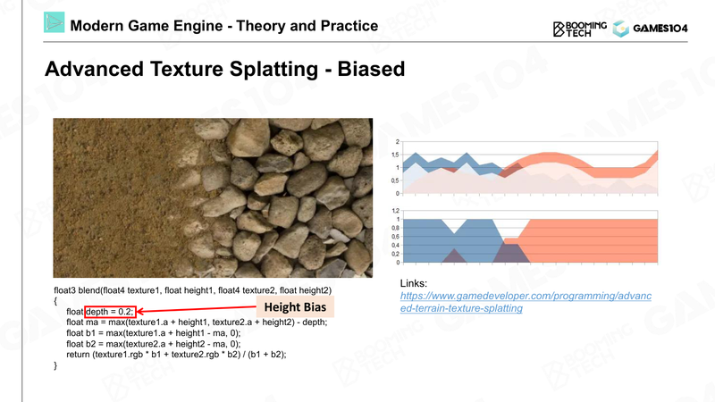
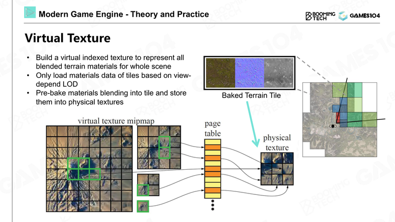
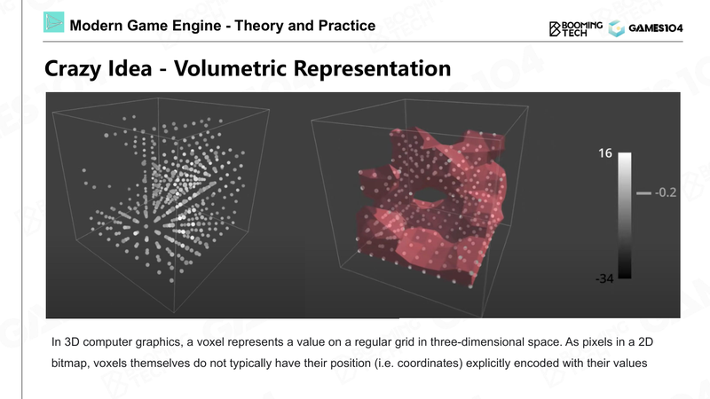
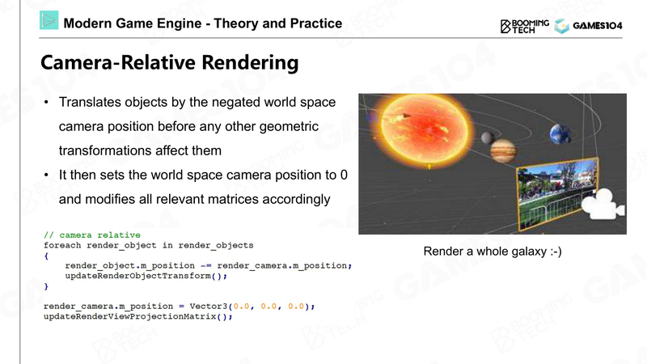
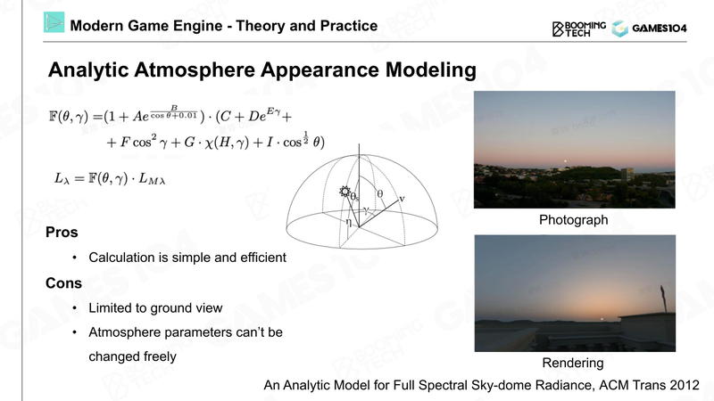

> [[索引|← 返回 游戏引擎索引]]

> [!abstract] 摘要
> 地形系统是游戏引擎渲染"自然之母"(Mother Nature)的核心技术之一。本文基于 GAMES104 Lecture 06《游戏中地形、大气和云的渲染》课程内容，结合现代游戏引擎实践，深度解析地形表示、LOD 优化、GPU 细分、材质混合、虚拟纹理等关键技术。

---

## 0. 小白入门：为什么要学习地形系统？

> [!note] 写给初学者的话
> 地形渲染可能是游戏引擎中最复杂的子系统之一。不要试图一次理解所有内容！建议按以下顺序学习：
> 1. **先搞懂 Heightmap** —— 这是地形的基础
> 2. **理解 LOD 概念** —— 这是性能优化的核心
> 3. **了解材质混合** —— 这是让地形好看的关键
> 4. **最后再看 GPU 细分和虚拟纹理** —— 这是现代引擎的高级特性

---

## 1. 地形表示：Heightfield 与几何基础

### 1.1 高程图（Heightmap）——地形的最简表达

在游戏引擎中，地形最经典且简单的表示方法是**高程图（Heightfield/Heightmap）**：

> [!tip] 小白理解：Heightmap 是什么？
> 想象你有一张黑白照片：
> - **白色** = 高山（高度值大）
> - **黑色** = 低谷（高度值小）
> - **灰色** = 中间高度
> 
> 游戏引擎读取这张"照片"，把每个像素点变成地形上的一个点，像素越亮，地形就越高！

**原理**：将地形表示为二维网格，每个网格点存储一个高度值

**渲染流程**：
1. 每隔固定距离（如 1 米或 0.5 米）生成均匀网格
2. 根据高程图对每个顶点进行位移，形成起伏地形
3. 应用材质属性（高度、粗糙度、纹理等）


*图：基于 GPU 三角形细分的大规模地形渲染（54×54 km，Unity 引擎）*

> [!note] Heightmap 的优势与局限
> **优势**：
> - 数据紧凑，易于存储和传输（就是一张图片！）
> - LOD（多层次细节）实现自然，通过 mipmap 不同层级即可提供不同精度
> - 与现代 GPU 纹理管线天然契合
>
> **局限**：
> - 无法表示垂直结构（如悬崖、洞穴）→ 因为每个 (x,z) 只能对应一个高度 y
> - 只能表达单值函数地形（不能有悬空或重叠）

### 1.2 地形网格细分策略

大规模地形面临的核心问题是**海量数据**：

| 地形规模 | 每米 1 个格子 | 三角形数量 |
|---------|--------------|-----------|
| 1 km² | 1000×1000 | 约 200 万 |
| 10 km² | 3162×3162 | 约 2000 万 |
| 100 km² | 10000×10000 | 约 2 亿 |

显然，计算机无法实时处理如此海量的三角形，必须通过**动态细分**和**LOD**优化。

> [!warning] 为什么要优化？
> 假设你的显示器是 1920×1080，只有约 200 万个像素。
> 如果地形有 2 亿个三角形，意味着每个像素要处理 100 个三角形！
> 这会造成巨大的性能浪费。

#### 细分原则一：基于 FOV（视场角）

> [!info] FOV 是什么？
> FOV（Field of View）就是你的"视野宽度"。
> - 正常玩游戏：FOV 约 70-90 度，看到的范围大
> - 开镜瞄准：FOV 收窄到 10-20 度，看到的范围小但细节更大

```
原理：屏幕像素量固定，FOV 越小，每个三角形占用的像素越多

- 正常游戏 FOV：70-80 度
- 望远镜效果（如 8 倍镜）：FOV 收窄到 10-20 度
- 结果：远处地形在屏幕上被"放大"，需要更高精度
```

#### 细分原则二：基于距离的自适应

根据观察距离决定细分级别：

$$
\text{IsNeedLOD} = \frac{\text{LodJudgeFactor} \times \text{NodeSize}}{\text{Distance} \times \text{FOV}} + \text{detailBias}
$$

> [!example] 距离细分公式解读
> - **Distance 越大** → IsNeedLOD 越小 → 使用更低细节级别
> - **NodeSize 越大**（地形块越大）→ IsNeedLOD 越大 → 可能需要更高细节
> - **FOV 越小**（瞄准时）→ IsNeedLOD 越大 → 需要更高细节


*图：Far Cry V 中基于四叉树网格的地形渲染*

### 1.3 程序化地形生成（Procedural Terrain Generation）

除了手工制作高度图，现代游戏引擎广泛采用**程序化生成**技术创建地形，这在开放世界、沙盒类游戏中尤为重要。

> [!note] 什么是"程序化生成"？
> 就是写代码自动生成地形，而不是美术手工画。
> 好处：
> - 可以生成无限大的世界（如《我的世界》）
> - 每次游戏都不一样（Roguelike 游戏）
> - 节省美术工作量

#### 1.3.1 噪声算法家族

程序化地形的核心是**噪声函数**，用于生成连续自然的高度数据：

| 噪声类型 | 特点 | 适用场景 | 计算复杂度 |
|---------|------|---------|-----------|
| **Perlin** | 平滑连续，经典算法 | 丘陵、平原 | 中等 |
| **Simplex** | Perlin 改进版，高维更高效 | 通用地形、移动平台 | 较低 |
| **Worley** | 细胞状结构，离散特征 | 山脉边界、峡谷 | 较高 |
| **Value** | 块状结构，过渡明显 | 悬崖、断层 | 低 |
| **Cellular** | 细胞状，形成斑点 | 洞穴、岩石 | 中等 |

> [!tip] 噪声函数简单理解
> 噪声函数就是一个特殊的随机数生成器：
> - 普通随机：`rand()` → 每次调用结果完全随机
> - 噪声函数：`noise(x, z)` → 输入相近的坐标，输出也相近
> 
> 这样可以生成连续的、自然的起伏，而不是突兀的随机尖峰。

**分形布朗运动（FBM, Fractal Brownian Motion）**：

通过叠加不同频率和振幅的噪声层，模拟真实地形的多尺度特征：

$$
\text{height}(x,z) = \sum_{i=0}^{\text{octaves}-1} \text{noise}(x \cdot f_i, z \cdot f_i) \cdot a_i
$$

其中：
- $f_i = \text{lacunarity}^i$ （频率倍增，每层噪声更"密集"）
- $a_i = \text{persistence}^i$ （振幅衰减，每层噪声对最终高度的影响更小）

> [!example] FBM 简单比喻
> 想象你在画一座山：
> - **第一层**：画出大山脉的轮廓（低频、大振幅）
> - **第二层**：添加山丘的细节（中频、中振幅）
> - **第三层**：添加岩石的纹理（高频、小振幅）
> 
> 把这三层叠加起来，就得到了自然的山脉！

```cpp
// FBM 噪声地形生成示例
float GenerateFBMHeight(float x, float z, int octaves, float persistence, float lacunarity) {
    float height = 0.0f;
    float amplitude = 1.0f;      // 当前层的振幅（影响程度）
    float frequency = 1.0f;      // 当前层的频率（密集程度）
    float maxValue = 0.0f;       // 用于归一化的最大值
    
    for (int i = 0; i < octaves; i++) {
        // 采样噪声并乘以振幅，累加到高度
        height += PerlinNoise(x * frequency, z * frequency) * amplitude;
        maxValue += amplitude;   // 记录最大可能的累加值
        
        // 下一层：振幅衰减，频率倍增
        amplitude *= persistence; // persistence 通常 0.5 左右
        frequency *= lacunarity;  // lacunarity 通常 2.0 左右
    }
    
    return height / maxValue; // 归一化到 0-1 范围
}
```

#### 1.3.2 多层地形合成

复杂地形通常由多层噪声组合而成：

```
地形合成层级：
├─ 大陆层 (Continental)：低频大尺度噪声，定义山脉走向
├─ 山峦层 (Mountain)：中频噪声，添加主要起伏
├─ 丘陵层 (Hills)：较高频噪声，添加中等细节
├─ 细节层 (Detail)：高频噪声，添加表面粗糙度
└─ 侵蚀层 (Erosion)：模拟水力/风力侵蚀效果
```

> [!tip] 实用技巧
> - **Ridged Multifractal**：对噪声取绝对值后反转，适合生成尖锐的山脊
> - **Terrace 阶梯化**：对高度值进行离散化，模拟梯田、高原
> - **Thermal Erosion**：热侵蚀模拟，平滑过陡的坡面
> - **Hydraulic Erosion**：水力侵蚀模拟，生成河流、沟壑

#### 1.3.3 运行时动态生成

对于无限世界，地形需要在运行时动态生成：

```cpp
// 基于区块的动态生成
class TerrainChunk {
    static const int CHUNK_SIZE = 64;  // 每个区块 64x64 格
    Vector2Int chunkCoord;              // 区块在世界中的坐标
    float heightMap[CHUNK_SIZE + 1][CHUNK_SIZE + 1];  // 高度数据
    
    void GenerateHeightMap() {
        for (int z = 0; z <= CHUNK_SIZE; z++) {
            for (int x = 0; x <= CHUNK_SIZE; x++) {
                // 将局部坐标转换为世界坐标
                float worldX = (chunkCoord.x * CHUNK_SIZE + x) * WORLD_SCALE;
                float worldZ = (chunkCoord.y * CHUNK_SIZE + z) * WORLD_SCALE;
                // 使用噪声生成高度
                heightMap[x][z] = GenerateFBMHeight(worldX, worldZ, 6, 0.5f, 2.0f);
            }
        }
    }
};
```

> [!note] Chunk（区块）概念
> 因为世界太大了，我们把它切成一块一块的（Chunk）。
> 玩家走到哪，就生成哪块地形，走远了的就删掉，这样可以节省内存。

---

## 2. LOD 与四叉树结构

### 2.1 四叉树地形表达（QuadTree-Based Subdivision）

现代游戏引擎普遍采用**四叉树**而非简单的三角形细分：

> [!info] 什么是四叉树（QuadTree）？
> 想象你在看一张地图：
> - 最开始是整个地图（根节点）
> - 如果某块区域太粗糙，就把它分成 4 个小块
> - 每个小块如果还需要更精细，继续分成 4 个
> - 这样就像一棵树，每个节点有 4 个子节点
>
> **离玩家近的地方分得更细，远的地方保持粗糙**。

```
四叉树优势：
1. 符合人的直觉和资源管理逻辑
2. 结果规整，暗含数据规范
3. 便于实现视锥体剔除和遮挡剔除
4. 与块（Block/Patch）结构天然契合
```

**分块策略**：
- 将大地形划分为多个 Block（如 512×512 米）
- 每个 Block 内部再细分为 Patch（如 64×64 米）
- 四叉树根据距离动态决定每个 Block 的细分级别

### 2.2 T-Junction 问题与缝合（Stitching）

四叉树细分会产生**T 型连接（T-Junction）**问题：

> [!warning] T-Junction 是什么？
> 想象两块相邻的地形：
> - **左边地块**：分得很细，有 4 条边
> - **右边地块**：分得很粗，只有 2 条边
> 
> 它们连接的地方会有一条裂缝！因为左边多出来的顶点没有对应的右边顶点。

![T-Junction 示意图]
*相邻地块细分级别不同时，边界处会产生裂缝*

**解决方案——缝合（Stitching）**：
1. 不将细分稀疏的一侧继续细分（保持拓扑结构）
2. 将细分更细一侧多出来的点吸附到稀疏一侧
3. 形成"退化三角形"（面积为零），保持水密性（Watertight）

> [!note] 什么是"退化三角形"？
> 正常三角形有面积，退化三角形就是"压扁"的三角形，三个点在一条线上。
> 它的面积是 0，但 GPU 依然可以渲染它，不会产生裂缝。

```glsl
// 简化的缝合逻辑示意
if (isBoundary && lodDifference > 0) {
    // 将顶点位置吸附到相邻较低 LOD 的边
    vertex.position = snapToLowerLodEdge(vertex.position);
}
```

### 2.3 地形碰撞检测与物理系统集成

地形渲染只是问题的一半，**碰撞检测**是另一半关键。物理引擎需要与地形系统紧密集成。

#### 2.3.1 高度场碰撞形状（HeightField Shape）

主流物理引擎（PhysX、Jolt、Bullet）都提供专门的高度场碰撞体：

| 物理引擎 | 高度场形状类 | 特点 |
|---------|-------------|------|
| **PhysX** | `PxHeightFieldGeometry` | 支持孔洞、材质索引、双面碰撞 |
| **Jolt** | `HeightFieldShape` | 高效采样，支持 8/16 位高度精度 |
| **Bullet** | `btHeightfieldTerrainShape` | 支持多种高度数据格式 |
| **Chaos** | `FHeightfieldShape` | UE5 默认，支持 Nanite 地形 |

> [!info] 为什么要专门的 HeightField 碰撞体？
> 如果用普通三角形网格做地形碰撞：
> - 1km² 的地形可能有 200 万个三角形
> - 玩家每一帧都要和这么多三角形检测碰撞，太慢了！
> 
> HeightField 碰撞体直接读取高度图，用数学公式快速计算某一点的地面高度，不需要遍历所有三角形。

**高度场碰撞数据结构**：

```cpp
// PhysX 高度场描述
struct PxHeightFieldDesc {
    PxU32 nbRows;           // 行数
    PxU32 nbColumns;        // 列数
    PxHeightFieldFormat format; // 格式（8/16/32位）
    void* samples;          // 高度数据指针
    PxReal thickness;       // 厚度（用于双面）
};
```

#### 2.3.2 碰撞检测流程

```
高度场碰撞检测流程：
├─ Broad Phase（粗检测）
│   └─ 使用 AABB 或四叉树快速定位可能相交的地形区域
│
└─ Narrow Phase（精检测）
    ├─ 1. 计算物体包围盒与地形网格的交集范围
    ├─ 2. 遍历交集中所有三角形
    ├─ 3. 对每个三角形进行精确碰撞测试
    │      ├─ Sphere-Triangle：球与三角
    │      ├─ AABB-Triangle：盒与三角
    │      └─ Convex-Triangle：凸包与三角
    └─ 4. 生成接触点（Contact Point）和法线
```

> [!tip] 碰撞检测的两阶段
> **Broad Phase**：先快速排除明显不会碰到的，比如用包围盒
> **Narrow Phase**：对可能碰到的进行精确计算
> 
> 这样就不用每帧都检测所有三角形了！

> [!warning] 注意事项
> - 高度场通常是**凹形（Concave）**，不能直接使用 GJK 算法
> - 对于复杂物体，通常使用**凸分解**或将地形三角化后处理
> - 大型地形需要**空间分区**优化，避免遍历所有三角形

#### 2.3.3 浮点精度问题与解决方案

当世界坐标很大时（远离原点），浮点精度会导致碰撞检测和渲染问题：

| 坐标范围 | float32 精度 | 可能的问题 |
|---------|-------------|-----------|
| 0-100 | ~0.00001 | 无显著问题 |
| 1000-10000 | ~0.001 | 轻微抖动 |
| 10000+ | ~0.1 | 明显抖动、碰撞穿透 |

> [!warning] 浮点精度问题
> 计算机用 32 位浮点数表示小数，精度有限。
> 数字越大，能表示的最小间隔也越大。
> 当坐标是 10000 时，最小间隔是 0.1，所以物体会"一跳一跳"的抖动！

**Camera-Relative 渲染**：

```cpp
// 将世界原点平移到相机位置
void UpdateCameraRelativePosition() {
    Vector3 cameraPos = mainCamera.GetPosition();
    
    foreach (RenderObject& obj : renderObjects) {
        // 所有物体相对于相机的位置 = 世界位置 - 相机位置
        obj.relativePosition = obj.worldPosition - cameraPos;
    }
    
    // 相机位于原点，保持高精度
    mainCamera.SetPosition(Vector3::Zero);
}
```

> [!note] Camera-Relative 的原理
> 既然远离原点精度差，那把相机放到原点不就行了？
> 所有物体的位置都减去相机位置，这样相机就在 (0,0,0)，精度最好。
> 渲染完再把坐标加回去。

#### 2.3.4 运行时地形修改

对于可破坏地形或动态地形变形：

```cpp
// 动态修改地形高度
void ModifyTerrainHeight(int x, int z, float newHeight) {
    // 1. 更新高度图数据
    heightMap[x][z] = newHeight;
    
    // 2. 重建 affected 区域的碰撞体
    physicsShape.UpdateHeightFieldRegion(x-1, z-1, 3, 3);
    
    // 3. 触发相邻物体的碰撞重新检测
    physicsWorld.WakeUpObjectsInAABB(affectedBounds);
    
    // 4. 更新渲染网格（GPU 端）
    renderMesh.UpdateVertexBuffer(x-1, z-1, 3, 3);
}
```

---

## 3. GPU 驱动的地形细分

### 3.1 硬件曲面细分（Hardware Tessellation）

现代 GPU（DirectX 11+）提供了强大的运行时细分能力：

> [!info] 什么是 Tessellation（曲面细分）？
> 就是让 GPU 在运行时把一个简单的三角形切成很多小三角形。
> 好处：
> - 从 CPU 传来的数据很少（粗网格）
> - GPU 根据距离动态决定切多细
> - 近的地方细节多，远的地方细节少


*图：DirectX 11 硬件曲面细分管线*

| 着色器阶段 | 功能 |
|-----------|------|
| **Hull Shader** | 生成 Patch，控制细分程度（告诉 GPU 要切多细）|
| **Tessellator** | 硬件固定阶段，执行实际细分（GPU 自动处理）|
| **Domain Shader** | 计算新顶点位置（从高度图采样实际高度）|
| **Geometry Shader** | 可选阶段，计算 UV 等属性 |

```hlsl
// Hull Shader 示例
[domain("quad")]                    // 使用四边形域
[partitioning("fractional_even")]   // 分区模式
[outputtopology("triangle_cw")]     // 输出顺时针三角形
[outputcontrolpoints(4)]            // 输出 4 个控制点
[patchconstantfunc("ConstantHS")]   // 使用 ConstantHS 计算细分因子
HullOutput HS_main(InputPatch<VertexOutput, 4> patch, uint id : SV_OutputControlPointID) {
    return patch[id];
}
```

> [!note] Hull Shader 的作用
> 想象你有一块布（Patch），Hull Shader 决定：
> - 这块布要切成几行几列？
> - 切完后每个新点在哪？
> 
> 它会输出控制点和细分因子，告诉 Tessellator 怎么切。

### 3.2 Mesh Shader：新一代渲染管线

DirectX 12 Ultimate 引入的 **Mesh Shader** 将传统管线阶段统一：


*图：Mesh Shader 与传统几何管线的对比*

> [!info] Mesh Shader 是什么？
> 传统管线有 Vertex → Hull → Domain → Geometry → Pixel 这么多阶段。
> Mesh Shader 把它们合并成一个，让开发者更灵活地控制几何生成。
>
> 就像原来要经过多个部门审批，现在一个窗口搞定。

```
Mesh Shader 优势：
1. 将 Hull/Domain/Geometry Shader 功能统一
2. 直接生成 Meshlet（网格片段）
3. 更高的灵活性和并行度
4. 支持 GPU-Driven 渲染流程
```

> [!tip] Meshlet 是什么？
> 把大模型切成很多小块（Meshlet），每块几百个三角形。
> GPU 可以并行处理这些小块，效率更高。

---

## 4. 地形材质与纹理混合

### 4.1 Texture Splatting 基础

地形需要表现多种材质（草地、泥土、岩石、雪地等），使用 **Texture Splatting** 技术：

> [!info] 什么是 Texture Splatting？
> 想象你有几张透明胶片（草地、泥土、岩石）：
> - 每张胶片上有一种材质的纹理
> - 另有一张"控制图"决定每张胶片的透明度
> - 把它们叠在一起，就得到了混合的地表

**基础混合公式**：
```glsl
float3 blend(float4 texture1, float height1, float4 texture2, float height2) {
    return height1 > height2 ? texture1.rgb : texture2.rgb;
}
```

**带 Bias 的高度混合**（解决接缝问题）：
```glsl
float3 blend(float4 texture1, float height1, float4 texture2, float height2) {
    float depth = 0.2;  // Bias 值，控制过渡柔和度
    float ma = max(texture1.a + height1, texture2.a + height2) - depth;
    float b1 = max(texture1.a + height1 - ma, 0);
    float b2 = max(texture2.a + height2 - ma, 0);
    return (texture1.rgb * b1 + texture2.rgb * b2) / (b1 + b2);
}
```


*图：基于高度图的纹理混合原理*

> [!note] 为什么需要高度混合？
> 如果直接用透明度混合，草地和岩石会"交错"在一起，很假。
> 用高度混合，可以让高处的岩石"盖住"低处的草地，更自然。

### 4.2 材质纹理数组（Texture Array）

现代游戏通常有数十到上百种地表材质，使用 **Texture Array** 管理：

> [!info] 什么是 Texture Array？
> 普通纹理是 2D 图片，Texture Array 是一叠 2D 图片。
> 在 Shader 里可以用索引访问其中任意一层。

```
工作流程：
1. Splatting Texture（R8）存储材质索引
2. 运行时动态合成 Texture2DArray（最多 32 层）
3. Shader 中进行索引转换并采样
4. 双线性插值实现材质间平滑过渡
```

**Tri-Planar 映射**：解决陡峭崖壁的纹理拉伸问题

> [!warning] 崖壁纹理拉伸问题
> 地形纹理通常是"从上往下"投影的（Planar Mapping）。
> 在陡峭的崖壁上，纹理会被拉得很长很模糊。

```glsl
// Tri-Planar 采样示意
float3 triplanarSample(Texture2D tex, float3 worldPos, float3 normal) {
    // 根据法线方向计算三个方向的权重
    float3 blendWeights = abs(normal);
    blendWeights = pow(blendWeights, sharpness);
    blendWeights /= dot(blendWeights, 1.0);
    
    // 从三个方向分别采样
    float3 x = tex.Sample(uv.zy);  // X 方向投影
    float3 y = tex.Sample(uv.xz);  // Y 方向投影
    float3 z = tex.Sample(uv.xy);  // Z 方向投影
    
    // 按权重混合三个方向的采样结果
    return x * blendWeights.x + y * blendWeights.y + z * blendWeights.z;
}
```

---

## 5. 虚拟纹理（Virtual Texture）

### 5.1 传统材质混合的性能瓶颈

当需要混合 4-5 种材质时，性能问题凸显：

| 操作 | 开销 |
|-----|------|
| 采样 Splatting Texture | 4 次（双线性插值） |
| 每种材质采样 | 4-5 次 |
| 插值运算 | 7 次以上 |
| **总计** | **单次像素 20+ 次纹理采样** |

> [!warning] 为什么 20 次采样会有问题？
> GPU 读取显存很慢！
> 每次纹理采样都可能需要从显存读取数据。
> 如果每个像素要读 20 次，帧率会很低。

### 5.2 虚拟纹理核心思想


*图：虚拟纹理的分页和映射机制*

```
核心思想：
1. 将大纹理分割为固定大小的 Tile/Page
2. 不同 LOD 的纹理预烘焙存储在硬盘
3. 运行时只加载视野内需要的 Tile
4. 通过 Page Table 映射虚拟地址到物理纹理
```

> [!note] 虚拟纹理的类比
> 想象你在看一张巨大的世界地图：
> - 你不可能把整张地图都印在一张纸上（太大了）
> - 而是把地图切成很多小块（Tile）
> - 你当前看哪块，就把哪块贴到一张小纸上
> - 这张小纸就是物理纹理，上面的位置就是 Page Table

**工作流程**：
1. **Feedback Pass**：确定需要的 Tile 和 LOD
2. **Streaming**：从硬盘异步加载所需 Tile
3. **Page Table 更新**：更新虚拟到物理的映射
4. **渲染**：使用物理纹理进行实际渲染

> [!tip] 优化技巧
> - **Pixel Error**：允许一定像素误差，控制加载数量
> - **优先队列**：根据距离和重要性排序加载
> - **双缓冲**：加载新 Tile 时保留旧 Tile 避免闪烁

### 5.3 流式加载与大地形管理

对于开放世界的大地形（> 100 km²），需要**流式加载（Streaming）**：

```
大世界地形管理架构：
├─ 世界分块（World Chunking）
│   ├─ 将世界划分为固定大小的区块（如 1km × 1km）
│   ├─ 每个区块包含地形、植被、建筑等
│   └─ 根据玩家位置动态加载/卸载区块
│
├─ 多层流式传输（Multi-Layer Streaming）
│   ├─ Terrain Layer：地形网格和高度图
│   ├─ Object Layer：静态物体、建筑
│   ├─ Detail Layer：小型道具、植被
│   └─ Far Layer：远景低模、Impostor
│
└─ 异步加载系统
    ├─ 使用独立线程进行 I/O 操作
    ├─ 优先级队列管理加载请求
    └─ 平滑过渡避免卡顿
```

> [!info] 什么是 Impostor？
> 远处的物体用一个"纸片"（ Billboard ）代替，上面画着物体的图片。
> 这样就不需要渲染复杂的 3D 模型了。

**World Streamer 模式**：

```cpp
class WorldStreamer {
    Vector3 playerPosition;          // 玩家位置
    float loadDistance = 500.0f;     // 加载距离
    float unloadDistance = 600.0f;   // 卸载距离（比加载距离大，避免频繁加载/卸载）
    
    void Update() {
        // 检查周围区块
        for (int x = -radius; x <= radius; x++) {
            for (int z = -radius; z <= radius; z++) {
                Vector3 chunkPos = GetChunkPosition(x, z);
                float dist = Distance(playerPosition, chunkPos);
                
                // 距离小于加载距离且未加载 → 加载
                if (dist < loadDistance && !IsLoaded(x, z)) {
                    LoadChunkAsync(x, z);
                } 
                // 距离大于卸载距离且已加载 → 卸载
                else if (dist > unloadDistance && IsLoaded(x, z)) {
                    UnloadChunk(x, z);
                }
            }
        }
    }
};
```

---

## 6. 高级技术与未来趋势

### 6.1 体素表示与 Marching Cubes

对于非高度场地形（洞穴、悬空结构），使用**体素（Voxel）**表示：


*图：体素表示与 Marching Cubes 算法*

> [!info] 什么是体素（Voxel）？
> 2D 图片的基本单位是像素（Pixel）
> 3D 体积的基本单位是体素（Voxel = Volume + Pixel）
> 
> 想象《我的世界》，每个方块就是一个体素。

**Marching Cubes 算法**：
1. 将空间划分为规则网格
2. 每个网格点存储密度值（0-16 或 -0.2 到 16）
3. 根据密度等值面生成三角形网格
4. 可表示复杂几何（隧道、悬崖等）

> [!note] Marching Cubes 简单理解
> 想象一个立方体，8 个角每个角有一个密度值。
> 密度 = 0 的地方就是"表面"。
> 算法会在这个立方体内生成三角形，把这些表面点连起来。
> 很多个立方体连在一起，就形成了连续的地形表面。

### 6.2 Camera-Relative Rendering


*图：Camera-Relative 渲染原理*

大规模地形面临的**浮点精度问题**：
- 当坐标值很大时（如 10000+），float32 精度不足
- 远处物体会出现抖动（Jittering）

**解决方案**：
```cpp
// Camera-Relative 渲染
foreach (render_object in render_objects) {
    render_object.m_position -= render_camera.m_position;
    updateRenderObjectTransform();
}
render_camera.m_position = Vector3(0.0, 0.0, 0.0);
```

将世界空间原点平移到相机位置，保持渲染精度。

### 6.3 GPU-Driven 渲染管线

现代 3A 游戏引擎的趋势是将更多工作移到 GPU：

```
传统流程：
CPU: 计算 LOD → 视锥剔除 → 遮挡剔除 → 提交渲染 → GPU 渲染

GPU-Driven 流程：
CPU: 提交整个地形 → GPU: 计算 LOD → 视锥剔除 → 遮挡剔除 → 渲染
```

> [!info] 为什么要 GPU-Driven？
> CPU 和 GPU 之间的数据传输很慢。
> 如果 CPU 要每帧决定渲染哪些三角形，会花很多时间准备数据。
> 
> GPU-Driven 就是 CPU 一次性把整个地形丢给 GPU，
> GPU 自己决定渲染哪些部分，省去了来回传输的开销。

**优势**：
- 利用 GPU 并行计算能力
- 减少 CPU-GPU 数据传输
- 支持更大地形和更多细节

### 6.4 DirectStorage 与 DMA


*图：现代硬件架构下的数据流*

**直接存储（DirectStorage）**：
- GPU 直接从 NVMe SSD 读取压缩数据
- 绕过 CPU 和系统内存
- 专用解压硬件（如 Xbox Velocity Architecture）
- 大幅降低加载时间

> [!info] 传统 vs 现代数据流
> **传统**：SSD → 内存 → CPU解压 → 内存 → GPU（慢！）
> **现代**：SSD → GPU直接读取 → GPU解压 → 显存（快！）

```
数据传输路径演进：
传统：SSD → 内存 → CPU解压 → 内存 → GPU
现代：SSD → GPU直接读取 → GPU解压 → 显存
```

### 6.5 UE5 Nanite Virtual Heightfield Mesh

Unreal Engine 5 引入了**Nanite Virtual Heightfield Mesh (VHM)** 技术，代表了地形渲染的最新发展方向：

| 特性 | 传统地形 | UE5 VHM |
|-----|---------|---------|
| 几何表示 | 固定网格 | Nanite 虚拟微多边形 |
| LOD 系统 | 预计算 LOD | 自动微多边形流式加载 |
| 置换细节 | Tessellation | 真正的几何细分 |
| 内存占用 | 与地形分辨率成正比 | 与屏幕像素成正比 |
| 支持特性 | 有限 | 自动 LOD、流式加载、光线追踪 |

> [!info] 什么是 Nanite？
> UE5 的新技术，可以渲染数十亿个多边形。
> 原理是：只在屏幕上可见的地方渲染细节，
> 远处的物体自动简化，近处的保留细节。
> 
> 就像摄影师对焦：对焦的地方清晰，其他地方模糊。

**VHM 工作原理**：
1. 使用 **Runtime Virtual Texture (RVT)** 捕获地形材质和高度信息
2. **Virtual Heightfield Mesh** 实时读取 RVT 数据并生成几何
3. **Nanite** 技术自动处理几何流式加载和 LOD
4. 实现真正的像素级几何细节，支持数百万多边形的实时渲染

> [!note] VHM 的优势与局限
> **优势**：
> - 极致的几何细节（真正的置换而非法线贴图）
> - 自动处理 LOD 和流式加载
> - 与 Nanite 网格无缝混合
> - 支持 Lumen 全局光照
>
> **局限**：
> - 不支持动态碰撞（需依赖底层 Landscape）
> - 运行时修改地形需要重新烘焙 RVT
> - 对硬件要求较高（需要支持 Nanite）

---

## 7. 植被与道路系统

### 7.1 Decorator 渲染

地形上需要大量植被（草、树、石头等），使用 **Decorator** 系统：

> [!info] Decorator 是什么？
> "装饰器"，就是放置在地形上的装饰物。
> 草、花、石头、小树枝都算 Decorator。

```
实现方式：
1. 使用简化 Mesh（Billboard 或低模）
2. GPU Instancing 批量渲染
3. 基于地形高度和法线放置
4. 距离剔除和 LOD
```

### 7.2 道路系统

道路渲染挑战：
- 地形分辨率不足导致细节丢失
- Splatting ID 方案过渡僵硬

**解决方案**：
1. **贴花（Decal）**：在运行时动态投射道路纹理
2. **Virtual Texture**：将道路烘焙到 VT
3. **几何变形**：根据道路形状调整地形高度

> [!info] 什么是 Decal（贴花）？
> 就像贴纸一样，把一张纹理"贴"到地形表面。
> 可以用来做道路、轮胎印、弹孔等效果。

### 7.3 地形编辑器与笔刷系统

地形编辑器是美术工作流的核心，提供直观的雕刻和绘制工具：

#### 7.3.1 地形笔刷类型

| 笔刷类型 | 功能描述 | 典型应用 |
|---------|---------|---------|
| **Raise/Lower** | 升高/降低地形 | 塑造山脉、挖掘峡谷 |
| **Flatten** | 平整地形到指定高度 | 创建平台、建筑基地 |
| **Smooth** | 平滑地形起伏 | 柔化陡峭边缘 |
| **Noise** | 添加随机噪声 | 添加自然细节 |
| **Erosion** | 模拟侵蚀效果 | 水力/风力侵蚀 |
| **Stamp** | 印章式放置预设形状 | 快速放置山丘、凹陷 |

#### 7.3.2 笔刷参数

```cpp
struct TerrainBrush {
    BrushType type;           // 笔刷类型
    float radius;             // 笔刷半径（米）
    float strength;           // 笔刷强度（0-1）
    float falloff;            // 衰减曲线（线性/指数/球形）
    float rotation;           // 笔刷旋转角度
    Texture2D shape;          // 笔刷形状纹理（可选）
    
    // 高级参数
    bool useTargetHeight;     // 是否使用目标高度
    float targetHeight;       // 目标高度值
    int hardness;             // 边缘硬度
};
```

#### 7.3.3 实时雕刻算法

```cpp
void SculptTerrain(Vector3 brushPos, TerrainBrush brush) {
    // 1. 计算受影响的地形区域
    int minX = (brushPos.x - brush.radius) / cellSize;
    int maxX = (brushPos.x + brush.radius) / cellSize;
    int minZ = (brushPos.z - brush.radius) / cellSize;
    int maxZ = (brushPos.z + brush.radius) / cellSize;
    
    // 2. 遍历受影响区域
    for (int z = minZ; z <= maxZ; z++) {
        for (int x = minX; x <= maxX; x++) {
            Vector3 cellPos = GetCellPosition(x, z);
            float dist = Distance(cellPos, brushPos);
            
            if (dist < brush.radius) {
                // 3. 计算笔刷影响因子（离中心越远，影响越小）
                float influence = brush.strength * 
                    CalculateFalloff(dist / brush.radius, brush.falloff);
                
                // 4. 应用笔刷效果
                float currentHeight = GetHeight(x, z);
                float delta = CalculateBrushDelta(brush, currentHeight, influence);
                SetHeight(x, z, currentHeight + delta);
            }
        }
    }
    
    // 5. 更新渲染和碰撞数据
    UpdateTerrainMesh(minX, minZ, maxX, maxZ);
    UpdatePhysicsShape(minX, minZ, maxX, maxZ);
}
```

#### 7.3.4 程序化笔刷与蓝图笔刷

现代引擎支持**程序化笔刷（Blueprint Brushes）**，允许通过代码定义复杂的地形修改逻辑：

```
程序化笔刷应用示例：
├─ 道路笔刷：根据路径曲线自动平整地形，添加路边细节
├─ 河流笔刷：模拟水流路径，自动雕刻河床，添加河岸侵蚀
├─ 城市笔刷：根据建筑布局平整区域，添加道路网络
└─ 生态笔刷：根据气候参数自动生成合理地形特征
```

**非破坏性编辑（Non-Destructive Editing）**：
- 使用编辑图层（Edit Layers）保存不同的修改
- 可随时调整、禁用或删除图层
- 支持图层间的混合和遮罩

---

## 8. 性能剖析与优化实战

### 8.1 性能瓶颈分析

地形渲染的性能瓶颈通常出现在以下环节：

| 瓶颈类型 | 典型症状 | 分析工具 |
|---------|---------|---------|
| **CPU 瓶颈** | Draw Call 过多、卡顿 | Unity Profiler、Unreal Insights |
| **GPU 几何** | 顶点处理过重 | GPU Profiler、RenderDoc |
| **GPU 像素** | Overdraw、复杂 Shader | Frame Debugger、PIX |
| **内存带宽** | 纹理采样过多 | Snapdragon Profiler、Mali Offline Compiler |
| **I/O 瓶颈** | 加载卡顿、硬盘占用高 | I/O Profiler、资源监控 |

> [!tip] 如何定位瓶颈？
> 1. 如果 CPU 时间 > GPU 时间 → CPU 瓶颈
> 2. 如果 GPU 时间很高 → 看是几何阶段还是像素阶段
> 3. 如果纹理采样很多 → 内存带宽瓶颈

### 8.2 优化策略矩阵

```
优化策略选择：
├─ CPU 优化
│   ├─ Draw Call 合批（Static Batching / GPU Instancing）
│   ├─ 遮挡剔除（Occlusion Culling）
│   ├─ 视锥剔除（Frustum Culling）
│   ├─ 细节层次（LOD）
│   └─ GPU-Driven 渲染
│
├─ GPU 优化
│   ├─ 减少 Overdraw
│   ├─ Shader 优化（复杂度、分支）
│   ├─ 纹理压缩与 Mipmap
│   ├─ Early-Z / Pre-Z Pass
│   └─ 延迟渲染（Deferred Shading）
│
└─ 内存优化
    ├─ 纹理流送（Texture Streaming）
    ├─ 虚拟纹理（Virtual Texture）
    ├─ 网格压缩
    └─ 对象池（Object Pooling）
```

### 8.3 具体优化技术

#### 8.3.1 遮挡剔除（Occlusion Culling）

```cpp
// 基于 GPU 查询的遮挡剔除
void GPUOcclusionCulling() {
    // 1. 渲染深度缓冲（低分辨率）
    RenderDepthBuffer(lowRes);
    
    // 2. 对所有地形块进行遮挡查询
    for (TerrainChunk& chunk : chunks) {
        if (!chunk.isVisible) continue;
        
        // 使用边界盒进行遮挡查询
        chunk.occlusionQuery.Begin();
        RenderBoundingBox(chunk.bounds);
        chunk.occlusionQuery.End();
    }
    
    // 3. 读取查询结果，剔除被遮挡的块
    for (TerrainChunk& chunk : chunks) {
        if (chunk.occlusionQuery.GetPixelCount() == 0) {
            chunk.isOccluded = true;  // 完全被遮挡，不需要渲染
        }
    }
}
```

> [!info] 遮挡剔除的原理
> 如果一座山挡住了后面的地形，后面的地形就不需要渲染。
> 用 GPU 查询可以快速判断一个包围盒是否可见。

#### 8.3.2 视锥剔除（Frustum Culling）

```cpp
bool FrustumCulling(const BoundingBox& bbox, const Frustum& frustum) {
    // 使用分离轴定理（SAT）进行视锥测试
    for (int i = 0; i < 6; i++) {
        const Plane& plane = frustum.planes[i];
        
        // 计算包围盒在平面法线方向的极值点
        Vector3 pVertex = bbox.min;
        if (plane.normal.x > 0) pVertex.x = bbox.max.x;
        if (plane.normal.y > 0) pVertex.y = bbox.max.y;
        if (plane.normal.z > 0) pVertex.z = bbox.max.z;
        
        // 如果极值点在平面背面，则完全不可见
        if (plane.Distance(pVertex) < 0) {
            return false; // 被剔除
        }
    }
    return true; // 可见
}
```

> [!info] 视锥剔除的原理
> 相机的视野是一个锥形（视锥体）。
> 如果物体完全在锥形外面，就不需要渲染。
> 这是最基本的剔除，应该每帧都做。

#### 8.3.3 GPU Instancing 优化

对于大量重复的地表细节（草、石头）：

```hlsl
// GPU Instancing Shader
#pragma multi_compile_instancing

struct InstancedData {
    float4x4 instanceMatrix;
    float4 instanceColor;
};

StructuredBuffer<InstancedData> _InstancedDataBuffer;

v2f vert(appdata_base v, uint instanceID : SV_InstanceID) {
    v2f o;
    
    // 从 Instanced Buffer 读取变换矩阵
    float4x4 instanceMatrix = _InstancedDataBuffer[instanceID].instanceMatrix;
    
    float4 worldPos = mul(instanceMatrix, v.vertex);
    o.pos = mul(UNITY_MATRIX_VP, worldPos);
    
    return o;
}
```

> [!info] GPU Instancing 是什么？
> 传统方式：画 1000 棵草 = 1000 次 Draw Call
> Instancing 方式：一次 Draw Call 画 1000 棵草
> 
> 原理是告诉 GPU"我要画 1000 个相同的东西，只是位置不同"，
> GPU 就可以并行处理，效率很高。

### 8.4 性能剖析实战

#### 8.4.1 Unity Profiler 使用

```
关键指标监控：
├─ CPU Usage
│   ├─ Rendering：Draw Call 提交时间
│   ├─ Culling：剔除计算时间
│   └─ Other：地形生成、物理更新
│
├─ GPU Usage
│   ├─ opaque：不透明地形渲染
│   ├─ transparent：透明效果（水、雾）
│   └─ post-processing：后处理
│
└─ Memory
    ├─ Texture：纹理内存占用
    ├─ Mesh：网格数据占用
    └─ Render Texture：Render Target 占用
```

#### 8.4.2 移动端特殊优化

| 优化项 | 推荐设置 | 说明 |
|-------|---------|------|
| 地形分辨率 | 512×512 每区块 | 平衡质量与性能 |
| 纹理格式 | ASTC 6×6 或 ETC2 | 移动端 GPU 原生支持 |
| Shader 复杂度 | 避免复杂分支 | 使用 Shader Variant |
| Overdraw | 控制在 3 层以内 | 使用 Early-Z |
| 批处理 | 静态合批 + Instancing | 减少 Draw Call |

### 8.5 技术选型建议

| 场景规模 | 推荐方案 | 关键特性 |
|---------|---------|---------|
| 小型场景（< 1km²） | 静态 Mesh + Heightmap | 简单、高效 |
| 中型场景（1-10km²） | 四叉树 LOD + GPU Tessellation | 平衡质量性能 |
| 大型场景（> 10km²） | GPU-Driven + Virtual Texture | 大规模支持 |
| 复杂地形（洞穴/悬崖） | Voxel + Marching Cubes | 非高度场支持 |
| 超大规模（> 100km²） | UE5 Nanite VHM + World Partition | 前沿技术 |

---

## 9. 实战建议与总结

### 9.1 关键要点回顾

1. **LOD 是核心**：视距、FOV、地形复杂度共同决定细分级别
2. **GPU 是趋势**：从 CPU 驱动的四叉树到 GPU-Driven 管线
3. **纹理是关键**：Virtual Texture 解决材质多样性问题
4. **硬件是边界**：关注 DirectStorage、Mesh Shader 等新技术

### 9.2 学习路径建议

> [!tip] 给初学者的学习路线图

```
入门（1-2 周）：
1. 实现基础 Heightmap 渲染
   - 加载一张高度图
   - 生成网格并渲染
   
2. 添加简单的 LOD（距离-based）
   - 远处用低分辨率网格
   - 近处用高分辨率网格
   
3. 实现 Texture Splatting（2-3 层材质）
   - 草地、泥土混合

进阶（1-2 个月）：
4. 四叉树 LOD + Stitching
   - 学习四叉树数据结构
   - 解决 T-Junction 问题
   
5. GPU Tessellation（Hull/Domain Shader）
   - 学习 DirectX 11 Tessellation
   
6. Virtual Texture 实现
   - 实现简单的 VT 系统

高级（长期学习）：
7. GPU-Driven 渲染管线
8. Mesh Shader
9. Voxel Terrain
10. UE5 Nanite VHM
```

---

## 参考资源

### 课程与教程
- GAMES104 Lecture 06: 游戏中地形、大气和云的渲染
- [GAMES104 课程笔记 - 地形渲染](https://peng00bo00.github.io/blog/2022/GAMES104-NOTES-06/)

### 开源项目
- [LeoGPUDriven - GPU 地形渲染实现](https://github.com/lijundacom/LeoGPUDriven)
- [Godot-MTerrain - Godot 优化地形系统](https://github.com/mohsenph69/Godot-MTerrain-plugin)

### 技术文章
- [Far Cry 4 Adaptive Virtual Texture Rendering](https://www.lfzxb.top/adaptive-virtual-texture-rendering-in-far-cry-4/)
- [Ghost Recon Wildlands: Terrain Tools and Technology (GDC)](https://cloud.tencent.com/developer/article/2071252)
- [Unreal Engine 5 Virtual Heightfield Mesh 教程](https://dev.epicgames.com/community/learning/tutorials/ZZzk/unreal-engine-implementing-a-landscape-with-a-virtual-heightfield-mesh)

### 论文与参考文献
- **Polynomial methods for fast Procedural Terrain Generation** - Yann Thorimbert (2016)
- **Real-time Collision Detection** - Christer Ericson
- **GPU Gems** 系列地形渲染章节

---

> [!quote] 结语
> "地形渲染是痛苦的挑战，但也是充满乐趣的创造过程。" —— GAMES104
> 
> 从简单的 Heightmap 到复杂的 GPU-Driven 系统，地形渲染技术的发展体现了游戏图形学的进化：利用硬件能力、减少数据传输、最大化并行计算。理解这些原理，是构建现代游戏引擎的必经之路。
