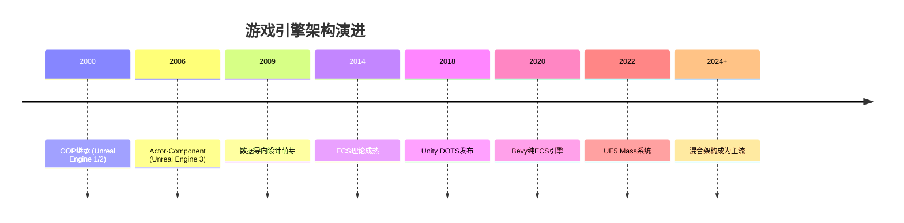

> [[索引|← 返回 游戏引擎索引]]

# 游戏引擎架构概览

## Why：为什么要了解引擎架构？

游戏引擎的架构决定了：
- **开发效率**：代码是否容易理解和维护
- **运行时性能**：能否支撑大规模场景和复杂逻辑
- **编译迭代速度**：修改一行代码需要等待多久才能看到效果
- **团队分工**：模块边界是否清晰，多人协作是否顺畅

不同的架构选择没有绝对的优劣，只有**适合特定场景**的方案。

## What：主流架构模式

### 1. ECS（Entity-Component-System）架构

**核心理念**：数据与行为彻底分离

| 元素 | 职责 | 特点 |
|------|------|------|
| **Entity** | 轻量标识符（ID） | 无数据、无方法，只是"标签" |
| **Component** | 纯数据结构（POD） | 只有状态，无逻辑 |
| **System** | 纯函数逻辑 | 只读/写 Component 数据 |

**代表引擎**：Unity DOTS、Bevy（纯ECS）、UE5 Mass（部分ECS）

**优势场景**：
- 大规模实体模拟（万人同屏、复杂物理）
- 需要极致缓存性能和并行计算
- 追求编译隔离性（改一行代码不影响其他模块）

---

### 2. 传统 OOP（面向对象）架构

**核心理念**：封装数据与行为

```cpp
// 传统OOP：数据和行为封装在一起
class Player {
    Vector3 position;      // 数据
    void Move() { ... }    // 行为
};
```

**代表引擎**：Godot（Scene Graph）、早期 Unity（MonoBehaviour）

**优势场景**：
- 复杂UI和交互逻辑
- 剧情驱动游戏
- 快速原型开发
- 团队规模小、需要快速迭代

---

### 3. Actor-Component 架构（混合模式）

**核心理念**：OOP + 组合优于继承

```cpp
// Actor 是容器
class Actor {
    std::vector<Component*> components;
};

// Component 含数据和逻辑
class MovementComponent : public Component {
    Vector3 velocity;           // 数据
    void Tick(float dt) { ... } // 逻辑
};
```

**代表引擎**：Unreal Engine（传统Gameplay框架）

**特点**：
- 比纯继承灵活（可组合不同能力）
- 但 Component 仍包含逻辑，不是纯数据
- 反射系统（UHT）带来编译负担

---

### 4. 混合架构（现代主流趋势）

**核心理念**：各取所长，分层设计

```
性能关键层 → ECS（移动、物理、AI、渲染）
复杂逻辑层 → OOP（状态机、行为树、剧情）
用户界面层 → 事件驱动（UI框架）
游戏流程层 → OOP（GameMode、状态管理）
```

**代表引擎**：
- Unity（MonoBehaviour + DOTS ECS 共存）
- Unreal Engine 5（Actor框架 + Mass ECS）

## How：如何选择架构？

### 决策矩阵

| 项目特征 | 推荐架构 | 理由 |
|----------|----------|------|
| 实体数量 < 1000 | OOP/Godot Node | ECS是过度设计，OOP更直观 |
| 实体数量 > 10,000 | ECS | 缓存友好性成为瓶颈 |
| 复杂剧情/UI | OOP | 状态机和事件处理更自然 |
| 物理/AI密集 | ECS | 便于并行化和SIMD优化 |
| 编译速度优先 | ECS（非模板实现） | 编译隔离性更好 |
| 快速原型 | Godot/Unity OOP | 可视化编辑器、资产管线 |

### 具体引擎选择建议

| 你的需求 | 推荐引擎 | 理由 |
|----------|----------|------|
| 纯ECS + 现代语言 | Bevy (Rust) | 100% ECS，编译快，无历史包袱 |
| ECS + 完整编辑器 | Unity DOTS | 商业级工具链，资产丰富 |
| 轻量ECS + C++ | Flecs + raylib | 编译<3秒，零依赖 |
| 轻量 + 编辑器 | Godot | <100MB编辑器，源码完全开放 |
| 3A级画面 + ECS | UE5 Mass | 顶级渲染，但编译慢 |

## 架构演进趋势



## 关键认知

> **ECS不是银弹，而是一种针对特定问题的优化方案。**

它通过极致的数据/逻辑分离换取**缓存性能**和**并行能力**，代价是**抽象复杂度**和**学习成本**。

当前趋势是**混合架构**：在保留原有OOP框架的基础上引入ECS处理高性能场景，而非完全替代。
