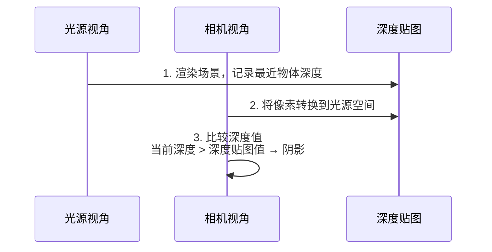
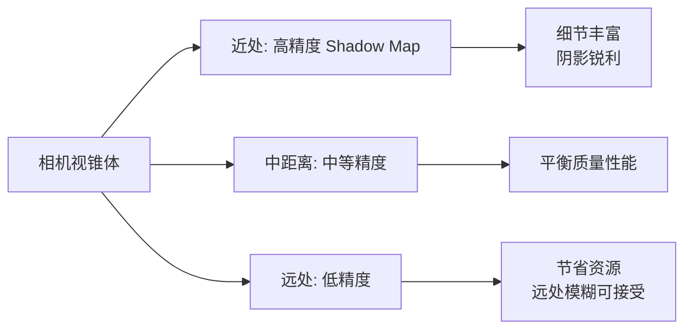
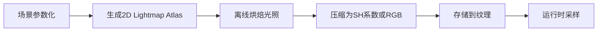
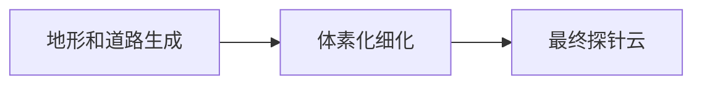
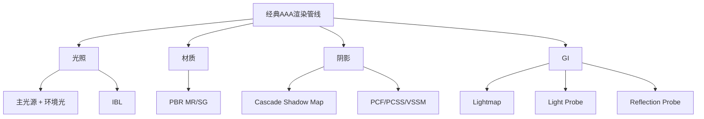

> [[索引|← 返回 游戏引擎索引]]

## 1. 渲染方程及三大挑战

### 1.1 渲染的核心参与者

图形渲染是一个充满挑战的冒险故事，涉及三个核心参与者：

| 术语               | 解释                   | 核心作用                    |
| :--------------- | :------------------- | :---------------------- |
| **Lighting（光照）** | 光子的发射、反弹、吸收和被感知      | 渲染的"起源"——一切视觉始于光        |
| **Material（材质）** | 物质如何与光子反应            | 决定物体外观的根本属性             |
| **Shader（着色器）**  | 如何组织和训练GPU运算单元完成海量计算 | 把GPU运算单元比作执行具体任务的"微型奴隶" |

### 1.2 渲染方程（The Rendering Equation）

1986年，James Kajiya 在 SIGGRAPH 上提出了渲染方程，这是真实感图形学的理论基础：

$$L_o(x, \omega_o) = L_e(x, \omega_o) + \int_{\Omega} f_r(x, \omega_i, \omega_o) \cdot L_i(x, \omega_i) \cdot \cos\theta_i \, d\omega_i$$

各项含义如下：

| 符号 | 含义 |
|:---|:---|
| $L_o(x, \omega_o)$ | **出射辐射亮度**：点 $x$ 沿方向 $\omega_o$ 射出的光 |
| $L_e(x, \omega_o)$ | **自发光**：点 $x$ 自身发出的光（如光源） |
| $f_r(x, \omega_i, \omega_o)$ | **BRDF**：双向反射分布函数，描述表面如何反射光线 |
| $L_i(x, \omega_i)$ | **入射辐射亮度**：从方向 $\omega_i$ 入射到点 $x$ 的光 |
| $\cos\theta_i$ | 入射角余弦，体现 Lambert 定律的投影面积效应 |
| $\int_{\Omega} \dots d\omega_i$ | 对半球所有入射方向积分 |

> **物理意义**：某点的出射光 = 自身发光 + 所有入射光经表面反射后的总和

### 1.3 真实渲染的三大挑战

渲染方程虽然优雅，但在实际应用中面临三个核心挑战：

| 挑战 | 问题描述 | 核心难点 | 解决方案 |
|:---|:---|:---|:---|
| **Challenge 1: 可见性** | 如何获取任意入射方向的入射辐射度 $L_i$ | 需要知道场景中其他表面发出的光 | Shadow Map、Lightmap、Light Probe |
| **Challenge 2: 积分计算** | 半球上光照与散射函数的积分计算昂贵 | 涉及连续半球域，数值计算代价高 | 球谐函数(SH)、蒙特卡洛采样、预计算 |
| **Challenge 3: 递归性** | 渲染方程是递归的 | 要求 $L_i$ 本身又要解另一个渲染方程，形成无限递归 | 光线路径截断、近似算法、实时光线追踪 |

---

## 2. 基础光照解决方案

### 2.1 从简单开始

面对复杂的渲染方程，早期的解决方案是**简化假设**：

> "Starting from Simple - Forget some abstract concepts for a while, i.e. radiosity, microfacet and BRDF etc"

**简化策略**：
1. **简化 BRDF**：对材质光学属性做简化假设
2. **简化入射光 $L_i$**：只处理方向光、点光源、聚光灯等有解析表达式的光源

### 2.2 简单光照方案

#### 2.2.1 主光源 + 环境光

| 光照类型 | 用途 | 实现 |
|:---|:---|:---|
| **主光源(Dominant Light)** | 解决主要方向光照 | 通常为方向光（模拟太阳） |
| **点光源/聚光灯** | 特殊情况 | 局部照明 |
| **环境光(Ambient)** | "取巧"模拟复杂半球光照 | 用一个常量表示平均辐照度 |

```cpp
// OpenGL 固定管线示例
glLightfv(GL_LIGHT0, GL_AMBIENT, light_ambient);   // 环境光
glLightfv(GL_LIGHT0, GL_DIFFUSE, light_diffuse);   // 漫反射
glLightfv(GL_LIGHT0, GL_SPECULAR, light_specular); // 高光
glLightfv(GL_LIGHT0, GL_POSITION, light_position); // 位置/方向
```

#### 2.2.2 环境贴图反射 (Environment Map)

早期基于图像的光照探索：

```glsl
vec3 N = normalize(normal);
vec3 V = normalize(camera_position - world_position);
vec3 R = reflect(V, N);  // 计算反射向量
FragColor = texture(cube_texture, R);  // 采样环境贴图
```

**Mipmap 与粗糙度**：
- 用不同层级的 mipmap 模拟表面粗糙度
- 粗糙表面 → 采样模糊的高层级 mipmap
- 光滑表面 → 采样清晰的低层级 mipmap

### 2.3 光照组合的数学原理

| 光照组件 | 频率特征 | 作用 |
|:---|:---|:---|
| **主光源** | 主导方向 | 主要照明和阴影 |
| **环境光** | 低频（Low-frequency） | 均匀或缓慢变化的间接光，可用 SH 近似 |
| **环境贴图** | 高频（High-frequency） | 精确的环境反射，保留镜面高光细节 |

> 核心思想：将复杂光照分解为 **低频基础 + 高频细节**，分别用不同精度的方法计算

---

## 3. Blinn-Phong 材质模型

### 3.1 经典光照模型

Blinn-Phong 是早期 OpenGL 固定管线的标准光照模型：

**光照方程**：
$$L = L_a + L_d + L_s$$

展开形式：
$$L = k_a I_a + k_d \frac{1}{r^2} \max(0, \mathbf{n}\cdot\mathbf{l}) + k_s \frac{1}{r^2} \max(0, \mathbf{n}\cdot\mathbf{h})^p$$

| 符号 | 含义 |
|:---|:---|
| $k_a, k_d, k_s$ | 材质的环境、漫反射、高光系数 |
| $I_a$ | 环境光强度 |
| $r$ | 光源到表面的距离 |
| $\mathbf{n}$ | 表面法向量 |
| $\mathbf{l}$ | 光源方向向量 |
| $\mathbf{h} = \frac{\mathbf{l}+\mathbf{v}}{\|\mathbf{l}+\mathbf{v}\|}$ | **半角向量**（Blinn-Phong 的关键改进）|
| $p$ | 高光指数（shininess）|

### 3.2 Blinn-Phong 的问题

| 问题 | 说明 |
|:---|:---|
| **非能量守恒** | 反射光能量可能超过入射光，违反物理规律 |
| **难以建模复杂材质** | 参数调整靠经验，无法准确模拟金属、粗糙表面等 |
| **光线追踪中不稳定** | 在全局光照环境下容易产生噪点 |

> 对比：非能量守恒模型（左）产生大量噪点 vs PBR 着色（右）结果更稳定真实

---

## 4. 阴影技术

### 4.1 阴影的本质

> "Shadow is nothing but space when the light is blocked by an opaque object"

阴影的历史发展：
- **平面阴影 (Planar Shadow)**：将物体投影到平面上，仅适用于平坦地面
- **阴影体 (Shadow Volume)**：基于几何体的精确阴影，用 stencil buffer 实现
- **阴影贴图 (Shadow Map)**：现代游戏引擎的标准方案

### 4.2 Shadow Map 原理



**核心着色器代码**：
```glsl
// Pass 1: 投影到光源视角
vec4 proj_pos = shadow_viewproj * pos;
vec2 shadow_uv = proj_pos.xy / proj_pos.w;  // 透视除法
shadow_uv = shadow_uv * 0.5 + vec2(0.5);    // NDC [-1,1] → UV [0,1]
float real_depth = proj_pos.z / proj_proj.w;
real_depth = real_depth * 0.5 + 0.5;        // 深度归一化

// Pass 2: 深度比较
float shadow_depth = texture(shadowmap, shadow_uv).x;
float shadow_factor = (shadow_depth < real_depth) ? 0.0 : 1.0;
```

### 4.3 Shadow Map 的问题

| 问题 | 说明 | 解决方案 |
|:---|:---|:---|
| **分辨率限制** | 纹理分辨率有限 → 阴影边缘锯齿 | 级联阴影贴图 (CSM) |
| **深度精度限制** | 引发阴影痤疮 (Shadow Acne) | 偏移量调节 (Bias) |
| **硬阴影** | 缺乏真实感的软阴影 | PCF、PCSS、VSSM |

### 4.4 级联阴影贴图 (Cascaded Shadow Maps)



CSM 的核心思想：根据距离使用不同分辨率的阴影贴图

### 4.5 软阴影技术

#### 4.5.1 PCF (Percentage Closer Filtering)

PCF 通过对阴影贴图周围区域采样，平均结果来模拟软阴影：

```glsl
// 3x3 PCF 采样
float shadow = 0.0;
vec2 texel_size = 1.0 / textureSize(shadow_map, 0);
for(int x = -1; x <= 1; ++x) {
    for(int y = -1; y <= 1; ++y) {
        float pcf_depth = texture(shadow_map, proj_coords.xy + vec2(x,y) * texel_size).r;
        shadow += current_depth - bias > pcf_depth ? 1.0 : 0.0;
    }
}
shadow /= 9.0;
```

**采样方式对比**：
- **均匀圆盘分布**：简单但噪声明显
- **泊松圆盘分布**：采样点间距约束，效果更自然
- **旋转采样**：配合随机旋转消除规则性

#### 4.5.2 PCSS (Percentage Closer Soft Shadows)

PCSS 根据遮挡物距离动态调整采样半径，实现"接触硬、远处软"的效果：

```
1. Blocker Search: 搜索遮挡物，计算平均遮挡距离
2. Penumbra Estimation: 根据遮挡距离计算半影大小
3. PCF Filtering: 使用动态半径进行 PCF 采样
```

| 技术 | 特点 | 性能 | 应用场景 |
|:---|:---|:---|:---|
| **PCF** | 均匀软阴影 | 较低开销 | 基础软阴影 |
| **PCSS** | 物理正确的可变软度 | 中等开销 | 3A游戏标配 |
| **VSSM** | 基于统计的近似，无采样 | 最低开销 | 移动端/性能敏感 |

---

## 5. 基于预计算的全局光照

### 5.1 为什么需要全局光照

| 光照方式 | 效果 |
|:---|:---|
| **直接光照** | 画面偏暗、生硬，阴影处死黑 |
| **直接+间接光照** | 画面自然、真实，暗部有细节，存在颜色渗色 |

> **核心思想**：用**空间换时间**——离线预计算光照信息，运行时直接采样

### 5.2 球谐函数 (Spherical Harmonics)

为解决间接光照的存储和积分计算问题，引入球谐函数。

#### 5.2.1 傅里叶变换的启示

**卷积定理**：空间域的卷积 = 频率域的乘积
- 复杂信号可分解为不同频率的简单正弦波之和
- 球面上的复杂积分可用多项式近似

#### 5.2.2 球谐函数可视化

球谐函数 $Y_l^m(\theta, \phi)$ 是球坐标系下的正交基函数：

| 阶数 | 系数数量 | 表示内容 |
|:---|:---|:---|
| **L0（基频）** | 1 | 平均亮度 |
| **L1（一阶）** | 3 | 方向信息（x, y, z） |
| **L2（二阶）** | 5 | 更高阶细节 |

> **关键优势**：球面上的复杂积分可转化为对有限个 SH 系数的简单求和

**漫反射 L1 SH 简化计算**：
```glsl
vec3 shEvaluateL1(vec3 normal, vec4 sh_coeffs[3]) {
    // sh_coeffs 包含 L0 和 L1 系数
    vec3 result = sh_coeffs[0].rgb * 0.282095;  // L0
    result += sh_coeffs[1].rgb * 0.488603 * normal.y;  // L1y
    result += sh_coeffs[2].rgb * 0.488603 * normal.z;  // L1z  
    result += sh_coeffs[3].rgb * 0.488603 * normal.x;  // L1x
    return max(result, 0.0);
}
```

### 5.3 Lightmap（光照贴图）

#### 5.3.1 工作流程



**Frostbite 引擎实现**：

| 系数 | 存储方式 | 说明 |
|:---|:---|:---|
| L0 | BC6H 纹理 (HDR) | 1个RGB纹理，存3个系数 |
| L1 | 3×BC7 或 3×BC1 纹理 (LDR) | 3个RGB纹理，存9个系数 |
| **总计** | **4个RGB纹理** | 12个SH系数 |

#### 5.3.2 Lightmap 优缺点

| 优点 | 缺点 |
|:---|:---|
| 运行时非常高性能 | 预计算耗时且成本高（需要光照农场） |
| 能烘焙大量GI细节 | 只能处理静态场景和静态光源 |
| 画质可接近离线渲染 | 包体和显存占用大 |

#### 5.3.3 优化技术

- **低多边形代理模型**：用简化版模型烘焙光照
- **减少UV碎片**：优化UV布局，提高空间利用率
- **HBAO补充**：用屏幕空间AO添加短距离高频阴影细节

### 5.4 Light Probe（光照探针）

#### 5.4.1 探针生成流程



#### 5.4.2 Light Probes + Reflection Probes

| 特点 | 说明 |
|:---|:---|
| **优点** | 运行时高效、支持静态和动态物体、同时处理漫反射和高光 |
| **缺点** | 需要预计算、无法处理GI精细细节（如重叠结构的软阴影） |

**探针插值策略**：
- 动态物体插值最近3-4个探针
- 四面体剖分确保插值连续性
- 可结合 SSR 补充高频反射

---

## 6. 基于物理的渲染 (PBR)

### 6.1 微表面理论

微表面理论用统计方法描述粗糙表面的光学特性：

| 法线分布 | 视觉效果 |
|:---|:---|
| **集中 (Concentrated)** | 光泽 (Glossy) / 高光 |
| **分散 (Spread)** | 漫反射 (Diffuse) / 哑光 |

**直观理解**：粗糙表面由无数微小镜面组成
- 法线集中 → 微表面朝向一致 → 反射光方向集中 → **光滑/镜面**
- 法线分散 → 微表面朝向杂乱 → 反射光散射 → **粗糙/漫反射**

### 6.2 Cook-Torrance BRDF

现代 PBR 的标准模型：

$$f_r = k_d f_{lambert} + f_{cookTorrance}$$

**Cook-Torrance 镜面反射项**：
$$f_{cookTorrance} = \frac{DFG}{4(\omega_i \cdot n)(\omega_o \cdot n)}$$

| 符号 | 名称 | 作用 |
|:---|:---|:---|
| **D** | 法线分布函数 (NDF) | 微表面朝向分布，**GGX**是最常用的模型 |
| **F** | 菲涅尔项 (Fresnel) | 视角依赖的反射率 |
| **G** | 几何遮蔽 (Geometry) | 微表面间的相互遮挡 |

### 6.3 GGX 法线分布函数

```cpp
float D_GGX(float NoH, float roughness) {
    float a2 = roughness * roughness;      // α²
    float f = (NoH * NoH) * (a2 - 1.0) + 1.0;
    return a2 / (PI * f * f);
}
```

**各分布对比**：
- **Beckmann（红色）**：传统高斯型，尾部衰减快
- **Phong（蓝色）**：经典余弦幂分布
- **GGX（绿色）**：**长尾分布，最接近真实材质**

### 6.4 几何衰减 (Smith-GGX)

![[Assets/games/images/geometry_obstruction.png]]
*几何遮蔽函数模拟微表面间的自遮挡效应*

```glsl
float GGX(float NdotV, float k) {
    return NdotV / (NdotV * (1.0 - k) + k);
}

float G_Smith(float NdotV, float NdotL, float roughness) {
    float k = pow(roughness + 1.0, 2.0) / 8.0;  // Disney近似
    return GGX(NdotL, k) * GGX(NdotV, k);
}
```

> 模拟微表面间的自阴影效应，防止粗糙度极高时出现不真实的反射

### 6.5 菲涅尔效应 (Fresnel)

![[Assets/games/images/fresnel.png]]
*菲涅尔效应：反射强度随观察角度变化*

**Schlick 近似**：
$$F_{Schlick} = F_0 + (1 - F_0)(1 - \cos\theta)^5$$

```glsl
float FSchlick(float VoH, float f0) {
    float f = pow(1.0 - VoH, 5.0);
    return f0 + (1.0 - f0) * f;
}
```

| 观察角度 | 反射强度 |
|:---|:---|
| 掠射角（grazing angle） | 反射强 |
| 正入射 | 反射弱、透射强 |

**不同材质的 $F_0$ 值**：

| 材质 | $F_0$ (线性) | $F_0$ (sRGB) |
|:---|:---|:---|
| 水 | 0.02 | 0.15 |
| 塑料 | 0.04 | 0.22 |
| 玻璃 | 0.04 | 0.22 |
| 银 | 0.95 | 0.98 |
| 金 | 1.00 | 1.00 |

### 6.6 PBR 工作流对比

#### 6.6.1 Specular-Glossiness (SG)

| 贴图 | 格式 | 颜色空间 |
|:---|:---|:---|
| Diffuse | RGB | sRGB |
| Specular | RGB | sRGB |
| Glossiness | Grayscale | Linear |

#### 6.6.2 Metallic-Roughness (MR)

| 贴图 | 格式 | 颜色空间 |
|:---|:---|:---|
| Base Color | RGB | sRGB |
| Roughness | Grayscale | Linear |
| Metallic | Grayscale | Linear |

#### 6.6.3 对比

| 特点 | MR | SG |
|:---|:---|:---|
| **优点** | 制作简单、省内存、不易出错 | 边缘伪影少、可控制电介质F0 |
| **缺点** | 边缘伪影明显、无法控制电介质F0 | 容易输入错误值、可能破坏能量守恒、费内存 |
| **行业地位** | **游戏行业主流**（UE/Unity默认） | 传统/影视常用 |

### 6.7 Disney Principled BRDF

Brent Burley 提出的五大设计原则：

1. **直观优先于物理**：使用艺术家易理解的参数
2. **参数尽可能少**：简化工作流
3. **参数范围归一化到 [0,1]**：便于控制和预测
4. **允许突破合理范围**：艺术创作需要时可超出
5. **所有组合都要稳健可靠**：任意参数组合都不应产生错误

> 这套 BRDF 不是为了物理正确，而是为了**艺术创作友好**

---

## 7. 基于图像的光照 (IBL)

### 7.1 IBL 的基本思想

用一张图像（通常是 HDR 环境贴图）表示来自所有方向的远距离光照环境。

**核心问题**：如何高效计算某一点在这种光照下的着色结果？

渲染方程：
$$L_o(x, \omega_o) = \int_{\Omega} f_r(x, \omega_o, \omega_i) L_i(x, \omega_i) \cos\theta_i \, d\omega_i$$

**困境**：
- 蒙特卡洛积分需要大量采样 → **渲染速度慢**
- 解决方案：**预计算**

### 7.2 Split Sum Approximation

将渲染方程分解为两部分分别预计算：

$$L_o \approx \underbrace{\int_{\Omega} L_i(\omega_i) \cdot \text{filter} \, d\omega_i}_{\text{预过滤环境贴图}} \times \underbrace{\int_{\Omega} f_r \cdot \cos\theta_i \, d\omega_i}_{\text{BRDF LUT}}$$

#### 7.2.1 光照项（预过滤环境贴图）

![[Assets/games/images/ibl_prefilter.png]]
*不同粗糙度级别的预过滤环境贴图（从左到右粗糙度递增）*

- 对不同粗糙度预计算模糊的环境贴图
- 粗糙表面 → 使用更高模糊级别的 mipmap
- 存储为 **Prefiltered Mipmap Chain**

#### 7.2.2 BRDF 项（LUT）

![[Assets/games/images/ibl_brdf_lut.png]]
*BRDF LUT 纹理：输入粗糙度和 NdotV，输出缩放和偏移*

- 预计算 BRDF 的积分结果
- 存储为 2D LUT（Lookup Texture）
- 输入：粗糙度 + 视线与法线夹角
- 输出：缩放和偏移系数

**UE4 的 BRDF LUT**：

```glsl
// 从 2D LUT 采样
vec2 envBRDF = texture(brdfLUT, vec2(NoV, roughness)).rg;
vec3 specular = prefilteredColor * (F * envBRDF.x + envBRDF.y);
```

#### 7.2.3 快速着色

![[Assets/games/images/ibl_irradiance.png]]
*IBL 漫反射（左）与镜面反射（右）的结合*

```glsl
// 简化的 IBL 着色
vec3 diffuse = irradianceMap * baseColor;
vec3 specular = prefilteredEnvMap * (F * envBRDF.x + envBRDF.y);
vec3 color = diffuse + specular;
```

---

## 8. 现代 AAA 渲染管线总结

### 8.1 经典 AAA 游戏方案



### 8.2 技术演进路线

| 年代 | 代表作 | 关键技术 |
| :--- | :------------------------ | :----------------------- |
| 2004 | Doom 3 | Shadow Map + Blinn-Phong |
| 2007 | Assassin's Creed | Lightmap + Light Probe |
| 2012 | Assassin's Creed III | PBR早期探索 |
| 2017 | Assassin's Creed: Origins | 完整PBR + IBL |
| 2020+ | 现代3A | 实时光追 + GI |

### 8.3 新兴技术趋势

| 技术 | 说明 |
|:---|:---|
| **实时光线追踪** | RTX、DXR 硬件加速 |
| **动态全局光照** | SSGI、SDF GI、Voxel GI、Lumen |
| **虚拟阴影贴图** | 解决传统阴影分辨率问题 |
| **更复杂的材质模型** | BSDF（毛发）、BSSRDF（次表面散射）|

---

## 9. Shader 管理

### 9.1 Uber Shader & Shader Variants

现代游戏面临**Shader爆炸**问题：
- 165个 Uber Shader 可能生成 **75,536** 个运行时 Shader
- 需要处理多种光照类型、渲染通道、材质类型的组合

**解决方案**：
- **Uber Shader**：共享大量状态代码
- **Shader Variants**：通过预定义宏编译为多个变体

### 9.2 跨平台 Shader 编译

```
HLSL/GLSL Source
      ↓ [Shader Cross-Compiler]
      → SPIR-V (中间表示)
      ↓ [Platform Backend]
      → DXIL / Metal IR / Vulkan SPIR-V
```

---

## 10. 总结

本节课程从渲染方程出发，系统性地讲解了现代游戏引擎渲染管线的核心组成：

1. **光照**：从简单光源到基于图像的光照，理解光照的频率分解思想
2. **材质**：从 Blinn-Phong 到基于微表面理论的 PBR，掌握 BRDF 的核心组成
3. **全局光照**：Lightmap、Light Probe 等预计算方案，用空间换时间
4. **阴影**：Shadow Map 及其优化技术，从硬阴影到软阴影
5. **着色器管理**：应对复杂组合挑战的工程实践

> **核心理念**：真实感渲染是在物理正确性、计算效率和视觉质量之间寻找平衡的艺术。

---

## 参考资料

- GAMES104 现代游戏引擎：从入门到实践
- "The Rendering Equation" - James Kajiya, SIGGRAPH 1986
- "Physically Based Shading at Disney" - Brent Burley, SIGGRAPH 2012
- "Real-Time Rendering, 4th Edition" - Tomas Akenine-Möller et al.
- [彻底看懂PBR/BRDF方程](https://zhuanlan.zhihu.com/p/158025828)
- [草履虫也能看懂的Cook-Torrance BRDF](https://zhuanlan.zhihu.com/p/\d+)
