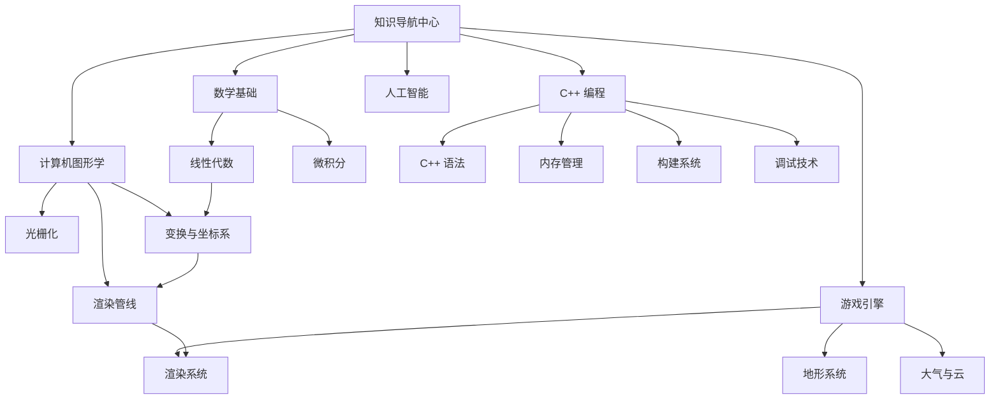

# 知识导航中心

> [!info] 使用指南
> 本仓库遵循 **费曼学习法** 组织知识：
> - **Why?** — 为什么要学这个概念？解决什么问题？
> - **What?** — 这个概念是什么？核心原理是什么？
> - **How?** — 如何在实践中应用？代码如何实现？
>
> 点击各领域卡片开始探索 →

---

## 🗺️ 知识领域地图



---

## 📚 核心学习路径

### 1️⃣ 数学基础

| 主题 | 权威笔记 | 相关笔记 | 状态 |
|------|---------|---------|------|
| **线性代数的本质** | [[Math/线性代数的本质/00-索引\|线性代数 · 系列索引]] | [[graphics/2. 线性代数 Linear Algebra\|图形学中的线性代数]] | ✅ 已整理 |
| 向量与空间 | [[Math/线性代数的本质/01-向量\|01-向量]] | [[graphics/2. 线性代数 Linear Algebra\|点乘与叉乘]] | |
| 矩阵与变换 | [[Math/线性代数的本质/03-矩阵与线性变换\|03-矩阵与线性变换]] | [[graphics/3. 变换 Transformation\|图形学变换]] | |
| 特征值与特征向量 | [[Math/线性代数的本质/10-特征值与特征向量\|10-特征值与特征向量]] | | |

> [!tip] 学习建议
> 先学习 [[Math/线性代数的本质/00-索引\|线性代数的本质]] 系列建立几何直观，再参考图形学中的具体应用。

---

### 2️⃣ C++ 编程

| 主题 | 权威笔记 | 相关笔记 |
|------|---------|---------|
| **值类别与移动语义** | [[C++/C++ 值类别与移动语义\|值类别与移动语义]] | [[C++/C++ 对象生存期与 RAII\|RAII 与内存管理]] |
| **内存管理** | [[C++/C++ 对象生存期与 RAII\|对象生存期与 RAII]] | [[C++/C++ 值类别与移动语义\|移动语义]] |
| 构建系统 | [[C++/构建系统：make 与 CMake\|make 与 CMake]] | [[GameLearn/构建系统演进：从单文件到游戏引擎\|构建系统演进]] |
| 调试技术 | [[C++/调试器核心概念与原理\|调试器原理]] | [[C++/GDB调试指南\|GDB 指南]] |

#### 关键字速查

| 关键字 | 笔记 | 核心用途 |
|--------|------|---------|
| `explicit` | [[C++/C++ explicit 关键字\|explicit]] | 禁止隐式类型转换 |
| `inline` | [[C++/C++ inline 关键字\|inline]] | 内联展开，减少函数调用开销 |
| `noexcept` | [[C++/C++ noexcept 关键字\|noexcept]] | 标记不抛出异常，优化移动操作 |
| `decltype` | [[C++/C++ decltype 关键字\|decltype]] | 类型推导 |
| `volatile` | [[C++/C++ volatile 关键字\|volatile]] | 禁止编译器优化，用于硬件访问 |

---

### 3️⃣ 计算机图形学

> [!note] 知识来源
> - [[从零到入土的图形学学习.md\|从零到入土的图形学学习]] — 完整的 C++ 软渲染器学习路线
> - [[graphics/1. 图形学概览 Overview of Computer Graphics\|图形学概览]] — GAMES101 课程笔记

#### 核心知识脉络

```
数学基础（线性代数）
    ↓
变换（Transformation）
    ↓
光栅化（Rasterization）← Z-Buffer、抗锯齿
    ↓
着色（Shading）← 光照模型、纹理映射
    ↓
渲染管线（Graphics Pipeline）
    ↓
高级话题（光线追踪、PBR、实时渲染）
```

#### 章节导航

| # | 章节 | 核心概念 | 笔记链接 |
|---|------|---------|---------|
| 1 | **图形学概览** | 光栅化 vs 光线追踪 | [[graphics/1. 图形学概览 Overview of Computer Graphics\|图形学概览]] |
| 2 | **线性代数** | 向量、点乘、叉乘 | [[graphics/2. 线性代数 Linear Algebra\|线性代数]] → 详见 [[Math/线性代数的本质/00-索引\|线性代数系列]] |
| 3 | **变换** | 模型/视图/投影变换、齐次坐标 | [[graphics/3. 变换 Transformation\|变换]] |
| 4 | **变换续** | 视图变换、透视投影 | [[graphics/4. 变换续 Transformation Cont.\|变换续]] |
| 5 | **光栅化** | 三角形、采样、走样 | [[graphics/5.  光栅化Rasterization(Triangles)\|光栅化]] |
| 6 | **光栅化续** | 抗锯齿、Z-Buffer | [[graphics/6. 光栅化续 (Antialiasing and Z-Buffering)\|光栅化续]] |
| 7 | **光照与着色** | 着色模型、图形管线 | [[graphics/7. 光照、着色、管线(Illumination, Shading and Graphic Pipeline)\|光照与着色]] |

---

### 4️⃣ 游戏引擎

#### 渲染系统

| 主题 | 笔记 | 核心内容 |
|------|------|---------|
| **渲染系统概述** | [[GameLearn/104/游戏引擎渲染系统\|游戏引擎渲染系统]] | GPU 架构、渲染管线、可见性剔除、纹理压缩 |
| **光照材质与着色器** | [[GameLearn/104/游戏引擎渲染：光照材质与着色器\|光照材质与着色器]] | PBR、Shader、材质系统 |
| **地形系统** | [[GameLearn/104/游戏引擎中的地形系统\|地形系统]] | 地形渲染技术 |
| **地形底层数据** | [[GameLearn/104/地形系统底层数据表示\|地形底层数据]] | 地形数据存储与表示 |
| **大气和云** | [[GameLearn/104/游戏引擎中的大气和云\|大气和云]] | 体积渲染 |

#### 构建与工程

| 主题 | 笔记 |
|------|------|
| **构建系统演进** | [[GameLearn/构建系统演进：从单文件到游戏引擎\|构建系统演进]] |
| **引擎脚本构建** | [[GameLearn/引擎脚本构建分析\|引擎脚本构建分析]] |

---

### 5️⃣ 人工智能

| 主题 | 笔记 | 状态 |
|------|------|------|
| **AI 学习路线** | [[AI/AI学习路线\|AI学习路线]] | |
| **深度学习环境** | [[AI/动手学习深度学习/深度学习环境搭建（D2L）\|环境搭建]] | |
| **引言** | [[AI/动手学习深度学习/01-引言\|01-引言]] | |
| **Claude Memory** | [[AI/CLAUDE.md 与 MEMORY.md 的区别\|CLAUDE.md 与 MEMORY.md 的区别]] | |

---

## 🔗 知识依赖关系

### 学习路径推荐

```
阶段 1: 基础
├── C++ 基础语法
├── 线性代数（向量、矩阵）
└── 构建系统（CMake）

阶段 2: 进阶
├── C++ 内存管理（RAII、智能指针）
├── C++ 移动语义
└── 图形学变换

阶段 3: 应用
├── 软渲染器实现
├── 游戏引擎渲染系统
└── PBR 材质

阶段 4: 深入
├── GPU Driven 渲染
├── 现代图形 API（Vulkan）
└── AI 工程实践
```

---

## 🎯 费曼学习法实践

每篇笔记都应回答三个问题：

| 层次 | 问题 | 内容要求 |
|------|------|---------|
| **Why** | 为什么要学这个？ | 解决什么问题？不用会怎样？ |
| **What** | 这是什么？ | 核心概念、原理、公式 |
| **How** | 如何用？ | 代码实现、最佳实践、常见陷阱 |

> [!example] 示例：学习 MVP 矩阵
> - **Why**: 3D 物体需要变换到屏幕坐标才能显示
> - **What**: Model-View-Projection 三级变换，将局部坐标 → 世界坐标 → 相机坐标 → 裁剪坐标 → 屏幕坐标
> - **How**: 手写 4×4 矩阵类，实现模型加载和渲染

---

## 📈 学习进度追踪

- [ ] 线性代数系列（11章）
- [ ] 图形学 GAMES101（7章）
- [ ] C++ 核心概念（值类别、内存管理）
- [ ] 游戏引擎渲染系统
- [ ] 软渲染器实现
- [ ] AI 基础（动手学深度学习）

---

> [!quote] 持续更新
> 本导航页随学习进度持续更新，新笔记会自动链接到对应分类下。
> 最后更新：2026-03-28
