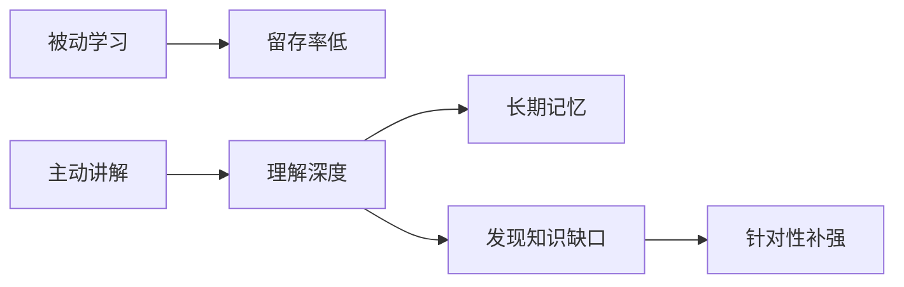
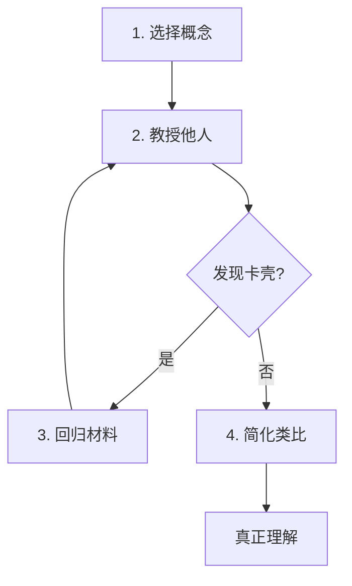
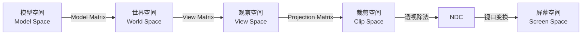

# 费曼学习法

> [!quote] 核心理念
> "如果你不能简单地解释它，你就还没有真正理解它。"
> —— 理查德·费曼（Richard Feynman，诺贝尔物理学奖得主）

---

## Why：为什么要用费曼学习法？

### 传统学习的问题

| 方式 | 问题 | 结果 |
|------|------|------|
| 被动阅读 | 信息从左耳进，右耳出 | 很快遗忘 |
| 死记硬背 | 记住术语，不理解本质 | 无法应用 |
| 标记重点 | 制造"已学会"的幻觉 | 知识碎片化 |

### 费曼法的优势



**核心洞察**：**教是最好的学**。当你试图向他人解释一个概念时，你被迫：
1. 组织知识结构
2. 使用简单语言
3. 暴露理解盲区

---

## What：费曼学习法是什么？

### 四步流程



### 详细步骤

#### 步骤 1：选择概念
- 确定你要学习的主题
- 在纸上写下概念名称
- 想象你要向一个 12 岁孩子讲解

#### 步骤 2：教授他人（假装）
- 用自己的话解释概念
- **避免使用专业术语**
- 使用简单、日常的语言
- 写下你的解释

#### 步骤 3：发现知识缺口，回归材料
- 标记讲解中卡壳的地方
- 回到原始材料重新学习
- 填补理解漏洞
- **重复步骤 2**

#### 步骤 4：简化和使用类比
- 将解释进一步简化
- 使用类比和比喻
- 创造故事或可视化场景
- 目标是**让一个外行也能理解**

---

## How：如何在笔记中应用？

### 本仓库的笔记结构

每篇技术笔记遵循 **Why → What → How** 三层结构：

```
笔记标题
├── Why：为什么要学这个？
│   ├── 解决什么问题？
│   └── 不用会怎样？
│
├── What：这是什么？
│   ├── 核心概念
│   ├── 关键公式/原理
│   └── 图解说明
│
└── How：如何用？
    ├── 代码示例
    ├── 最佳实践
    └── 常见陷阱
```

### 示例：MVP 矩阵笔记

| 层次 | 内容 |
|------|------|
| **Why** | 3D 物体需要从模型空间变换到屏幕坐标才能显示 |
| **What** | Model-View-Projection 三级变换，将局部坐标 → 世界坐标 → 相机坐标 → 裁剪坐标 |
| **How** | 手写 4×4 矩阵类，实现模型加载和渲染 |

### 检验清单

完成笔记后，问自己：

- [ ] 我能向一个非技术背景的朋友解释清楚吗？
- [ ] 我是否避免了专业术语（或已解释）？
- [ ] 我是否包含了具体的代码/实例？
- [ ] 我是否列出了常见的错误和陷阱？
- [ ] 如果 3 个月后回来看，我还能快速理解吗？

---

## 进阶技巧

### 1. 双栏笔记法

| 概念说明 | 简单解释                                    |
| ---- | --------------------------------------- |
| RAII | 资源获取即初始化——就像租房子，签合同（构造）时拿钥匙，合同到期（析构）时归还 |
| 光栅化  | 把 3D 三角形变成屏幕上的像素点，就像用马赛克拼图              |
| 移动语义 | 搬家时直接把家具搬过去，而不是买新的再复制一份                 |

### 2. 可视化工具

使用图表来辅助解释：



### 3. 教给不同的"学生"

| 对象 | 策略 |
|------|------|
| 初学者 | 多用类比，避免术语 |
| 同行 | 强调实现细节和陷阱 |
| 面试官 | 突出设计权衡和复杂度分析 |

---

## 相关笔记

- [[知识导航中心]] — 本仓库的知识组织结构
- [[从零到入土的图形学学习.md]] — 费曼法应用示例
- [[C++/C++ 值类别与移动语义]] — 完整的三层结构示例

---

> [!tip] 记住
> 知识不是收藏，而是**能用自己的话讲出来**。
> 你的笔记不是为了好看，而是为了**未来的自己能看懂**。

---

> 参考：
> - [The Feynman Technique](https://fs.blog/feynman-technique/)
> - [Sketchplanations - Feynman Learning](https://sketchplanations.com/feynman-learning-technique)
